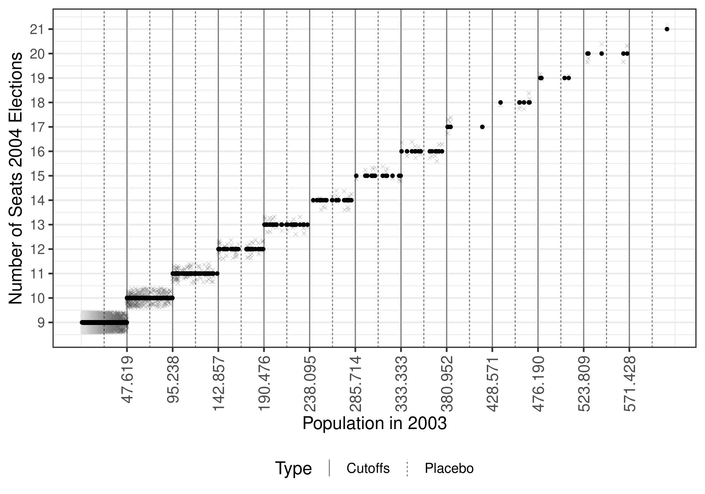
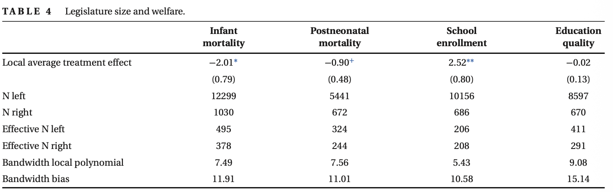
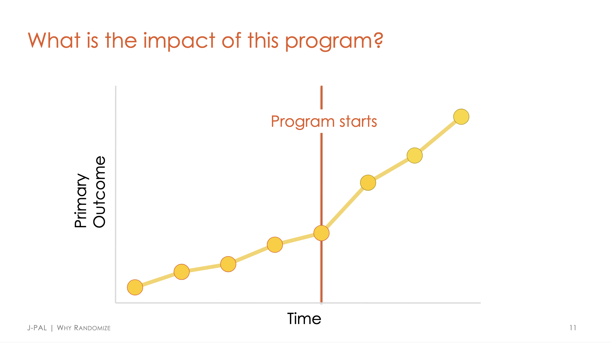
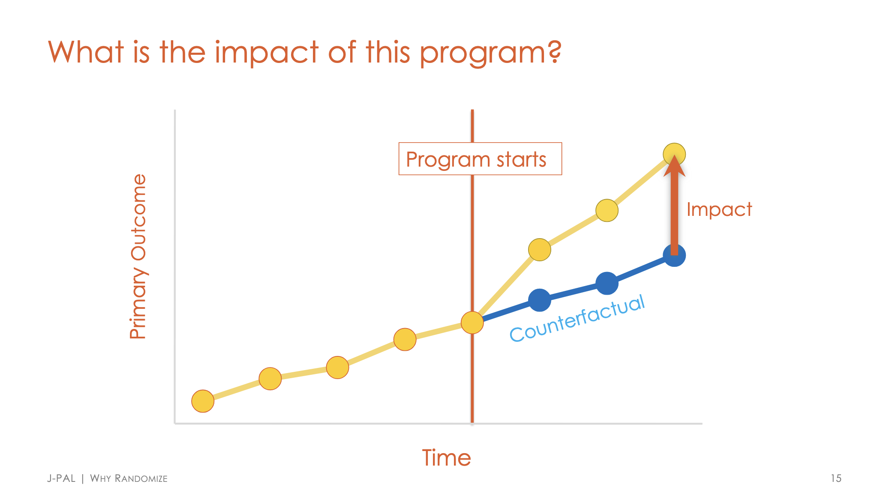
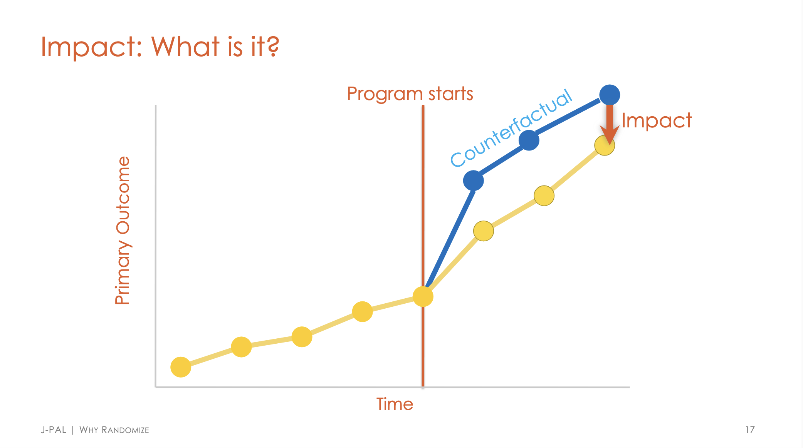
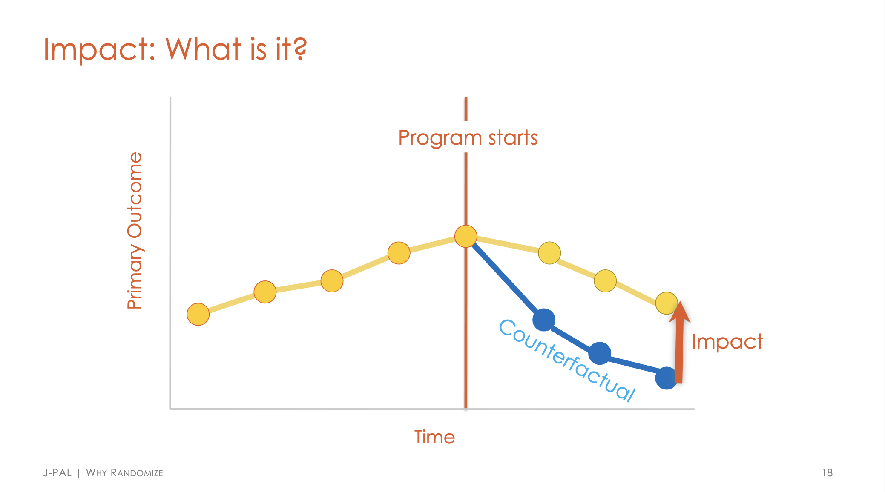

```{r setup, include=FALSE}
options(htmltools.dir.version = FALSE)
library(knitr)
opts_chunk$set(
  echo = FALSE,
  fig.align = "center",
  dpi = 300,
  cache = FALSE
)
suppressPackageStartupMessages(library(ggplot2))

if (!require("fontawesome", character.only = TRUE)) {
  install.packages("fontawesome", dependencies = TRUE)
  library(fontawesome, character.only = TRUE)
}
```

## Sobre el docente
### Un poco sobre mí

:::: {.columns}
::: {.column}


::: {style="font-size: 26px;"}
`r fa('envelope')` [danilofreire@gmail.com](mailto:danilofreire@gmail.com)

`r fa('globe')` <http://danilofreire.github.io/taller-evidencia-ucu>

`r fa('github')` <https://github.com/danilofreire/>
:::
:::

:::{.column}
:::{style="font-size: 28px;"}
`r fa('chalkboard-user')` Profesor asistente visitante en el [Department of Data and Decision Sciences](https://datascience.emory.edu/), [Emory University](https://www.emory.edu/)

`r fa('graduation-cap')` MA del Graduate Institute Geneva, PhD de King's College London, postdoc en Brown University, senior lecturer en la University of Lincoln, UK

`r fa('book-open')` Investigación: Métodos computacionales, experimentales y cuasiexperimentales, evaluación de políticas públicas
:::
:::
::::

## Sobre ustedes

:::{style="margin-top: 26px; font-size: 27px;"}
Antes de meternos en el contenido, contanos en una o dos frases:

- quién sos y de qué área venís

- si hay alguna [política o intervención]{.alert} que te gustaría evaluar, aunque sea una idea suelta

:::{style="margin-top: 16px; border-left: 4px solid #b85450; padding: 6px 18px; font-size: 24px;"}
Si somos muchos y el tiempo aprieta, seguimos charlando durante el día o en los recesos. La idea es que nos conozcamos y que el taller se acerque a sus intereses
:::
:::

## ¿Por qué no nos creyeron?

:::{style="margin-top: 30px; font-size: 23px;"}
:::{.columns}
:::{.column width=50%}
:::{style="text-align: center;"}
[{width="120%"}](#){data-modal-type="image" data-modal-url="figures/lincoln.jpeg"}
:::
- El hallazgo: en Brasil, los [concejos municipales más grandes mejoraron el bienestar]{.alert} ([Mignozzetti, Cepaluni y Freire, 2025](https://doi.org/10.1111/ajps.12843))

- La reacción de varios colegas del Norte global, con toda amabilidad, fue [no poder creerlo]{.alert} 😅
:::

:::{.column width=50%}
:::{style="font-size: 30px;"}
:::{.incremental}
- La pregunta que abre el taller: [¿cómo defender un resultado que cuesta creer, y cómo producir uno que sí sea creíble?]{.alert}

- El día gira en torno a dos preguntas:
  - a la mañana, [¿de dónde sale tu contrafactual?]{.alert}
  - a la tarde, [¿cuándo un resultado se vuelve evidencia?]{.alert}
:::
:::
:::
:::
:::

## El resultado que costó creer

:::{style="margin-top: 30px; font-size: 24px;"}
:::{.columns}
:::{.column width=50%}
- La Constitución brasileña fija el número de concejales por [tramos de población]{.alert}: cruzar un umbral le suma bancas al concejo

- Comparando municipios [apenas por encima y apenas por debajo]{.alert} de cada umbral, los concejos más grandes:
    - suben la [matrícula preescolar]{.alert} y los años de escolaridad
    - bajan la [mortalidad infantil]{.alert}
    - aumentan el [gasto en bienes públicos]{.alert}, que es el mecanismo

- Ni experimento ni encuesta cara: sólo [datos administrativos]{.alert} que el Estado ya recoge. Rigor barato, sobre un problema que importa
:::

:::{.column width=50%}
:::{style="text-align: center; margin-top: -25px;"}
[{width="80%"}](#){data-modal-type="image" data-modal-url="figures/rdd-umbrales.png"}

[{width="120%"}](#){data-modal-type="image" data-modal-url="figures/table-paper.png"}

[Mignozzetti, Cepaluni y Freire, 2025](https://doi.org/10.1111/ajps.12843)
:::
:::
:::
:::

## Qué es una evaluación de impacto

:::{style="margin-top: 24px; font-size: 24px;"}
:::{.incremental}
- Una [evaluación de impacto]{.alert} estima el [efecto causal]{.alert} de una política: cuánto cambió un resultado [por la intervención]{.alert}, no por otra cosa ([Gertler et al., 2016](https://www.worldbank.org/en/programs/sief-trust-fund/publication/impact-evaluation-in-practice))

- La pregunta es siempre [contrafactual]{.alert}: ¿qué habría pasado [sin]{.alert} la política? ([Imbens y Wooldridge, 2009](https://doi.org/10.1257/jel.47.1.5))

- El desafío es que ese contrafactual [no se observa]{.alert}: hay que construirlo con un grupo de comparación creíble

- Cada unidad tiene dos [resultados potenciales]{.alert}, con la política y sin ella, pero sólo observamos uno ([Holland, 1986](https://doi.org/10.2307/2289064))

- Comparar a quienes reciben con quienes no, cuando [eligen recibir]{.alert}, mezcla el efecto con el [sesgo de selección]{.alert}

- El [experimento aleatorizado]{.alert} lo resuelve por diseño: el azar hace los grupos comparables en todo lo demás ([Rubin, 1974](https://doi.org/10.1037/h0037350))

- Cuando no podemos aleatorizar, por ética, costo o política, buscamos un [casi-experimento]{.alert}: una regla que asigne el tratamiento casi al azar

- ¡Es el puente entre [los métodos]{.alert} y [la política pública]{.alert}!
:::
:::

## ¿Cuál es el impacto de este programa?

:::{style="margin-top: 30px; font-size: 24px; text-align: center;"}
[{width="120%"}](#){data-modal-type="image" data-modal-url="figures/causal-01.png"}
:::

## ¿Cuál es el impacto de este programa?

:::{style="margin-top: 30px; font-size: 24px; text-align: center;"}
[{width="120%"}](#){data-modal-type="image" data-modal-url="figures/causal-02.png"}
:::

## ¿Cuál es el impacto de este programa?

:::{style="margin-top: 30px; font-size: 24px; text-align: center;"}
[{width="120%"}](#){data-modal-type="image" data-modal-url="figures/causal-03.png"}
:::

## ¿Cuál es el impacto de este programa?

:::{style="margin-top: 30px; font-size: 24px; text-align: center;"}
[{width="120%"}](#){data-modal-type="image" data-modal-url="figures/causal-04.png"}
:::

# Por qué importa más en la región {background-color="#2d4563"}

## Tres hechos regionales

:::{style="margin-top: 14px; font-size: 26px;"}
1. [La evidencia importada no siempre viaja]{.alert}
    - Un programa que anduvo afuera puede rendir distinto acá: [el efecto depende del contexto]{.alert} ([Vivalt, 2020](https://doi.org/10.1093/jeea/jvaa019))
    - Copiar la receta sin mirar el contexto es [apostar a ciegas]{.alert}

2. [La base regional es delgada]{.alert}
    - Pocas evaluaciones propias, y [casi ninguna réplica o meta-análisis]{.alert} que las acumule
    - [Una oportunidad]{.alert}: los datos ya están recolectados y sólo falta alguien que los analice

3. [Rigor sin presupuesto de experimento]{.alert}
    - Rara vez hay plata para un ensayo aleatorizado a gran escala
    - La salida es ser [ingenioso]{.alert}: datos administrativos y cuasi-experimentos que el Estado ya corrió

:::

## Hay mucha investigación buena en la región: educación y salud

:::{style="margin-top: 8px; font-size: 23px;"}
:::{.columns}
:::{.column width=50%}
[Educación]{.alert}

- [Ser Pilo Paga]{.alert} en Colombia casi cerró la brecha de acceso universitario entre los mejores estudiantes pobres ([RDD]{.alert}; [Londoño-Vélez et al., 2020](https://doi.org/10.1257/pol.20180131))

- El [aprendizaje remoto]{.alert} en la pandemia (Brasil) subió la deserción y hundió los aprendizajes ~0,3 DE ([dif-en-dif]{.alert}; [Lichand et al., 2022](https://doi.org/10.1038/s41562-022-01350-6))

- Darles [información]{.alert} a las familias sobre el rendimiento de sus hijos mejoró los aprendizajes en Colombia ([RCT]{.alert}; [Barrera-Osorio et al., 2020](https://doi.org/10.1016/j.jpubeco.2020.104185))

- El [Plan Ceibal]{.alert}, una laptop por alumno en Uruguay, es hoy un caso muy estudiado
:::

:::{.column width=50%}
[Salud]{.alert}

- El [Seguro Popular]{.alert} en México no movió la mortalidad adulta, pero bajó ~10% la infantil en municipios pobres ([dif-en-dif]{.alert}; [Conti y Ginja, 2023](https://doi.org/10.3368/jhr.58.3.1117-9157R2))

- [CoronaVac]{.alert} en Chile: 66% de efectividad contra el COVID sintomático y ~86% contra UCI y muerte ([cohorte nacional]{.alert}; [Jara et al., 2021](https://doi.org/10.1056/NEJMoa2107715))

- [Bolsa Família]{.alert} en Brasil se asocia a menor mortalidad, sobre todo entre los más pobres ([experimento natural]{.alert}; [Pescarini et al., 2022](https://doi.org/10.1093/ije/dyac188))
:::
:::
:::

## Seguridad y protección social

:::{style="margin-top: 8px; font-size: 25px;"}
:::{.columns}
:::{.column width=50%}
[Seguridad y crimen]{.alert}

- Las [cámaras vigiladas por la policía]{.alert} en Montevideo bajaron el delito callejero entre 20% y 30% ([dif-en-dif]{.alert}; [Munyo y Rossi, 2020](https://doi.org/10.1111/sjoe.12375))

- El [patrullaje en puntos calientes]{.alert} en Bogotá dio efectos directos modestos que casi no sobrevivieron a la escala ([RCT]{.alert}; [Blattman et al., 2021](https://doi.org/10.1093/jeea/jvab002))

- Deportar pandilleros desde EE.UU. [exportó la violencia]{.alert} a El Salvador ([dif-en-dif]{.alert}; [Sviatschi, 2022](https://doi.org/10.1257/aer.20201540))
:::

:::{.column width=50%}
[Protección social]{.alert}

- [Oportunidades]{.alert} en México: la exposición en la niñez elevó la escolaridad de la próxima generación, sobre todo de las mujeres ([largo plazo]{.alert}; [Parker y Vogl, 2023](https://doi.org/10.1093/ej/uead049))

- En Nicaragua, una transferencia temporal dejó efectos que [persistieron 10 años]{.alert} ([RCT]{.alert}; [Molina-Millán et al., 2020](https://doi.org/10.1016/j.jdeveco.2019.102385))

- El [seguro de desempleo]{.alert} en Brasil pesa menos en la economía donde la informalidad es alta ([cuasi-experimento]{.alert}; [Gerard y Gonzaga, 2021](https://doi.org/10.1257/pol.20180072))
:::
:::

:::{style="text-align: center;"}
La misma lógica: comparar contra un [contrafactual creíble]{.alert}
:::
:::

# El mapa del día {background-color="#2d4563"}

## Dos preguntas

:::{style="margin-top: 20px; font-size: 28px;"}
:::{.columns}
:::{.column width=50%}
[A la mañana]{.alert}

¿De dónde sale tu [contrafactual]{.alert}?

- lo [construís]{.alert}: un experimento reparte el tratamiento al azar
- lo [encontrás]{.alert}: una regla lo asigna en un [umbral]{.alert} (regresión discontinua)
- lo [armás]{.alert}: a partir de la trayectoria de otras unidades (dif-en-dif y control sintético)
:::

:::{.column width=50%}
[A la tarde]{.alert}

¿Cuándo un resultado se vuelve [evidencia]{.alert}?

- cuando sobrevive a la [síntesis]{.alert}: muchos estudios juntos, en un meta-análisis
- cuando sobrevive a la [replicación]{.alert}: otro lo rehace y le da lo mismo
- cuando sobrevive a los [chequeos de robustez]{.alert}
:::
:::
:::

## Hoja de ruta

:::{style="margin-top: 18px; font-size: 26px;"}
| Hora | Bloque | Duración |
|------|--------|:--------:|
| 9:00 | [Apertura](https://danilofreire.github.io/taller-evidencia-ucu/diapositivas/01-apertura.html): el problema del contrafactual | 30 min |
| 9:30 | [Experimentos](https://danilofreire.github.io/taller-evidencia-ucu/diapositivas/02-experimentos.html): aleatorización y sesgo de selección | 75 min |
| 10:45 | Café | 15 min |
| 11:00 | [Regresión discontinua](https://danilofreire.github.io/taller-evidencia-ucu/diapositivas/03-rdd.html): el RDD de Brasil | 75 min |
| 12:15 | Cierre de la mañana y discusión | 15 min |
| 13:30 | [Diferencias en diferencias](https://danilofreire.github.io/taller-evidencia-ucu/diapositivas/04-did-sintetico.html) y control sintético | 45 min |
| 14:15 | [Acumulación](https://danilofreire.github.io/taller-evidencia-ucu/diapositivas/05-acumulacion.html): meta-análisis y replicación | 60 min |
| 15:15 | [Cierre](https://danilofreire.github.io/taller-evidencia-ucu/diapositivas/06-cierre.html) | 15 min |

:::{style="margin-top: 12px; border-left: 4px solid #2d4563; padding: 6px 18px; font-size: 22px;"}
Sitio web con las diapositivas, el código, los datos, las tareas y las referencias: <https://danilofreire.github.io/taller-evidencia-ucu/>
:::
:::

## Cómo trabajamos

:::{style="margin-top: 20px; font-size: 26px;"}
- Hoy nos paramos en [producir con método]{.alert}: no sólo leer evaluaciones, sino aprender a hacerlas

- Traé la [laptop]{.alert}: todo es en R, con el código ya escrito. La idea es simple: [corré, mirá, cambiá un parámetro]{.alert}

- El código lo corro yo; no hace falta que tipees a la par. Después te llevás [todos los materiales]{.alert}

- [Preguntá]{.alert} cuando algo no cierre; las pausas para pensar son parte del plan

- Los materiales están en [la página del taller](https://danilofreire.github.io/taller-evidencia-ucu/), y hacemos pausas para que los descargues y los tengas listos

:::{style="margin-top: 14px; border-left: 4px solid #2d4563; padding: 6px 18px; font-size: 24px;"}
¡Las preguntas y sugerencias siempre son bienvenidas! Sentite libre de hablar cuando (y de lo que) quieras 😉
:::
:::

## Para seguir la práctica

:::{style="margin-top: 18px; font-size: 21px;"}
Vamos a correr código en R. Abrí RStudio y dejá esto listo mientras arrancamos:

```r
# 1. Instalar si es necesario (solo la primera vez)
paquetes <- c("tidyverse", "estimatr", "rdrobust",
              "rddensity", "tidysynth", "metafor")

for (pkg in paquetes) {
  if (!require(pkg, character.only = TRUE)) {
    install.packages(pkg, dependencies = TRUE)
    library(pkg, character.only = TRUE)
  }
}

# 2. Los datos del primer bloque, directo desde la web:
datos <- read.csv("https://raw.githubusercontent.com/danilofreire/taller-evidencia-ucu/main/diapositivas/datos/dengue_incentivos.csv")
```

:::{style="margin-top: 30px; border-left: 4px solid #2d4563; padding: 6px 18px; font-size: 24px;"}
No hace falta que corras el código conmigo: te lo muestro paso a paso. Pero al final de cada bloque vas a tener un rato para [probarlo vos]{.alert}
:::
:::

# ¡Empecemos! 😎 {background-color="#2d4563"}

## Referencias

:::{style="font-size: 15px;"}
:::{.columns}
:::{.column width=50%}
Barrera-Osorio, F., Gonzalez, K., Lagos, F. y Deming, D. (2020). Providing performance information in education: an experimental evaluation in Colombia. *Journal of Public Economics* 186:104185. [doi](https://doi.org/10.1016/j.jpubeco.2020.104185)

Blattman, C., Green, D., Ortega, D. y Tobón, S. (2021). Place-based interventions at scale: the direct and spillover effects of policing and city services on crime. *Journal of the European Economic Association* 19(4):2022–2051. [doi](https://doi.org/10.1093/jeea/jvab002)

Conti, G. y Ginja, R. (2023). Who benefits from free health insurance? Evidence from Mexico. *Journal of Human Resources* 58(1):146–182. [doi](https://doi.org/10.3368/jhr.58.3.1117-9157R2)

Deaton, A. (2010). Instruments, randomization, and learning about development. *Journal of Economic Literature* 48(2):424–455. [doi](https://doi.org/10.1257/jel.48.2.424)

Gerard, F. y Gonzaga, G. (2021). Informal labor and the efficiency cost of social programs: evidence from unemployment insurance in Brazil. *American Economic Journal: Economic Policy* 13(3):167–206. [doi](https://doi.org/10.1257/pol.20180072)

Gertler, P., Martinez, S., Premand, P., Rawlings, L. y Vermeersch, C. (2016). *Impact Evaluation in Practice*, 2nd ed. World Bank and IDB. [enlace](https://www.worldbank.org/en/programs/sief-trust-fund/publication/impact-evaluation-in-practice)

Holland, P. (1986). Statistics and causal inference. *JASA* 81(396):945–960. [doi](https://doi.org/10.2307/2289064)

Imbens, G. y Wooldridge, J. (2009). Recent developments in the econometrics of program evaluation. *Journal of Economic Literature* 47(1):5–86. [doi](https://doi.org/10.1257/jel.47.1.5)

Jara, A. et al. (2021). Effectiveness of an inactivated SARS-CoV-2 vaccine in Chile. *New England Journal of Medicine* 385(10):875–884. [doi](https://doi.org/10.1056/NEJMoa2107715)
:::

:::{.column width=50%}
Lichand, G., Doria, C., Leal-Neto, O. y Fernandes, J. P. (2022). The impacts of remote learning in secondary education during the pandemic in Brazil. *Nature Human Behaviour* 6(8):1079–1086. [doi](https://doi.org/10.1038/s41562-022-01350-6)

Londoño-Vélez, J., Rodríguez, C. y Sánchez, F. (2020). Upstream and downstream impacts of college merit-based financial aid for low-income students: Ser Pilo Paga in Colombia. *American Economic Journal: Economic Policy* 12(2):193–227. [doi](https://doi.org/10.1257/pol.20180131)

Mignozzetti, U., Cepaluni, G. y Freire, D. (2025). Legislature size and welfare: evidence from Brazil. *American Journal of Political Science* 69(3):831–846. [doi](https://doi.org/10.1111/ajps.12843)

Molina-Millán, T., Macours, K., Maluccio, J. y Tejerina, L. (2020). Experimental long-term effects of early-childhood and school-age exposure to a conditional cash transfer program. *Journal of Development Economics* 143:102385. [doi](https://doi.org/10.1016/j.jdeveco.2019.102385)

Munyo, I. y Rossi, M. (2020). Police-monitored cameras and crime. *Scandinavian Journal of Economics* 122(3):1027–1044. [doi](https://doi.org/10.1111/sjoe.12375)

Parker, S. y Vogl, T. (2023). Do conditional cash transfers improve economic outcomes in the next generation? Evidence from Mexico. *The Economic Journal* 133(655):2775–2806. [doi](https://doi.org/10.1093/ej/uead049)

Pescarini, J. et al. (2022). Impact of Brazil's Bolsa Família Programme on cardiovascular and all-cause mortality: a natural experiment study using the 100 Million Brazilian Cohort. *International Journal of Epidemiology* 51(6):1847–1861. [doi](https://doi.org/10.1093/ije/dyac188)

Pritchett, L. y Sandefur, J. (2015). Learning from experiments when context matters. *American Economic Review* 105(5):471–475. [doi](https://doi.org/10.1257/aer.p20151016)

Rubin, D. (1974). Estimating causal effects of treatments in randomized and nonrandomized studies. *Journal of Educational Psychology* 66(5):688–701. [doi](https://doi.org/10.1037/h0037350)

Sviatschi, M. (2022). Spreading gangs: exporting US criminal capital to El Salvador. *American Economic Review* 112(6):1985–2024. [doi](https://doi.org/10.1257/aer.20201540)

Vivalt, E. (2020). How much can we generalize from impact evaluations? *Journal of the European Economic Association* 18(6):3045–3089. [doi](https://doi.org/10.1093/jeea/jvaa019)
:::
:::
:::
