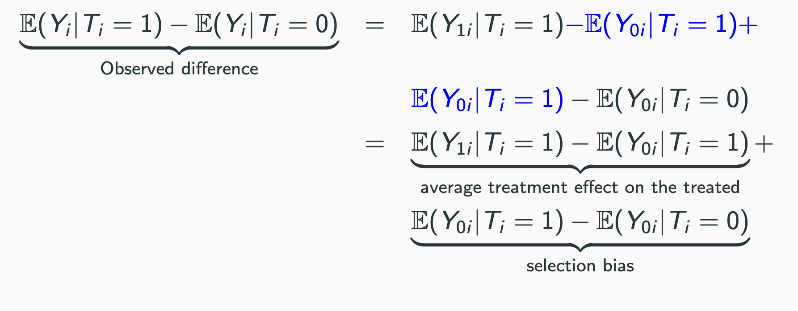
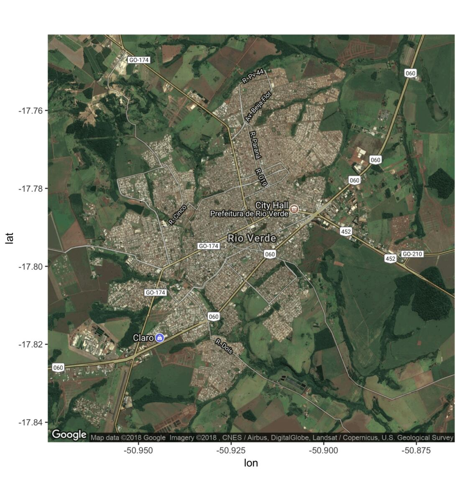
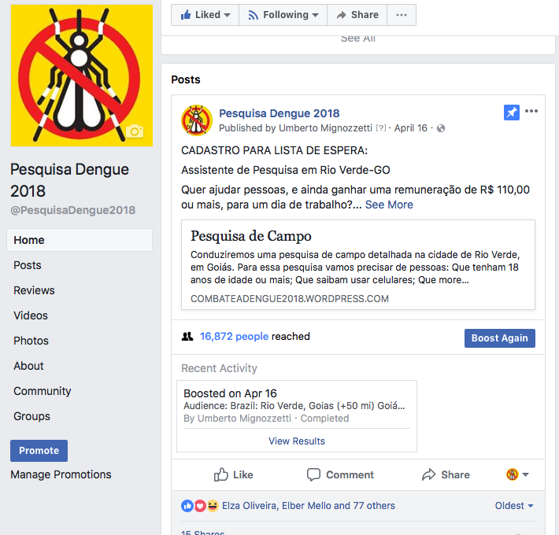
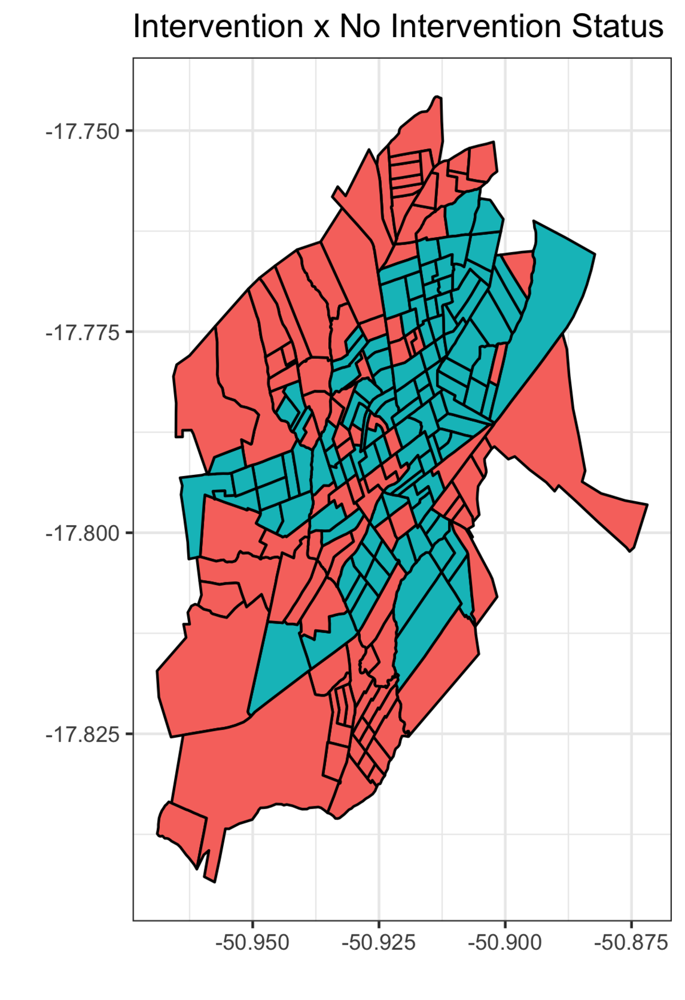
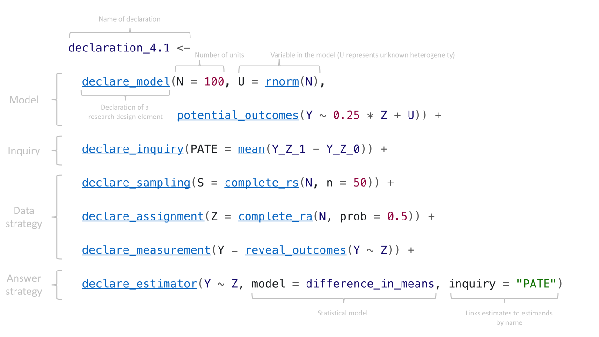
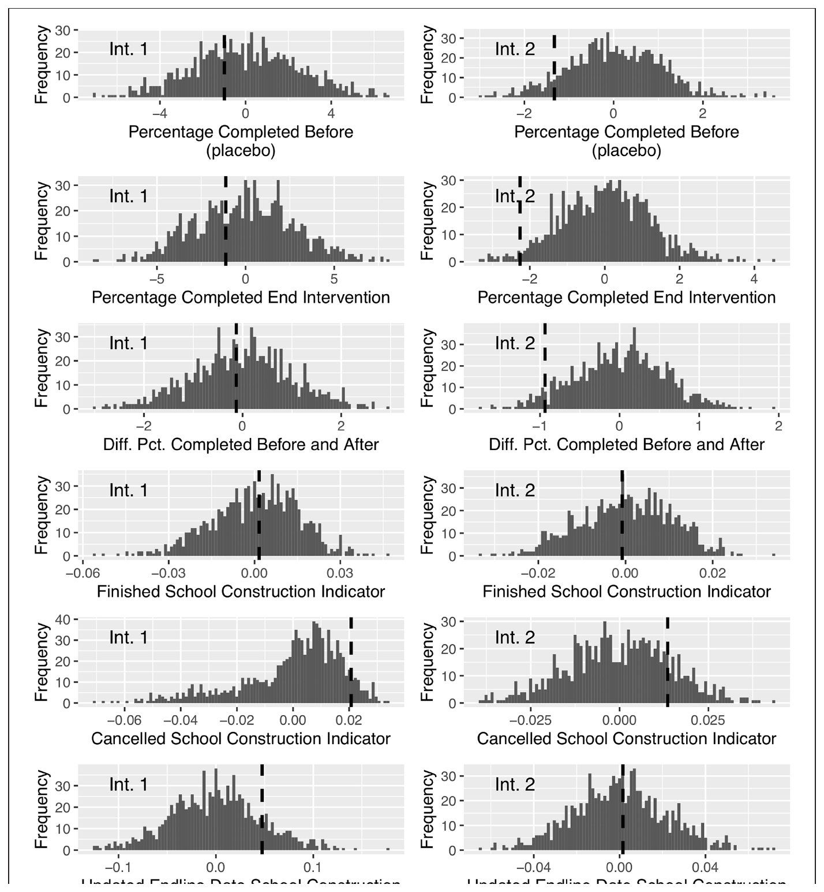

```{r setup, include=FALSE}
options(htmltools.dir.version = FALSE)
library(knitr)
opts_chunk$set(
  echo = FALSE,
  fig.align = "center",
  dpi = 300,
  cache = FALSE
)

options(repos = c(CRAN = "https://cran.rstudio.com/"))

ensure <- function(pkg) {
  if (!require(pkg, character.only = TRUE)) {
    install.packages(pkg, dependencies = TRUE)
    library(pkg, character.only = TRUE)
  }
}
invisible(lapply(c("ggplot2", "dplyr", "estimatr", "fabricatr", "randomizr"), ensure))

suppressPackageStartupMessages({
  library(ggplot2); library(dplyr); library(estimatr)
  library(fabricatr); library(randomizr)
})

# paleta de la casa (mismo par azul/rojo que 01-apertura.qmd)
azul <- "#2d4563"; rojo <- "#b85450"

tema_taller <- theme_minimal(base_size = 15) +
  theme(panel.grid.minor = element_blank(),
        plot.margin = margin(6, 10, 6, 6))

# los datos de la práctica: simulados con fabricatr, el MISMO generador que se
# muestra en la slide "Generá los datos" (con los huecos completos). Semilla fija
# => completar los huecos reproduce exactamente este CSV.
set.seed(3043)
datos <- fabricate(
  N = 400,
  edad            = round(rnorm(N, 38, 7.5)),
  mujer           = rbinom(N, 1, 0.7),
  experiencia     = round(rnorm(N, 7, 2.6)),
  zona            = sample(c("urbana", "rural"), N, replace = TRUE),
  visitas_previas = round(rnorm(N, 35, 6)),
  tratamiento     = complete_ra(N, m = 200),
  visitas = round(20 + 4.5 * tratamiento
                  + 3 * tratamiento * (zona == "urbana")
                  + 0.4 * visitas_previas + rnorm(N, 0, 9)),
  indice_larvario = round(pmax(0, 12 - 2.8 * tratamiento + rnorm(N, 0, 4)), 1)
)
datos$id_agente <- seq_len(nrow(datos))
datos <- datos[, c("id_agente", "tratamiento", "edad", "mujer", "experiencia",
                   "zona", "visitas_previas", "visitas", "indice_larvario")]
```

# El contrafactual que construís {background-color="#2d4563"}

## El plan del bloque

:::{style="margin-top: 10px; font-size: 24px;"}
:::{.columns}
:::{.column width=50%}
[Las ideas]{.alert}

- Resultados potenciales y el [problema fundamental]{.alert}
- El [sesgo de selección]{.alert}: por qué la comparación fácil engaña
- Qué gana [sortear]{.alert}: identificación, poder y transparencia
- [SUTVA]{.alert}, cumplimiento e [ITT vs TOT]{.alert}
- [Balance]{.alert} y efectos [heterogéneos]{.alert}
:::

:::{.column width=50%}
[Las herramientas]{.alert}

- `R`, `tidyverse` y `estimatr`
- La [diferencia de medias]{.alert} como coeficiente (`lm_robust`), con errores estándar [robustos]{.alert}
- Controles para [precisión]{.alert} e interacciones para [subgrupos]{.alert}
- `DeclareDesign` para [simular]{.alert} un diseño antes de correrlo
:::
:::

:::{style="margin-top: 8px; border-left: 4px solid #2d4563; padding: 6px 18px; font-size: 23px;"}
Dos casos de nuestra propia [investigación en la región]{.alert} (dengue y un resultado nulo si el tiempo lo permite), una intro a `DeclareDesign` para [simular]{.alert} diseños, y una práctica guiada donde generás los datos y corrés el código
:::
:::

## Resultados potenciales y el problema fundamental

:::{style="margin-top: 6px; font-size: 23px;"}
:::{.columns}
:::{.column width=50%}
[La notación]{.alert}

Un tratamiento $T$ y un resultado $Y$. Para cada unidad $i$ hay [dos resultados potenciales]{.alert}:

- $Y_{1,i}$: resultado si $i$ [recibe]{.alert} el tratamiento
- $Y_{0,i}$: resultado si $i$ [no lo recibe]{.alert}

El efecto causal sobre esa unidad es la diferencia entre sus dos mundos:

:::{style="text-align: center; font-size: 24px;"}
$\tau_i = Y_{1,i} - Y_{0,i}$
:::

Lo que sí observamos es un solo potencial, el del tratamiento recibido:

:::{style="text-align: center; font-size: 24px;"}
$Y_i = Y_{0,i} + (Y_{1,i} - Y_{0,i})\,T_i$
:::
:::

:::{.column width=50%}
[El problema fundamental]{.alert}

- De un tratado nunca vemos su $Y_{0,i}$; de un control, nunca su $Y_{1,i}$

- Es un [problema de datos faltantes]{.alert}: $\tau_i$ no se calcula para nadie ([Holland, 1986](https://doi.org/10.1080/01621459.1986.10478354))

:::{style="text-align: center; font-size: 22px; margin-bottom: 30px;"}
| Unidad | Trató | $Y_1$ | $Y_0$ |
|:--:|:--:|:--:|:--:|
| 1 | sí | 14 | [?]{.alert} |
| 2 | no | [?]{.alert} | 9 |
| 3 | sí | 11 | [?]{.alert} |
:::


- Por eso no apuntamos al efecto individual, sino a un [promedio]{.alert} $\hat{ATE} = E[Y_1 - Y_0]$

- Se define [sobre toda la población]{.alert}, tratados y no tratados por igual

- Ahí, si no tenemos cuidado con [quién]{.alert} recibe el tratamiento, aparece la trampa
:::
:::
:::

## La comparación ingenua

:::{style="margin-top: 6px; font-size: 24px;"}
:::{.columns}
:::{.column width=46%}
Lo más fácil es restar el promedio de los tratados menos el de los no tratados

Sumando y restando un mismo término (el $Y_0$ de los tratados) esa resta se parte en [dos]{.alert}:

- el [efecto sobre los tratados]{.alert} (lo que queremos)
- el [sesgo de selección]{.alert} (lo que estorba)

El sesgo compara el $Y_0$ de los dos grupos: cómo se [habrían visto sin tratamiento]{.alert} los tratados, contra los controles. Es una brecha que ya existía [antes]{.alert} del programa
:::

:::{.column width=54%}
:::{style="text-align: center; margin-top: 6px;"}
[{width="100%"}](#){data-modal-type="image" data-modal-url="figures/ds385-descomposicion.png"}
:::

:::{style="margin-top: 8px; font-size: 24px;"}
- Las unidades [no se tratan al azar]{.alert}: alguien entra a un programa cuando espera ganar, o sea cuando $Y_{1,i} - Y_{0,i} > 0$

- Si el sesgo es cero, la diferencia observada [ya es]{.alert} el efecto ([Angrist y Pischke, 2015](https://press.princeton.edu/books/paperback/9780691152844/mastering-metrics))
:::
:::
:::
:::

## La solución: sortear

:::{style="margin-top: 6px; font-size: 21px;"}
Si el tratamiento se asigna [al azar]{.alert}, recibirlo deja de depender de los resultados potenciales: $E[Y_{0,i}\mid T_i=1] = E[Y_{0,i}\mid T_i=0]$. El sesgo se anula [en expectativa]{.alert} y la diferencia de medias ya es el efecto causal promedio

:::{.columns}
:::{.column width=50%}
```{r sortear-fig, fig.width=4.6, fig.height=2.9}
set.seed(2026)
n_demo <- 400
x_demo <- rnorm(n_demo, 40, 8)
g_demo <- sample(rep(c("Tratamiento", "Control"), each = n_demo / 2))
df_demo <- data.frame(x = x_demo, g = g_demo)

ggplot(df_demo, aes(x, fill = g)) +
  geom_density(alpha = 0.5, color = NA) +
  scale_fill_manual(values = c("Tratamiento" = rojo, "Control" = azul)) +
  labs(x = "Un rasgo previo cualquiera", y = "Densidad", fill = NULL) +
  tema_taller +
  theme(legend.position = "top", legend.text = element_text(size = 10))
```
:::

:::{.column width=50%}
```{r prepost-fig, fig.width=4.7, fig.height=2.9}
pp <- data.frame(
  momento = factor(rep(c("Antes", "Después"), 2),
                   levels = c("Antes", "Después")),
  grupo = rep(c("Tratamiento", "Control"), each = 2),
  y = c(10, 16, 10, 13))
ggplot(pp, aes(momento, y, color = grupo, group = grupo)) +
  geom_line(linewidth = 1.3) +
  geom_point(size = 3) +
  annotate("segment", x = 2.06, xend = 2.06, y = 13, yend = 16,
           color = "grey30", linewidth = 0.7,
           arrow = arrow(ends = "both", length = unit(0.12, "cm"))) +
  annotate("text", x = 2.12, y = 14.5, label = "efecto\nreal +3",
           hjust = 0, size = 3.1, color = "grey30", lineheight = 0.9) +
  scale_color_manual(values = c("Tratamiento" = rojo, "Control" = azul)) +
  scale_y_continuous(limits = c(8.5, 17), breaks = c(10, 13, 16)) +
  xlim("Antes", "Después", " ") +
  labs(x = NULL, y = "Resultado", color = NULL) +
  tema_taller +
  theme(legend.position = "top")
```
:::
:::

:::{style="margin-top: 8px; font-size: 20px;"}
- El sorteo equilibra lo que medís [y también lo que no podés medir]{.alert}, que es lo más difícil de cualquier otro método ([Duflo, Glennerster y Kremer, 2007](https://doi.org/10.1016/S1573-4471(07)04061-2))

- Las pruebas de balance no demuestran que el sorteo fue válido: sólo son [consistentes]{.alert} con la hipótesis ([Mutz et al., 2019](https://doi.org/10.1080/00031305.2017.1322143))
:::
:::

## Los supuestos finos: SUTVA y cumplimiento

:::{style="margin-top: 6px; font-size: 24px;"}
:::{.columns}
:::{.column width=50%}
[SUTVA]{.alert}: el tratamiento de una unidad no cambia el resultado de otra. Se rompe si hay:

- [Contagio]{.alert}: vacunar a uno protege al vecino
- [Interferencia]{.alert}: un subsidio desvía clientes de otros
- [Contaminación]{.alert}: el control copia al tratamiento

Si falla, la diferencia de medias [mezcla]{.alert} efecto directo e indirecto. Salida: sortear por [conglomerados]{.alert} y separar los brazos
:::

:::{.column width=50%}
[Cumplimiento]{.alert}: no todos hacen lo que su asignación indica

- [ITT]{.alert}: efecto de [ofrecer]{.alert} el programa (todos los asignados); es lo que decide una política real
- [TOT]{.alert}: efecto sobre quienes [de verdad]{.alert} lo tomaron; otra pregunta, más supuestos

Capacitación gratis, asiste el 30%: el ITT mide la oferta; el TOT, asistir

:::{style="margin-top: 4px; border-left: 4px solid #2d4563; padding: 4px 20px; font-size: 19px;"}
En el dengue, el contagio entre grupos casi arruina el experimento
:::
:::
:::
:::

## De la teoría a la estimación

:::{style="margin-top: 8px; font-size: 24px;"}
:::{.columns}
:::{.column width=52%}
Todo esto aterriza en [una línea de código]{.alert}. Con asignación al azar:

- El ATE es el coeficiente de $T$ en una regresión: $Y_i = \alpha + \beta\,T_i + \varepsilon_i$

- $\hat{\beta}$ es exactamente la [diferencia de medias]{.alert}; el $t$-test da lo mismo

- Usamos errores estándar [robustos]{.alert} (`lm_robust`): corrigen heterocedasticidad sin costo

- Agregar covariables [pre-tratamiento]{.alert} no corrige sesgo (no hay), pero sube la [precisión]{.alert}
:::

:::{.column width=48%}
Antes de gastar un peso en el campo, se puede [simular el diseño]{.alert}:

- `DeclareDesign` deja declarar población, asignación y estimador, y [diagnosticar]{.alert} sesgo y poder sobre datos simulados

- Respondés "¿con esta muestra, detecto un efecto de este tamaño?" [sin datos reales]{.alert}

- Lo vemos [en un rato]{.alert}, antes de la práctica ([Blair et al., 2019](https://doi.org/10.1017/S0003055419000194))

:::
:::

:::{style="margin-top: 20px;"}
```r
library(estimatr)

modelo <- lm_robust(resultado ~ tratamiento + covariable1 + covariable2,
                     data = datos, se_type = "HC2")
summary(modelo)
```
:::
:::

# El caso: incentivos contra el dengue {background-color="#2d4563"}

## El problema de política

:::{style="margin-top: 8px; font-size: 24px;"}
:::{.columns}
:::{.column width=56%}
El [*Aedes aegypti*]{.alert} transmite dengue, zika y chikungunya. Sin vacunas seguras para la mayoría, la prevención depende de [agentes de salud]{.alert} que recorren casa por casa eliminando criaderos

- Los agentes trabajan [de a pares]{.alert}, y el esfuerzo es difícil de supervisar

- Cuando uno afloja, aparece el [problema del polizón]{.alert}: el otro carga con el trabajo ([Holmström, 1982](https://doi.org/10.2307/3003457))

- La pregunta: ¿un [incentivo económico]{.alert} mejora la productividad del control del mosquito?

- Y una más fina: ¿conviene premiar al [individuo]{.alert} o al [equipo]{.alert}?

- Pagar por desempeño en salud es [polémico]{.alert}: un bono mal puesto premia sólo lo que se mide y puede desplazar la motivación intrínseca
:::

:::{.column width=44%}
[{width="100%"}](#){data-modal-type="image" data-modal-url="figures/dengue-mapa.jpeg"}

:::{style="font-size: 15px; text-align: center; color: #555;"}
Rio Verde (Goiás): 229 mil habitantes, 1.156 casos de dengue en 2017 y 3.411 entre enero y septiembre de 2018 ([Freire y Mignozzetti, 2022](https://github.com/danilofreire/incentives-healthcare))
:::
:::
:::
:::

## El diseño y los tres brazos

:::{style="margin-top: 30px; font-size: 21px;"}
:::{.columns}
:::{.column width=56%}
- [Reclutamiento]{.alert} por Facebook → formulario → capacitación. Quien no fue a la capacitación quedó afuera

- [Sorteo simple]{.alert} a tres grupos, verificado con pruebas de balance sobre siete variables previas (edad, altruismo, religiosidad, ingreso, compromiso político y social, popularidad en Facebook)

- La productividad se [verifica con evidencia]{.alert}: foto del criadero, video de las larvas, foto de la casa. No con lo que el agente dice

- [Control]{.alert} ($n=58$): pago fijo de R\$ 110 (US\$ 25), sin bono
- [Bono individual]{.alert} ($n=64$): se [duplica]{.alert} el pago (R\$ 220) a quien queda por encima de la mediana
- [Bono colectivo]{.alert} ($n=74$): se duplica si [el par]{.alert} queda por encima de la mediana. El premio es compartido: conviene cooperar y controlarse
:::

:::{.column width=44%}
[{width="100%"}](#){data-modal-type="image" data-modal-url="figures/dengue-reclutamiento.png"}

:::{style="font-size: 18px; text-align: center; color: #555;"}
Reclutamiento por Facebook, la red más usada en Brasil
:::
:::
:::
:::

## Qué pasó

:::{style="margin-top: 4px; font-size: 24px;"}
:::{.columns}
:::{.column width=56%}
```{r resultados-fig, fig.width=5.0, fig.height=4.0}
res_paper <- data.frame(
  outcome = rep(c("Criaderos eliminados", "Larvas exterminadas",
                  "Casas visitadas", "Visitas < 2 min"), each = 2),
  brazo = rep(c("Individual", "Colectivo"), 4),
  est = c(25.1, 21.9, 3.9, 18.4, -9.1, -6.3, -7.4, -5.4),
  se  = c(5.21, 4.05, 5.6, 7.5, 4.84, 4.37, 3.96, 3.52))
res_paper$outcome <- factor(res_paper$outcome,
  levels = c("Visitas < 2 min", "Casas visitadas",
             "Larvas exterminadas", "Criaderos eliminados"))
res_paper$brazo <- factor(res_paper$brazo, levels = c("Individual", "Colectivo"))

ggplot(res_paper, aes(est, outcome, color = brazo)) +
  geom_vline(xintercept = 0, linetype = 2, color = "grey55") +
  geom_pointrange(aes(xmin = est - 1.96 * se, xmax = est + 1.96 * se),
                  position = position_dodge(width = 0.5), linewidth = 0.9) +
  scale_color_manual(values = c("Individual" = azul, "Colectivo" = rojo)) +
  labs(x = "Efecto estimado vs. control", y = NULL, color = NULL) +
  tema_taller +
  theme(legend.position = "top")
```
:::

:::{.column width=44%}
- [Criaderos eliminados]{.alert}: los dos bonos suben fuerte (+22 a +25 por par, $p<0{,}01$)

- [Larvas exterminadas]{.alert}: sólo el bono [colectivo]{.alert} las sube (+18,4 puntos, $p<0{,}05$); el individual no. La tarea difícil premia la cooperación

- [Casas visitadas]{.alert} y [visitas con menos de 2 minutos]{.alert}: baja. ¿Es una señal buena o mala?

- [Enfermedad]{.alert}: combinando ambos brazos, la incidencia baja 10,3%, pero el resultado no es robusto a todas las especificaciones
:::
:::

:::{style="margin-top: 2px; font-size: 22px; color: #555; text-align: center"}
Datos reales (Table 2, N = 196, errores robustos): las larvas van en puntos porcentuales, el resto en conteos por par. En la práctica vas a usar una versión simplificada
:::
:::

## Lo que no se ve: hacerlo en la región

:::{style="margin-top: 6px; font-size: 23px;"}
:::{.columns}
:::{.column width=56%}
El paper tiene tablas prolijas. El trabajo de campo fue [otra cosa]{.alert}:

- Convencer a [políticos]{.alert} de sortear en vez de repartir el beneficio a todos, y lidiar con la [resistencia]{.alert} de la administración

- El contagio entre grupos casi voltea el diseño: los del brazo tratado le [contaron]{.alert} a los del control que a ellos les pagaban más

- El control empezó a [exigir plata]{.alert} a los asistentes de investigación y a [amenazarlos]{.alert}

- Hubo que [cortar]{.alert} el operativo a mitad de camino y tuvimos que meter a la [policía]{.alert} en el caso 😅

- Elegí bien el resultado, hacé un piloto, calculá el poder y registrá un [plan de análisis previo]{.alert} ([Olken, 2015](https://doi.org/10.1257/jep.29.3.61))
:::

:::{.column width=44%}
:::{style="text-align: center; margin-top: 6px;"}
[{width="70%"}](#){data-modal-type="image" data-modal-url="figures/dengue-area.png"}
:::

:::{style="font-size: 20px; text-align: center; color: #555;"}
Sectores de trabajo: intervención y control
:::
:::
:::
:::

# Simular antes de correr {background-color="#2d4563"}

## DeclareDesign: declarar el diseño

:::{style="margin-top: 6px; font-size: 21px;"}
:::{.columns}
:::{.column width=50%}
Un plan de análisis se puede escribir [como código]{.alert} y probarlo antes del campo. `DeclareDesign` arma el diseño en piezas (MIDA), que se suman con `+` como en `ggplot`:

- `declare_model()`: población y [resultados potenciales]{.alert} 
- `declare_inquiry()`: la pregunta, el [estimando]{.alert} (el ATE)
- `declare_assignment()`: el [sorteo]{.alert}
- `declare_measurement()`: qué resultado se [observa]{.alert} 
- `declare_estimator()`: cómo se [estima]{.alert} 

`diagnose_design()` [simula]{.alert} el diseño miles de veces y devuelve sesgo, poder y cobertura, [antes]{.alert} de gastar un peso ([Blair, Coppock y Humphreys, 2023](https://book.declaredesign.org/))

`declare_sampling()` ni siempre es necesario: si la población es la muestra, se puede omitir
:::

:::{.column width=50%}
:::{style="text-align: center;"}
[{width="100%"}](#){data-modal-type="image" data-modal-url="figures/declaredesign-declaracion.svg"}

:::{style="font-size: 20px; color: #555;"}
Figura 1: un experimento de dos brazos, declarado (<https://declaredesign.org>)
:::
:::
:::
:::
:::

## Diseños listos: DesignLibrary

:::{style="margin-top: 6px; font-size: 23px;"}
:::{.columns}
:::{.column width=46%}
No hace falta declarar todo a mano. [`DesignLibrary`](https://declaredesign.org/r/designlibrary/) trae [diseñadores]{.alert} ya codificados: pasás unos parámetros y sale un diseño completo, listo para `diagnose_design()`.

Algunos que sirven para el taller:

- `two_arm_designer`: dos brazos
- `multi_arm_designer`: varios brazos (como el dengue)
- `block_cluster_two_arm_designer`: bloques y clusters
- `regression_discontinuity_designer`: el RDD de la tarde
- <https://declaredesign.org/r/designlibrary/> para ver todos los diseñadores
:::

:::{.column width=54%}
:::{style="margin-top: 30px;"}
```{r dl-demo, echo=TRUE, eval=FALSE}
library(DesignLibrary)

# dos brazos simple
d1 <- two_arm_designer(N = 200, ate = 0.3)

# varios brazos (como el dengue)
d2 <- multi_arm_designer(m_arms = 3,
        outcome_means = c(0, 0.3, 0.6))

# bloques y conglomerados
d3 <- block_cluster_two_arm_designer(
        N_blocks = 5, N_clusters_in_block = 10)

# regresión discontinua (el RDD de la tarde)
d4 <- regression_discontinuity_designer(
        N = 1000, cutoff = 0.5)

# sesgo, poder, cobertura...
diagnose_design(d1)
```
:::
:::
:::
:::

## Generá los datos de la práctica {#sec:ej-datos}

:::{style="margin-top: 4px; font-size: 24px;"}
Con `fabricatr` y `randomizr` (la cocina de `DeclareDesign`) armamos los datos [simulados]{.alert} del dengue. Te dimos la muestra (`N = 400`) y el efecto del incentivo (`4.5`); completá los dos [huecos]{.alert} y corré:

:::{.columns}
:::{.column width=62%}
:::{style="margin-top: 10px; font-size: 21px;"}
```{r gen-datos-show, echo=TRUE, eval=FALSE}
library(fabricatr); library(randomizr)
set.seed(3043)

datos <- fabricate(
  N = 400,
  edad            = round(rnorm(N, 38, 7.5)),
  mujer           = rbinom(N, 1, 0.7),
  experiencia     = round(rnorm(N, 7, 2.6)),
  zona            = sample(c("urbana", ___), ___, replace = ___),
  visitas_previas = ___,                        # (b)
  tratamiento     = complete_ra(N, m = N / 2),
  visitas = round(20 + 4.5 * tratamiento
                  + 3 * tratamiento * (zona == "urbana")
                  + 0.4 * visitas_previas + rnorm(N, 0, 9)),
  indice_larvario = round(pmax(0, 12 - 2.8 * tratamiento
                               + rnorm(N, 0, 4)), 1)
)
```
:::
:::

:::{.column width=38%}
:::{style="margin-top: 10px; font-size: 20px;"}
```{r gen-datos-head, echo=TRUE, eval=TRUE, message=FALSE, warning=FALSE}
datos |>
  select(tratamiento, zona, visitas) |>
  head()
```
:::

:::{style="font-size: 23px; color: #555;"}
[(a)]{.alert} `zona`: sorteá `"urbana"` o `"rural"` con `sample` sobre `N`, con reemplazo. [(b)]{.alert} `visitas_previas`: un `rnorm` de media 35 y desvío 6, redondeado (igual que `experiencia`)
:::
:::
:::

:::{style="margin-top: 6px;"}
[[Ver solución](#sec:sol-datos)]{.button}
:::
:::

# Práctica {background-color="#2d4563"}

## De qué se trata la práctica

:::{style="margin-top: 6px; font-size: 24px;"}
:::{.columns}
:::{.column width=56%}
Trabajamos con una versión [simulada]{.alert} del experimento del dengue: 400 agentes sorteados a recibir un incentivo (`tratamiento` = 1) o no (`tratamiento` = 0).

Objetivos:

- estimar el efecto con una [diferencia de medias]{.alert} robusta
- leer una [tabla de balance]{.alert} y saber cuándo preocuparse
- ver que los [controles]{.alert} en un experimento son para precisión, no para sesgo
- buscar efectos [heterogéneos]{.alert} con una interacción
:::

:::{.column width=44%}
[Las variables]{.alert}

:::{style="font-size: 24px;"}
| Variable | Qué es |
|:--|:--|
| `tratamiento` | 1 = recibió el incentivo |
| `visitas` | criaderos tratados (resultado) |
| `indice_larvario` | larvas por casa (resultado) |
| `edad`, `experiencia` | rasgos previos del agente |
| `zona` | urbana / rural |
| `visitas_previas` | actividad antes del estudio |
:::

Vamos a usar los datos que creamos, pero también podés bajarlos desde [la página del taller](https://danilofreire.github.io/taller-evidencia-ucu/materiales.html)
:::
:::
:::

## Los datos y los paquetes

:::{style="margin-top: 6px; font-size: 19px;"}
Cargá los paquetes del análisis (los `datos` ya los generamos con `fabricatr`), mirá qué tenés y compará las medias por grupo

```{r practica-setup}
#| echo: true
#| eval: true
#| message: false
#| warning: false
library(tidyverse)
library(estimatr)
# `datos` ya está en memoria. ¿Preferís bajarlo del repo? Descomentá:
# datos <- read.csv("https://raw.githubusercontent.com/danilofreire/taller-evidencia-ucu/main/diapositivas/datos/dengue_incentivos.csv")

glimpse(datos)

datos |>
  group_by(tratamiento) |>
  summarise(n = n(),
            visitas = mean(visitas),
            indice_larvario = mean(indice_larvario))
```

[¿El grupo tratado (tratamiento = 1) ya se ve distinto? ¿En qué dirección?]{.alert}
:::

## La diferencia de medias

:::{style="margin-top: 30px; font-size: 24px;"}
Como el incentivo se sorteó, la [diferencia de medias]{.alert} entre tratados y control ya es el efecto. `estimatr` la calcula, con su error estándar y su $t$-test, con `difference_in_means`

:::{style="margin-top: 60px; margin-bottom: 60px;"}
```{r practica-dim}
#| echo: true
#| eval: true
#| message: false
#| warning: false
difference_in_means(visitas ~ tratamiento, data = datos)
```
:::

[El estimado son las visitas de más por el incentivo. ¿El intervalo de confianza cruza el cero?]{.alert}
:::

## La regresión da lo mismo

:::{style="margin-top: 8px; font-size: 24px;"}
La misma diferencia sale de una regresión con errores estándar robustos: el coeficiente de `tratamiento` [coincide]{.alert} con la diferencia de medias

```{r practica-reg}
#| echo: true
#| eval: true
#| message: false
#| warning: false
ajuste_visitas <- lm_robust(visitas ~ tratamiento, data = datos)
summary(ajuste_visitas)
```

- El [punto estimado]{.alert} es idéntico al de `difference_in_means`

- ¿Para qué la regresión, entonces? Porque [escala]{.alert}: le sumás controles, interacciones y efectos fijos sin cambiar de herramienta

- El $t$-test es un [caso particular]{.alert} de la regresión, no una técnica aparte
:::

## Tabla de balance

:::{style="margin-top: 8px; font-size: 22px;"}
Un buen sorteo deja los grupos parejos [antes]{.alert} del tratamiento. Corré un modelo por covariable y juntá las diferencias con su valor $p$.

```{r practica-balance}
#| echo: true
#| eval: true
#| message: false
#| warning: false
# 1. un modelo por covariable: ¿difiere entre tratados y control?
b_edad    <- lm_robust(edad ~ tratamiento, data = datos)
b_exp     <- lm_robust(experiencia ~ tratamiento, data = datos)
b_previas <- lm_robust(visitas_previas ~ tratamiento, data = datos)

# 2. juntamos la diferencia (coef. de tratamiento) y su valor p en una tabla
balance <- data.frame(
  variable = c("edad", "experiencia", "visitas_previas"),
  dif      = round(c(b_edad$coefficients["tratamiento"],
                     b_exp$coefficients["tratamiento"],
                     b_previas$coefficients["tratamiento"]), 2),
  p_valor  = round(c(b_edad$p.value["tratamiento"],
                     b_exp$p.value["tratamiento"],
                     b_previas$p.value["tratamiento"]), 3)
)
balance
```

[Casi ninguna diferencia debería ser significativa. Pero mirá `experiencia`...]{.alert}
:::

## Balance: para discutir

:::{style="margin-top: 12px; font-size: 26px;"}
La tabla muestra una covariable [significativa]{.alert} (`experiencia`) aunque el tratamiento se sorteó. Antes de correr a "arreglarlo":

:::{style="margin-top: 80px; border-left: 4px solid #2d4563; padding: 8px 20px; font-size: 26px;"}
:::{.incremental}
- Con muchas covariables, ¿cuántas esperás que salgan significativas [sólo por azar]{.alert}?

- ¿Un valor $p$ significativo prueba que el sorteo [falló]{.alert}? ¿O es lo esperable en cada muestra concreta?

- El balance sólo cubre lo que [medimos]{.alert}. ¿Qué pasa con las variables que no observamos? ¿Por qué el sorteo igual nos protege de ellas?
:::
:::
:::

## Controles: precisión, no sesgo

:::{style="margin-top: 8px; font-size: 23px;"}
En un experimento no hace falta controlar para quitar sesgo (el sorteo ya lo hizo). Pero sumar covariables [pre-tratamiento]{.alert} puede achicar el error estándar

```{r practica-controles}
#| echo: true
#| eval: true
#| message: false
#| warning: false
ajuste_ctrl <- lm_robust(visitas ~ tratamiento + edad + visitas_previas,
                         data = datos)
summary(ajuste_ctrl)
```

- El coeficiente de `tratamiento` casi no cambia; su [error estándar]{.alert} suele bajar

- Los coeficientes de `edad` o `visitas_previas` [no]{.alert} tienen lectura causal. [**¿Por qué no?**]{.alert}
:::

## Ajuste a la Lin: covariables sin trampa

:::{style="margin-top: 6px; font-size: 18px;"}
Meter covariables a lo bruto puede colar un [sesgo chico]{.alert} (crítica de Freedman). La receta de [Lin (2013)]{.alert}: centrar las covariables e [interactuarlas]{.alert} con el tratamiento. `estimatr` lo hace en la función `lm_lin()`

```{r practica-lin}
#| echo: true
#| eval: true
#| message: false
#| warning: false
ajuste_lin <- lm_lin(visitas ~ tratamiento,
                     covariates = ~ edad + visitas_previas,
                     data = datos)
summary(ajuste_lin)
```

- Mismo efecto, [error estándar]{.alert} igual o menor que sin ajustar

- Es el ajuste de covariables [recomendado]{.alert} para experimentos, sin el riesgo de sesgo de la regresión ingenua
:::

## Probá vos: ¿para quién funciona? {#sec:ej-interaccion}

:::{style="margin-top: 16px; font-size: 24px;"}
[Completá el código]{.alert} para ver si el efecto del incentivo cambia entre zona urbana y rural. Reemplazá los `___`:

```{r practica-probavos}
#| echo: true
#| eval: false
ajuste_hetero <- lm_robust(visitas ~ tratamiento ___ zona, data = datos)
summary(ajuste_hetero)
```

:::{style="margin-top: 12px; font-size: 20px;"}
- ¿Qué operador une `tratamiento` y `zona` para pedir una [interacción]{.alert}?

- ¿Qué signo tiene el término de interacción y qué te dice sobre [dónde]{.alert} rinde más el incentivo?

- Cuidado: los subgrupos casi nunca están [pre-registrados]{.alert}, así que se leen como exploración, no como prueba
:::

[[Ver solución](#sec:sol-interaccion)]{.button}
:::

# Cuando el resultado es nulo {background-color="#2d4563"}

## Cuando la respuesta es cero

:::{style="margin-top: 6px; font-size: 24px;"}
:::{.columns}
:::{.column width=56%}
No todos los experimentos encuentran un efecto. Un [cero creíble]{.alert} también es información.

- La app [*Tá de Pé*]{.alert} deja a los ciudadanos monitorear obras de [escuelas públicas]{.alert}: ver el estado, mandar fotos y presionar a la alcaldía. Es rendición de cuentas [desde abajo]{.alert}

- Campo aleatorizado en municipios de Brasil, en dos olas (2017–19): primero a nivel municipio, después a nivel escuela, [por bloques]{.alert}

- Muestra grande y [con poder]{.alert}, con un placebo que debía dar nulo. Google Analytics confirma que la gente [usó]{.alert} la app

- Y sin embargo: los coeficientes son chicos, [no significativos]{.alert} y con signos que cambian. El diseño [descarta]{.alert} los efectos grandes que la teoría predecía
:::

:::{.column width=44%}
:::{style="text-align: center;"}
[{width="72%"}](#){data-modal-type="image" data-modal-url="figures/nulo-paper.jpg"}

:::{style="font-size: 19px; color: #555;"}
Freire, Galdino y Mignozzetti (2020), *Research & Politics*
:::
:::
:::
:::
:::

## El nulo, puesto a prueba: inferencia por aleatorización

:::{style="margin-top: 4px; font-size: 22px;"}
:::{.columns}
:::{.column width=42%}
¿El cero es real o falta de poder? El diseño y una prueba extra lo respaldan:

- Dos olas grandes: sorteo por [municipio]{.alert} (2.642 vs 344) y por [escuela]{.alert} en bloques (3.717 vs 659)

- La [inferencia por aleatorización]{.alert} compara el efecto observado (línea punteada) contra la distribución de [todas las asignaciones posibles]{.alert} bajo la hipótesis nula, sin apoyarse en la normalidad ([paquete `ri2`]{.alert})

- El estimado real cae [dentro]{.alert} de la nube en casi todos los casos: no se rechaza el nulo, salvo cancelaciones en la ola 1

- Un cero de un diseño así [pesa]{.alert} tanto como un efecto
:::

:::{.column width=58%}
:::{style="text-align: center;"}
[{width="75%"}](#){data-modal-type="image" data-modal-url="figures/nulo-ri.png"}

:::{style="font-size: 13px; color: #555;"}
Distribución del coeficiente bajo aleatorización; la línea punteada es el efecto observado ([Freire, Galdino y Mignozzetti, 2020](https://doi.org/10.1177/2053168020914444), Fig. 4)
:::
:::
:::
:::
:::

## Para discutir: ¿por qué publicar un nulo?

:::{style="margin-top: 12px; font-size: 26px;"}
Un nulo creíble casi nunca llega a una revista. Pensemos como científicos sociales:

:::{style="margin-top: 50px; border-left: 4px solid #b85450; padding: 8px 20px; font-size: 26px;"}
- ¿Por qué el sistema [premia]{.alert} los efectos y castiga los ceros? ¿A quién beneficia ese sesgo?

- Si diez equipos prueban la misma idea y sólo se publica el que "encontró algo", ¿qué le pasa a la [evidencia acumulada]{.alert}?

- ¿Qué [gana]{.alert} un gobierno al saber que un programa no funciona? ¿Y una ONG que iba a copiarlo?
:::
:::

## Para llevarte

:::{style="margin-top: 8px; font-size: 23px;"}
:::{.columns}
:::{.column width=50%}
[Las ideas]{.alert}

- El efecto causal necesita un [contrafactual]{.alert}, y el contrafactual no se observa: se construye

- [Sortear]{.alert} lo construye casi solo, porque equilibra los grupos en expectativa

- Balance esperado no es balance [garantizado]{.alert} en cada muestra

- Los supuestos finos ([SUTVA]{.alert}, cumplimiento) pueden torcer un experimento bien sorteado

- Simular el diseño de antemano te dice si vas a [poder detectar]{.alert} el efecto

- Los [nulos]{.alert} creíbles informan tanto como los efectos, aunque se publiquen menos
:::

:::{.column width=50%}
[La caja de herramientas]{.alert}

- `difference_in_means` y `lm_robust`: el efecto con errores [robustos]{.alert}

- Controles pre-tratamiento para [precisión]{.alert}, no para sesgo

- `lm_lin`: ajuste de covariables [sin sesgo]{.alert} (Lin)

- Interacciones para efectos [heterogéneos]{.alert} (con cautela)

- Pruebas de [balance]{.alert}: un modelo por covariable

- `fabricatr` y `randomizr` para [simular]{.alert} datos y sortear

- `DeclareDesign` para [diagnosticar]{.alert} el diseño antes de gastar en campo
:::
:::

:::{style="margin-top: 8px; border-left: 4px solid #2d4563; padding: 6px 18px; font-size: 22px;"}
Cuando no podés sortear, el resto del día es sobre cómo [encontrar]{.alert} o [armar]{.alert} un contrafactual creíble
:::
:::

## Para seguir

:::{style="margin-top: 8px; font-size: 22px;"}
:::{.columns}
:::{.column width=50%}
[Para leer]{.alert}

- Angrist y Pischke, *Mastering 'Metrics* (2015): el capítulo sobre experimentos

- Gerber y Green, *Field Experiments* (2012): el manual de campo

- Duflo, Glennerster y Kremer (2007): el toolkit de aleatorización

- [Blair, Coppock y Humphreys (2023)](https://book.declaredesign.org/): el libro de `DeclareDesign`, gratis online

[Nuestros casos de hoy]{.alert}

- [Freire y Mignozzetti (2022)](https://github.com/danilofreire/incentives-healthcare): incentivos y dengue

- [Freire, Galdino y Mignozzetti (2020)](https://doi.org/10.1177/2053168020914444): el cero informativo

- Fichas completas en las [referencias](#sec:referencias)
:::

:::{.column width=50%}
[Herramientas en R]{.alert}

- [`estimatr`](https://declaredesign.org/r/estimatr/): `lm_robust`, `lm_lin`, `difference_in_means`

- Errores [agrupados]{.alert}: `lm_robust(y ~ z, clusters = ...)` si sorteás por conglomerados

- [`DeclareDesign`](https://declaredesign.org/): declarar, diagnosticar y simular diseños

- [`fabricatr`](https://declaredesign.org/r/fabricatr/) y [`randomizr`](https://declaredesign.org/r/randomizr/): simular datos y sortear

- [`ri2`](https://cran.r-project.org/package=ri2): inferencia por aleatorización (la de la Fig. 4)

- Múltiples resultados: ajustá los $p$ con `p.adjust()` o armá un índice
:::
:::
:::

# Apéndice: soluciones {background-color="#2d4563"}

## Solución: generá los datos {#sec:sol-datos}

:::{style="margin-top: 6px; font-size: 21px;"}
Los dos huecos, completos y en contexto:

:::{style="margin-top: 6px; font-size: 17px;"}
```{r sol-datos, echo=TRUE, eval=FALSE}
library(fabricatr); library(randomizr)
set.seed(3043)

datos <- fabricate(
  N = 400,
  edad            = round(rnorm(N, 38, 7.5)),
  mujer           = rbinom(N, 1, 0.7),
  experiencia     = round(rnorm(N, 7, 2.6)),
  zona            = sample(c("urbana", "rural"), N, replace = TRUE),  # (a)
  visitas_previas = round(rnorm(N, 35, 6)),                           # (b)
  tratamiento     = complete_ra(N, m = N / 2),
  visitas = round(20 + 4.5 * tratamiento
                  + 3 * tratamiento * (zona == "urbana")
                  + 0.4 * visitas_previas + rnorm(N, 0, 9)),
  indice_larvario = round(pmax(0, 12 - 2.8 * tratamiento
                               + rnorm(N, 0, 4)), 1)
)
```
:::

[(a)]{.alert} `sample()` sortea una zona para cada uno de los `N` agentes; `replace = TRUE` porque la misma zona se repite muchas veces. [(b)]{.alert} `round(rnorm(N, 35, 6))`: visitas previas con media 35 y desvío 6, redondeadas a enteros

:::{style="margin-top: 6px; font-size: 19px; color: #555;"}
Con la semilla 3043, esto reproduce [exactamente]{.alert} el `datos` que venimos usando y el CSV del repo
:::

[[Volver al ejercicio](#sec:ej-datos)]{.button}
:::

## Solución: la interacción {#sec:sol-interaccion}

:::{style="margin-top: 10px; font-size: 19px;"}
```{r sol-interaccion}
#| echo: true
#| eval: true
#| message: false
#| warning: false
ajuste_hetero <- lm_robust(visitas ~ tratamiento * zona, data = datos)
summary(ajuste_hetero)
```

El operador es `*`: pide los dos efectos [más]{.alert} su interacción. Como `rural` es la categoría de referencia, el efecto del incentivo ahí es $\approx 4{,}5$; el término `tratamiento:zonaurbana` ($\approx +3$) dice que en la zona [urbana]{.alert} rinde más. Léelo como exploración: no estaba pre-registrado.

[[Volver al ejercicio](#sec:ej-interaccion)]{.button}
:::

# Nos vemos después del café ☕ {background-color="#2d4563"}

## Referencias {#sec:referencias}

:::{style="font-size: 15px;"}
:::{.columns}
:::{.column width=50%}
Angrist, J. y Pischke, J.-S. (2015). *Mastering 'Metrics: The Path from Cause to Effect*. Princeton University Press. [enlace](https://press.princeton.edu/books/paperback/9780691152844/mastering-metrics)

Blair, G., Cooper, J., Coppock, A. y Humphreys, M. (2019). Declaring and diagnosing research designs. *American Political Science Review* 113(3):838–859. [doi](https://doi.org/10.1017/S0003055419000194)

Blair, G., Coppock, A. y Humphreys, M. (2023). *Research Design in the Social Sciences: Declaration, Diagnosis, and Redesign*. Princeton University Press. [enlace](https://book.declaredesign.org/)

Duflo, E., Glennerster, R. y Kremer, M. (2007). Using randomization in development economics research: a toolkit. *Handbook of Development Economics* 4:3895–3962. [doi](https://doi.org/10.1016/S1573-4471(07)04061-2)

Falk, A. e Ichino, A. (2006). Clean evidence on peer effects. *Journal of Labor Economics* 24(1):39–57. [doi](https://doi.org/10.1086/497818)

Freire, D., Galdino, M. y Mignozzetti, U. (2020). Bottom-up accountability and public service provision: evidence from a field experiment in Brazil. *Research & Politics* 7(2). [doi](https://doi.org/10.1177/2053168020914444)

Freire, D. y Mignozzetti, U. (2022). Financial incentives and health care provision: evidence from an experimental *Aedes aegypti* control program in Brazil. *Working paper*. [enlace](https://github.com/danilofreire/incentives-healthcare)

Gerber, A. y Green, D. (2012). *Field Experiments: Design, Analysis, and Interpretation*. W. W. Norton.
:::

:::{.column width=50%}
Holland, P. (1986). Statistics and causal inference. *Journal of the American Statistical Association* 81(396):945–960. [doi](https://doi.org/10.1080/01621459.1986.10478354)

Holmström, B. (1982). Moral hazard in teams. *The Bell Journal of Economics* 13(2):324–340. [doi](https://doi.org/10.2307/3003457)

Itoh, H. (1991). Incentives to help in multi-agent situations. *Econometrica* 59(3):611–636. [doi](https://doi.org/10.2307/2938316)

Lin, W. (2013). Agnostic notes on regression adjustments to experimental data: reexamining Freedman's critique. *Annals of Applied Statistics* 7(1):295–318. [doi](https://doi.org/10.1214/12-AOAS583)

Mutz, D., Pemantle, R. y Pham, P. (2019). The perils of balance testing in experimental design. *The American Statistician* 73(1):32–42. [doi](https://doi.org/10.1080/00031305.2017.1322143)

Olken, B. (2015). Promises and perils of pre-analysis plans. *Journal of Economic Perspectives* 29(3):61–80. [doi](https://doi.org/10.1257/jep.29.3.61)

Rosenbaum, P. y Rubin, D. (1985). Constructing a control group using multivariate matched sampling methods. *The American Statistician* 39(1):33–38. [doi](https://doi.org/10.1080/00031305.1985.10479383)
:::
:::
:::
