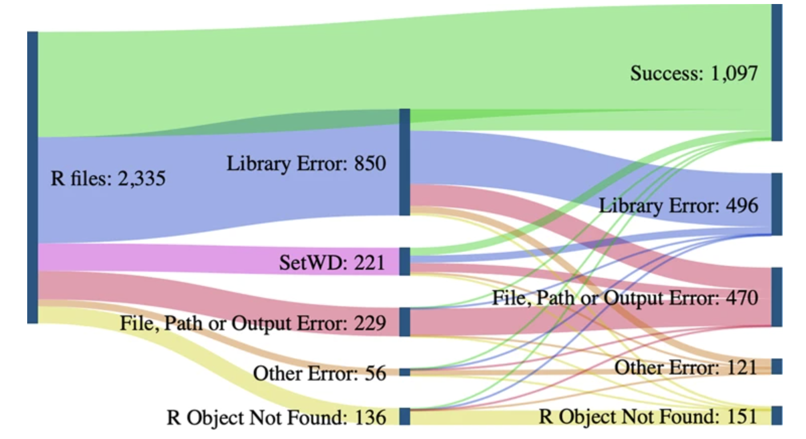
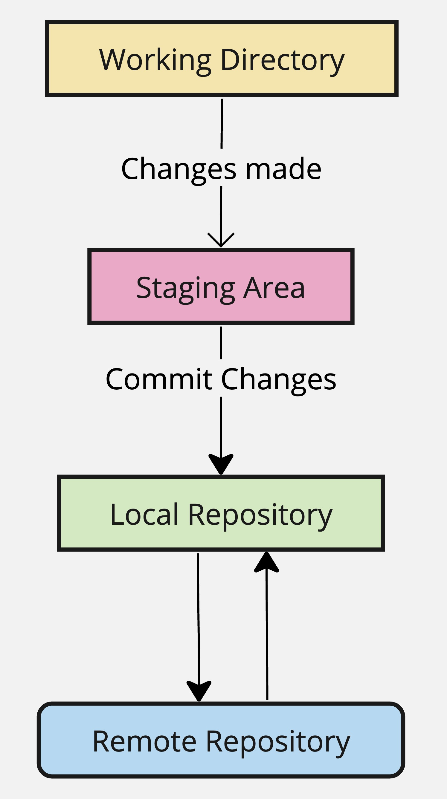
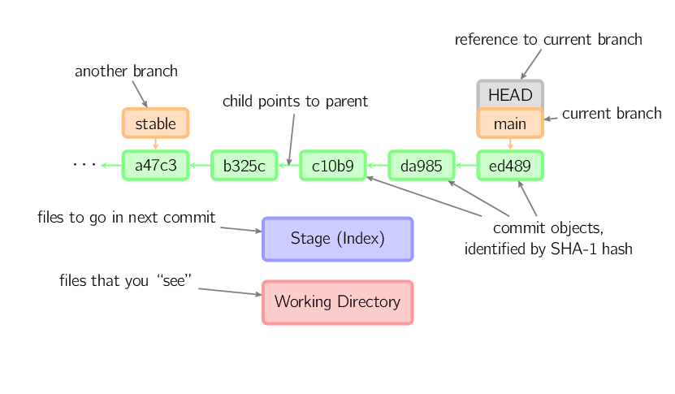
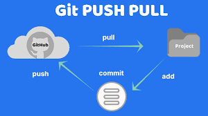
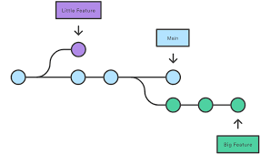
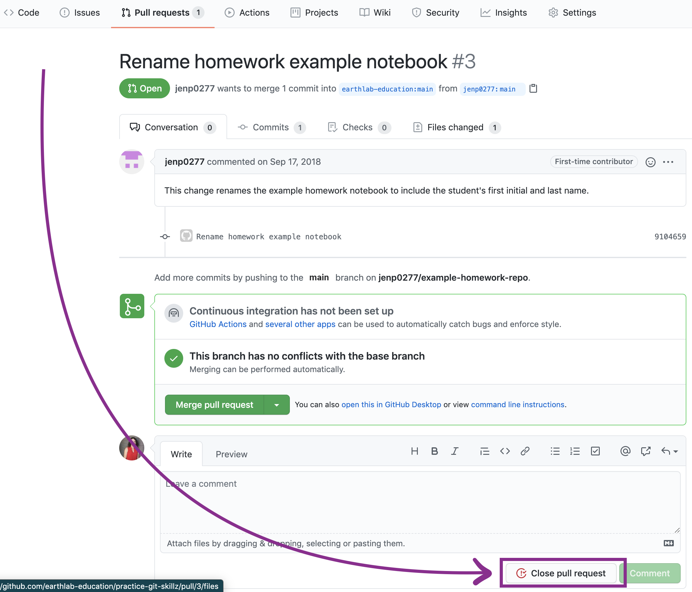
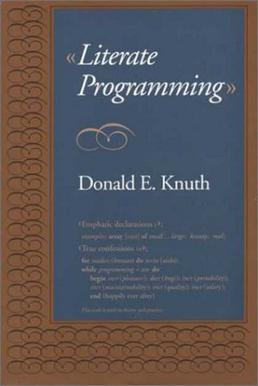

```{r setup, include=FALSE}
options(htmltools.dir.version = FALSE)
library(knitr)
opts_chunk$set(
  prompt = T,
  fig.align = "center",
  dpi = 300,
  cache = T,
  engine.opts = list(bash = "-l")
)

knit_hooks$set(
  prompt = function(before, options, envir) {
    options(
      prompt = if (options$engine %in% c("sh", "bash", "zsh")) "$ " else "R> ",
      continue = if (options$engine %in% c("sh", "bash", "zsh")) "$ " else "+ "
    )
  }
)

options(repos = c(CRAN = "https://cran.rstudio.com/"))

if (!require("fontawesome", character.only = TRUE)) {
  install.packages("fontawesome", dependencies = TRUE)
  library(fontawesome, character.only = TRUE)
}

suppressPackageStartupMessages(library(ggplot2))
```

## Del resultado creíble al reproducible

:::{style="margin-top: 30px; font-size: 24px;"}
:::{.columns}
:::{.column width=50%}
- Los [meta-análisis]{.alert} son una herramienta importante de acumulación de conocimiento: [sintetizan lo que ya se sabe sobre un tema]{.alert}

- Pero eso solo funciona [si los números que entran en la síntesis son confiables]{.alert}

- Esta sesión baja al [piso de la pirámide]{.alert}: si otra persona toma tus datos y tu código, ¿obtiene tus números?

- La [reproducibilidad computacional]{.alert} es la condición que vuelve la evidencia acumulable. [Sin eso, la síntesis acumula resultados que nadie verificó]{.alert}
 
- Va de "sólo el artículo" a [un entorno ejecutable que corre solo]{.alert} ([Peng, 2011](https://doi.org/10.1126/science.1213847))
:::

:::{.column width=50%}
- La sesión recorre [una capa por vez]{.alert}: cada una cierra un modo de fallo distinto ([Gentzkow y Shapiro, 2014](https://web.stanford.edu/~gentzkow/research/CodeAndData.pdf))

:::{style="text-align: center;"}
| Capa | Herramienta | Qué falla si falta |
|---|---|---|
| [Organización]{.alert} | carpeta, rutas relativas | rutas rotas |
| [Versiones]{.alert} | git y GitHub | decisiones no documentadas |
| [Documento]{.alert} | Quarto | errores de copiar y pegar |
| [Entorno]{.alert} | renv, contenedores | deriva de versiones |
:::

Antes de las herramientas: ¿reproducir, replicar o robustez? [¡No son lo mismo!]{.alert}
:::
:::
:::

# Por qué la reproducibilidad importa {background-color="#2d4563"}

## Reproducible, replicable, robusto

:::{style="margin-top: 30px; font-size: 25px;"}
:::{.columns}
:::{.column width=50%}
- Las Academias Nacionales de EE.UU. ([NASEM, 2019](https://doi.org/10.17226/25303)) separan tres cosas que en la práctica [se mezclan]{.alert}

- [Reproducibilidad]{.alert}: tomo tus mismos datos y tu mismo código, ¿obtengo [el mismo número]{.alert}? Es un problema técnico, no de diseño

- [Replicabilidad]{.alert}: un estudio nuevo, con datos nuevos, sobre la misma pregunta, ¿llega a [la misma conclusión]{.alert}?

- [Robustez]{.alert}: con los mismos datos pero [otras decisiones defendibles]{.alert} (otro control, otro corte), ¿el resultado sobrevive?
:::

:::{.column width=50%}
:::{style="margin-top: 10px; font-size: 22px;"}
| | Datos | Análisis | Pregunta |
|---|---|---|---|
| [Reproducibilidad]{.alert} | los mismos | el mismo código | ¿el mismo número? |
| [Replicabilidad]{.alert} | nuevos | nuevo estudio | ¿la misma conclusión? |
| [Robustez]{.alert} | los mismos | otras decisiones defendibles | ¿sobrevive? |

:::

:::{style="margin-top: 15px; font-size: 25px;"}
- La reproducibilidad es el [piso, no el techo]{.alert}: un resultado puede reproducirse al decimal y aun así estar equivocado

- Pero si [no]{.alert} se reproduce, no hay nada que discutir todavía

- Es la primera línea de defensa, la que [habilita a las otras dos]{.alert}
:::
:::
:::
:::

## La crisis, medida

:::{style="margin-top: 14px; font-size: 20px;"}
Dos preguntas distintas fallan a tasas altas. [Replicar]{.alert}: datos nuevos sobre la misma pregunta. [Reproducir]{.alert}: el mismo código sobre los mismos datos. Compartir los materiales es [necesario pero no suficiente]{.alert}

:::{.columns}
:::{.column width=55%}
[Replicación]{.alert} (datos nuevos, misma pregunta):

- [Psicología:]{.alert} se replicó el 36% de 100 estudios, con el efecto medio a la mitad ([Open Science Collaboration, 2015](https://doi.org/10.1126/science.aac4716))
- [Economía experimental:]{.alert} 11 de 18 experimentos (61%), con efectos más chicos ([Camerer et al., 2016](https://doi.org/10.1126/science.aaf0918))
- [Biología del cáncer:]{.alert} de 193 experimentos seleccionados sólo pudieron completarse 50, por falta de datos y protocolos ([Errington et al., 2021](https://doi.org/10.7554/eLife.71601))

[Reproducción]{.alert} (mismo código, mismos datos):

- [Economía y ciencia política:]{.alert} 110 artículos de revistas líderes (2024): ~85% reproducible, pero la robustez cae al [70%]{.alert} y el 25% tenía errores de código ([Brodeur et al., 2024](https://doi.org/10.2139/ssrn.4790780))
- [Trisovic et al. (2022)](https://doi.org/10.1038/s41597-022-01143-6): de 9.000+ scripts de R, el [74% falló]{.alert} a la primera, 56% tras limpieza automática
:::

:::{.column width=45%}
:::{style="text-align: center; font-size: 18px;"}
[{width="100%"}](#){data-modal-type="image" data-modal-url="figures/r-papers.png"}

Fuente: [Trisovic et al. (2022)](https://doi.org/10.1038/s41597-022-01143-6)
:::

:::{style="font-size: 20px;"}
- Las causas no son fraude: rutas absolutas, paquetes ausentes, orden de ejecución implícito, archivos que faltan, etc
:::
:::
:::
:::

## Lo estudié desde adentro: 100 estudios reanalizados

:::{style="margin-top: 14px; font-size: 20px;"}
:::{.columns}
:::{.column width=55%}
En [Aczél, Szászi, Nosek et al. (2026)](https://doi.org/10.1038/s41586-025-09844-9), en *Nature*, 457 analistas reanalizaron de forma independiente una muestra aleatoria de 100 estudios sociales (2009–2018), cada uno con sus [propias decisiones defendibles]{.alert}. (Soy coautor)

- Sólo el [34%]{.alert} de los reanálisis dio el mismo resultado que el original (±0,05 de la d de Cohen); 57% con un margen cuatro veces más amplio
- [74%]{.alert} llegó a la misma conclusión, 24% a ninguna o inconclusa, 2% a la opuesta
- En el [81%]{.alert} de los estudios, los analistas reportaron estadísticos distintos
- [Ciencia política:]{.alert} la menos robusta de las disciplinas grandes (24% de los estudios robusto, frente al 41% en psicología), y peor en diseños observacionales
:::

:::{.column width=45%}
:::{style="text-align: center; font-size: 18px;"}
[{width="80%"}](#){data-modal-type="image" data-modal-url="figures/nature.png"}

Fuente: [Aczél, Szászi, Nosek et al. (2026)](https://doi.org/10.1038/s41586-025-09844-9)

- Datos, código y codebooks abiertos son [el requisito previo]{.alert} para siquiera poder medir la robustez
:::
:::
:::
:::

## De la buena voluntad a la infraestructura compartida

:::{style="margin-top: 14px; font-size: 20px;"}
La revolución de la credibilidad volvió la transparencia parte del diseño, no un extra ([Christensen y Miguel, 2018](https://doi.org/10.1257/jel.20171350)). Hoy se apoya en dos piezas: [dónde se deposita el material]{.alert} y [quién lo verifica]{.alert}.

:::{.columns}
:::{.column width=50%}
[Repositorios con DOI citable]{.alert}:

- [Harvard Dataverse](https://dataverse.harvard.edu/) (IQSS, Harvard): el repositorio de datos de ciencias sociales más usado; cada depósito recibe un DOI permanente
- [OSF](https://osf.io/) (Center for Open Science): aloja datos, código y [preregistros](https://osf.io/registries) en un mismo flujo de proyecto
- [Zenodo](https://zenodo.org/) (CERN) y [Code Ocean](https://codeocean.com/): archiva cada *release* de GitHub y Code Ocean reejecuta el análisis en la nube: DOIs para datos y código; Zenodo archiva cada *release* de GitHub y Code Ocean reejecuta el análisis en la nube
- [GitHub](https://github.com/): el repositorio de código más usado; con [Actions](https://docs.github.com/en/actions) reejecuta el análisis en cada push y publica un sitio web con los resultados
:::

:::{.column width=50%}
[Verificación antes de publicar]{.alert}:

- [AJPS]{.alert} (ciencia política): desde 2015 el Odum Institute (UNC) reejecuta el código según su [política de verificación](https://ajps.org/ajps-verification-policy/); al principio [casi ningún paquete pasaba a la primera]{.alert}
- [AEA]{.alert} (economía): desde 2018 una [Data Editor](https://aeadataeditor.github.io/) controla todo artículo aceptado; cerca de [la mitad necesita más de una ronda]{.alert}
- [TOP Guidelines](https://doi.org/10.1126/science.aab2374): +1.000 revistas adoptaron estándares comunes de transparencia
:::
:::
:::

## Para pensar

:::{style="margin-top: 30px; font-size: 24px;"}
:::{.columns}
:::{.column width=52%}
Para cada escenario, decidí si es un problema de [reproducibilidad]{.alert}, [replicabilidad]{.alert} o [robustez]{.alert}:

a) otro equipo recolecta [datos nuevos]{.alert} sobre la misma pregunta y no encuentra el efecto

b) corro [tu código con tus datos]{.alert} y obtengo un coeficiente distinto al que reportás

c) agrego un [control razonable]{.alert} a tu modelo y el resultado se da vuelta

Pista: fijate qué cambia entre tu estudio y el mío, ¿los datos, el código o las decisiones de análisis?
:::

:::{.column width=48%}
:::{style="margin-top: 30px;"}
## Respuestas

::::{.incremental}
a) [Replicabilidad]{.alert}: datos nuevos, nuevo estudio, misma pregunta
b) [Reproducibilidad]{.alert}: mismos datos y mismo código deberían dar el mismo número; si no, algo en el entorno o el flujo cambió
c) [Robustez]{.alert}: mismos datos, otra decisión defendible; el efecto no sobrevive al multiverso de especificaciones
::::
:::
:::
:::
:::

# Proyectos reproducibles {background-color="#2d4563"}

## Una carpeta autocontenida

:::{style="margin-top: 14px; font-size: 20px;"}
:::{.columns}
:::{.column width=50%}
```
proyecto/
├── datos/
│   ├── crudos/        # solo lectura, jamás se editan
│   ├── derivados/     # los genera el código
│   └── codebook.md    # origen, unidades, definiciones
├── R/                 # 01-limpieza.R, 02-modelo.R …
├── salidas/
│   ├── figuras/       # regenerables, no se editan a mano
│   └── tablas/
├── informe.qmd        # texto y código en un solo archivo
├── _targets.R         # el pipeline como grafo
├── proyecto.Rproj     # ancla de las rutas relativas
├── renv.lock          # versiones exactas de paquetes
├── .gitignore         # qué NO versionar
├── LICENSE            # permiso de reuso
└── README.md          # cómo correr todo, en una página
```

Rutas [relativas]{.alert}, nunca `setwd("/Users/danilo/...")`: [here](https://here.r-lib.org/) arma todo desde la raíz del `.Rproj`, así el proyecto corre en cualquier máquina ([Bryan, 2018](https://doi.org/10.1080/00031305.2017.1399928)).
:::

:::{.column width=50%}
Tres reglas hacen casi todo el trabajo:

- [Crudos inmutables]{.alert}: los datos originales son de solo lectura; toda transformación escribe un archivo nuevo en `derivados/`, nunca pisa el original
- [Salidas regenerables]{.alert}: nada en `salidas/` se edita a mano; si se borra, el código lo reconstruye
- [Scripts numerados]{.alert}: el orden de ejecución está en los nombres (`01-`, `02-`), no en tu memoria

Dos buenos hábitos:

- [Nombres que ordenan solos]{.alert}: sin espacios ni acentos, fechas en formato `AAAA-MM-DD`
- [Versioná lo escrito a mano, no lo generado]{.alert}: el `.gitignore` deja fuera `datos/derivados/` y `salidas/`; el código las reconstruye

El `README` y el [codebook]{.alert} registran origen de los datos, unidades y decisiones de limpieza. La estructura sigue a [Project TIER](https://www.projecttier.org/) y [Gentzkow y Shapiro (2014)](https://web.stanford.edu/~gentzkow/research/CodeAndData.pdf).
:::
:::
:::

## Un pipeline, no pasos manuales

:::{style="margin-top: 14px; font-size: 20px;"}
En vez de [pasos manuales]{.alert} (clics, copiar y pegar), declarás el análisis como un [grafo dirigido]{.alert}: cada paso es código y la [procedencia]{.alert} de cada número queda explícita ([Claerbout y Karrenbach, 1992](https://doi.org/10.1190/1.1822162)).

:::{.columns}
:::{.column width=46%}
[Funciones básicas de `targets`]{.alert} ([Landau, 2021](https://doi.org/10.21105/joss.02959)):

- `tar_target(nombre, código)`: define un paso y el objeto que produce
- `tar_make()`: corre el pipeline y rehace [solo lo que cambió]{.alert}
- `tar_visnetwork()`: dibuja el grafo de dependencias
- `tar_read(x)` y `tar_load(x)`: traen un resultado ya calculado a tu sesión
- `tar_outdated()`: lista qué quedó desactualizado
- `tar_option_set()`: paquetes y opciones globales

El criterio: borrá todas las salidas y reconstruilas con [un solo comando]{.alert}
:::

:::{.column width=54%}
Un `_targets.R` mínimo:

```r
# _targets.R
library(targets)
tar_source()              # carga las funciones de R/
tar_option_set(packages = c("readr", "dplyr"))

list(
  tar_target(
    archivo,
    "datos/crudos/encuesta.csv",
    format = "file"       # vigila cambios en el archivo
  ),
  # leer, ajustar y graficar son funciones suyas
  tar_target(datos,  leer(archivo)),
  tar_target(modelo, ajustar(datos)),
  tar_target(figura, graficar(modelo))
)
```

```r
tar_make()        # construye el grafo entero
tar_read(modelo)  # trae un resultado a la sesión
```

Guía paso a paso: [The {targets} R Package User Manual](https://books.ropensci.org/targets/walkthrough.html)
:::
:::
:::

<!-- IMG (despues): el analisis como DAG (datos crudos -> derivados -> modelo -> salidas) -->

# Control de versiones: git y GitHub {background-color="#2d4563"}

## Git: el cuaderno de laboratorio del análisis

:::{style="margin-top: 14px; font-size: 21px;"}
:::{.columns}
:::{.column width=55%}
Git no guarda copias sueltas: guarda una [secuencia de instantáneas]{.alert} del proyecto entero. Cada *commit* es una foto del estado completo, con su [hash]{.alert}, autor, fecha y un mensaje que dice [por qué]{.alert} cambiaste algo.

- Volvés a cualquier estado anterior sin haber guardado un `informe_v2_final` a mano
- El historial es el [cuaderno de laboratorio]{.alert} del análisis: qué hiciste, cuándo y con qué intención
- El mensaje es una nota al [futuro-vos]{.alert}: en seis meses es lo único que explica por qué tomaste esa decisión
- Lo que [Breznau et al. (2022)](https://doi.org/10.1073/pnas.2203150119) llaman "decisiones no documentadas", git lo registra [por diseño]{.alert} ([Bryan, 2018](https://doi.org/10.1080/00031305.2017.1399928))
:::

:::{.column width=45%}
:::{.callout-note}
## Commit ≠ guardar

Guardar conserva el [último]{.alert} estado del archivo y pisa el anterior: no hay vuelta atrás.

Un commit conserva [todos]{.alert} los estados y la relación entre ellos: comparás, revertís y entendés cómo evolucionó el proyecto.
:::
:::
:::
:::

## Los tres árboles

:::{style="margin-top: 12px; font-size: 20px;"}
:::{.columns}
:::{.column width=52%}
git mueve cada cambio por [tres áreas]{.alert} antes de que llegue a GitHub. Saber en cuál está algo es media batalla:

| Área | Qué contiene | Comando |
|---|---|---|
| [Directorio de trabajo]{.alert} | los archivos que editás | — |
| [Staging]{.alert} | lo que entrará al próximo commit | `git add` |
| [Repositorio local]{.alert} | el historial en tu máquina | `git commit` |
| [Remoto (GitHub)]{.alert} | la copia compartida | `git push` / `git pull` |

[GitHub]{.alert} aloja repositorios y suma respaldo, issues y revisión, pero [no es git]{.alert}: git corre entero en tu máquina, sin conexión. Podés versionar un proyecto sin abrir el navegador una sola vez.
:::

:::{.column width=48%}
:::{style="text-align: center;"}
[{width="100%"}](#){data-modal-type="image" data-modal-url="figures/fig-3trees.jpg"}

:::{style="font-size: 19px;"}
La edición pasa por staging, se fija en un commit local y recién entonces sube al remoto
:::
:::
:::
:::
:::

## El flujo básico

:::{style="margin-top: 14px; font-size: 21px;"}
:::{.columns}
:::{.column width=55%}
```bash
$ git status                    # ¿qué cambió? el que más vas a usar
$ git add 01-limpieza.R         # mando ese archivo a staging
$ git commit -m "Corrijo el filtro de edad"
$ git log --oneline             # la cadena de instantáneas
```

El ciclo diario no cambia: editás, `status`, `add`, `commit`. Corré `git status` antes de cada `add` y sabés [exactamente]{.alert} qué vas a registrar.

Un buen mensaje guarda la [intención]{.alert}, no el cambio: "Corrijo el filtro de edad" le sirve al futuro-vos; "cambios" o "fix" no le sirven a nadie.
:::

:::{.column width=45%}
:::{style="text-align: center;"}
[{width="100%"}](#){data-modal-type="image" data-modal-url="figures/fig-git-ref.png"}

:::{style="font-size: 19px;"}
El mapa de los comandos entre directorio de trabajo, staging y repositorio ([Lodato, 2010](https://marklodato.github.io/visual-git-guide/index-en.html))
:::
:::
:::
:::
:::

## Viajar en el tiempo; qué versiona git y qué no

:::{style="margin-top: 14px; font-size: 21px;"}
:::{.columns}
:::{.column width=50%}
[Viajar en el tiempo]{.alert}

`git checkout <hash>` te devuelve a un estado anterior: la carpeta entera vuelve a verse como en ese commit.

- No [borra nada]{.alert}: sólo movés un puntero. Volvés al presente con `git checkout main`
- `git diff` te muestra qué cambió entre dos estados, línea por línea
- Un [tag]{.alert} marca un estado exacto (la versión enviada a la revista, la del preregistro), recuperable para siempre por su hash
:::

:::{.column width=50%}
[Qué versiona, qué no]{.alert}

- git brilla con [texto plano]{.alert}: código, `.qmd`, scripts; los compara línea a línea
- [No]{.alert} sirve para binarios ni datos pesados: un `.csv` de 2 GB o un `.dta` no se diffean
- `.gitignore` deja afuera datos crudos, salidas y credenciales
- Para datos grandes: [git-lfs](https://git-lfs.com/) o [DVC](https://dvc.org/), o archivar con DOI en [Dataverse](https://dataverse.org/), [Zenodo](https://zenodo.org/) u [OSF](https://osf.io/) y versionar [sólo el script]{.alert} que los baja
:::
:::
:::

## Para pensar

:::{style="margin-top: 16px; font-size: 21px;"}
:::{.columns}
:::{.column width=50%}
Mirá esta secuencia con atención:

```bash
$ git add modelo.R              # (1)
# ... seguís editando modelo.R ...
$ git commit -m "Nuevo control" # (2)
```

Entre el `add` y el `commit` editaste `modelo.R` un poco más.

[¿Qué versión de `modelo.R` quedó en el commit?]{.alert} ¿La del momento del `add`, o la del `commit` con tus últimas ediciones?
:::

:::{.column width=50%}
:::{.fragment}
Quedó la del momento del [`git add`]{.alert}, no tus ediciones posteriores.

`git add` saca una [foto del archivo]{.alert} y la deja en staging; `git commit` registra esa foto, no el estado actual del directorio. Lo que editaste después sigue sin registrar, esperando el próximo `add`.

Moraleja: corré [`git status` antes de cada `commit`]{.alert}. Te dice qué hay en staging y qué quedó afuera, así no registrás una versión vieja sin darte cuenta.
:::
:::
:::
:::

## Del repositorio local al remoto

:::{style="margin-top: 16px; font-size: 21px;"}
:::{.columns}
:::{.column width=55%}
Hasta acá todo vivía en tu máquina. El [remoto]{.alert} agrega respaldo y colaboración. Se configura [una sola vez]{.alert} por proyecto:

```bash
git remote add origin URL    # apunta al repo en GitHub
git push -u origin main      # sube y enlaza la rama
git pull                     # baja e integra lo que haya
```

- `git push` sube tus commits; `git pull` es [fetch + merge]{.alert}: baja los del remoto y los integra en tu rama
- [GitHub]{.alert} aloja git, pero [no es git]{.alert} ([Bryan, 2018](https://doi.org/10.1080/00031305.2017.1399928)): suma [respaldo]{.alert}, [Pages]{.alert} (publica un sitio desde el repo) y [Actions]{.alert} (corre el análisis en cada push)
- Este taller es un repo: cada `push` dispara [Actions]{.alert}, que reconstruye el sitio y lo publica en [Pages]{.alert}, solo
:::

:::{.column width=45%}
:::{style="text-align: center;"}
[{width="100%"}](#){data-modal-type="image" data-modal-url="figures/fig-push-pull.png"}

:::{style="font-size: 19px;"}
push y pull entre el repo local y el remoto
:::
:::
:::
:::
:::

## Ramas: versionar lo que probaste

:::{style="margin-top: 16px; font-size: 21px;"}
:::{.columns}
:::{.column width=55%}
Una [rama (branch)]{.alert} es una línea paralela para probar una alternativa sin tocar la principal; `git merge` la integra cuando funciona.

- Una rama por especificación vuelve [explícito y registrado]{.alert} el [jardín de senderos que se bifurcan]{.alert} de [Gelman y Loken (2014)](https://doi.org/10.1511/2014.111.460): las decisiones dejan de ser invisibles
- Es el [análisis multiverso]{.alert} de [Steegen et al. (2016)](https://doi.org/10.1177/1745691616658637) hecho con git: cada rama es uno de los caminos
- Un [tag]{.alert} congela un estado exacto: el envío a la revista, la versión del preregistro, recuperable para siempre por su hash

```bash
git checkout -b control-por-pbi        # abre la rama
git checkout main && git merge control-por-pbi
git tag v-envio                        # marca el envío
```
:::

:::{.column width=45%}
:::{style="text-align: center;"}
[{width="100%"}](#){data-modal-type="image" data-modal-url="figures/fig-branches.png"}

:::{style="font-size: 19px;"}
Una rama por línea de trabajo
:::
:::
:::
:::
:::

## Pull requests, issues y revisión

:::{style="margin-top: 14px; font-size: 20px;"}
:::{.columns}
:::{.column width=55%}
- Un [pull request]{.alert} propone un cambio (una rama o un fork) y lo abre a [revisión]{.alert} antes de entrar a `main`: nadie pisa el trabajo de otro sin que alguien mire primero
- Los [issues]{.alert} registran tareas, errores y decisiones pendientes, cada uno con su hilo y su número; un commit puede cerrarlos al citarlos
- Así trabaja la [ciencia abierta]{.alert}: un coautor abre un PR con su parte, el resto comenta línea por línea y recién entonces se integra
- Para reproducir a otra persona, [forkeás]{.alert} su repo, corrés su análisis y proponés correcciones por pull request
- Llegar al envío con el [paquete ya reproducible]{.alert} es parte de escribir el paper: las revistas ya verifican antes de publicar ([AJPS](https://ajps.org/ajps-verification-policy/), [AEA Data Editor](https://aeadataeditor.github.io/))
:::

:::{.column width=45%}
:::{style="text-align: center;"}
[{width="100%"}](#){data-modal-type="image" data-modal-url="figures/fig-pull-request.png"}

:::{style="font-size: 18px;"}
Revisar código es [control de calidad]{.alert}, no burocracia: la misma lógica que el revisor que reejecuta tu paquete antes de aceptar el paper
:::
:::
:::
:::
:::

# Documentos dinámicos con Quarto {background-color="#2d4563"}

## Del copiar y pegar a la programación literaria

:::{style="margin-top: 14px; font-size: 20px;"}
:::{.columns}
:::{.column width=55%}
El flujo habitual [copia]{.alert} los números del análisis y los [pega]{.alert} en el documento. Cada copia es un punto donde el texto y el análisis se [desincronizan]{.alert} en silencio. No es hipotético: `statcheck` halló que cerca del [50%]{.alert} de los artículos de psicología tenía una inconsistencia entre un estadístico y su p-valor, y un [12,5%]{.alert} una [grave]{.alert}, que daba vuelta la significancia ([Nuijten et al., 2016](https://doi.org/10.3758/s13428-015-0664-2)).

La idea opuesta es la [programación literaria]{.alert} de [Knuth (1984)](https://doi.org/10.1093/comjnl/27.2.97): un documento [entrelaza]{.alert} prosa, código y salida, y de esa fuente única salen el documento para leer (*weave*) y el código para correr (*tangle*). Quarto lo implementa sobre [knitr o Jupyter]{.alert} y [Pandoc]{.alert}.
:::

:::{.column width=45%}
:::{style="text-align: center;"}
[{width="68%"}](#){data-modal-type="image" data-modal-url="figures/fig-book.jpg"}
:::

:::{style="font-size: 18px;"}
El mismo `.qmd` se entreteje en muchos formatos:
:::

```
.qmd
 │  knitr / Jupyter
 ▼
.md
 │  Pandoc
 ▼
PDF · HTML · Word
```
:::
:::
:::

## Un ejemplo mínimo

:::{style="margin-top: 16px; font-size: 20px;"}
:::{.columns}
:::{.column width=52%}
````markdown
La muestra tiene `r knitr::inline_expr("nrow(datos)")` casos.

```{r}`r ''`
m <- lm(participacion ~ tamano_legislatura, datos)
coef(m)[["tamano_legislatura"]]
```
````
:::

:::{.column width=48%}
- El `r knitr::inline_expr("nrow(datos)")` del texto se [calcula al renderizar]{.alert}: si cambian los datos, el número cambia con ellos, sin que toques una sola línea de prosa
- El bloque corre el modelo y muestra su salida [dentro del documento]{.alert}, sin un paso intermedio donde colar un error de transcripción
- Del dato crudo al informe, [un solo comando]{.alert}, `quarto render`, y todo el análisis queda reejecutable desde la fuente
:::
:::
:::

# Entornos y dependencias {background-color="#2d4563"}

## El entorno también es parte del resultado

:::{style="margin-top: 14px; font-size: 20px;"}
:::{.columns}
:::{.column width=52%}
Tenés datos, código versionado y un documento dinámico, y aun así puede no reproducirse: tu R 4.4 con `dplyr` 1.1 no es el R 4.1 con `dplyr` 1.0 de quien te lee. Una actualización puede [dar vuelta un resultado]{.alert} sin avisar.

Es una de las [fuentes de irreproducibilidad]{.alert} documentadas en [Breznau et al. (2025)](https://doi.org/10.1098/rsos.241038) y buena parte del [74%]{.alert} de scripts que no corrían en [Trisovic et al. (2022)](https://doi.org/10.1038/s41597-022-01143-6): código correcto que falla porque el entorno cambió debajo.

```r
renv::init()      # biblioteca aislada del proyecto
renv::snapshot()  # versiones exactas → renv.lock
renv::restore()   # otra persona reconstruye igual
```
:::

:::{.column width=48%}
[`renv`](https://rstudio.github.io/renv/) escribe `renv.lock`, texto plano que [versionás con git]{.alert}: quien clona corre `renv::restore()` y obtiene [las mismas versiones, no las últimas]{.alert}. En Python, `requirements.txt` o `uv.lock`.

Tres niveles, de liviano a hermético:

- [renv]{.alert} fija las versiones de los paquetes de R
- [Docker / rocker](https://rocker-project.org/) empaqueta el sistema operativo, las librerías y el código en una imagen que corre igual en cualquier lado ([Boettiger y Eddelbuettel, 2017](https://doi.org/10.32614/RJ-2017-065))
- [Binder]{.alert} convierte un repo en un entorno ejecutable en el navegador

Empezá por lo liviano: subí de nivel sólo si el proyecto lo pide.
:::
:::
:::

## El software se descompone

:::{style="margin-top: 14px; font-size: 21px;"}
:::{.columns}
:::{.column width=55%}
La reproducibilidad no es sólo "hoy corre": es "corre [dentro de cinco años]{.alert}". El software se degrada sin que toques nada: paquetes que salen de CRAN, dependencias que rompen compatibilidad, enlaces que mueren.

Por eso el último eslabón [archiva]{.alert} los datos y materiales en un repositorio con DOI ([Dataverse](https://dataverse.org/), [Zenodo](https://zenodo.org/), [OSF](https://osf.io/)), no en un Dropbox personal ni "disponible a pedido". [Vines et al. (2014)](https://doi.org/10.1016/j.cub.2013.11.014) estiman que la disponibilidad de los datos cae [~17% por año]{.alert}.
:::

:::{.column width=45%}
:::{.callout-note}
## Sentido de proporción

Para la mayoría de los proyectos, [renv + un `.qmd` + datos con DOI]{.alert} ya alcanza.

Docker se reserva para cuando el propio entorno (librerías de sistema, una base de datos) deba quedar congelado. No empieces por lo más pesado.
:::
:::
:::
:::

## Para pensar

:::{style="margin-top: 16px; font-size: 21px;"}
:::{.columns}
:::{.column width=50%}
[El escenario]{.alert}

Tu código corre sin problemas en tu máquina, pero tu coautora lo clona, lo ejecuta y le falla.

[Las preguntas]{.alert}

- ¿Por qué falla, si es el mismo código?
- ¿Qué capa del flujo lo resuelve?
:::

:::{.column width=50%}
:::{.fragment}
Casi siempre es el [entorno]{.alert}: versiones de R o de paquetes distintas a las tuyas. A veces es una [ruta absoluta]{.alert} que sólo existe en tu disco.

Lo cierra fijar el entorno con [renv]{.alert} (o un contenedor) y usar rutas relativas con `here()`. Son las dos últimas de las [cuatro capas]{.alert}: organización, versiones, documento y entorno, trabajando juntas.
:::
:::
:::
:::

# Tu próximo lector puede ser una IA {background-color="#2d4563"}

## Un agente leyó, corrigió y extendió un paper

:::{style="margin-top: 14px; font-size: 20px;"}
:::{.columns}
:::{.column width=55%}
Ethan Mollick le dio a un modelo grande una copia de su [primer paper de posgrado]{.alert} y lo dejó trabajar solo ([Mollick, 2025](https://x.com/emollick/status/2068507998343885284)). En una sola corrida el agente:

- leyó el argumento y encontró [errores]{.alert} en el análisis original
- buscó [datos nuevos]{.alert} para poner a prueba la hipótesis
- los analizó y generó [archivos reproducibles]{.alert} (código y datos enlazados)
- extendió el [argumento central]{.alert} con resultados nuevos

El punto no es que la IA "piense": es que un agente ya puede [leer, reejecutar y extender]{.alert} un trabajo entero, siempre que sea reproducible y legible para una máquina.

<!-- IMG (después): captura o esquema del flujo IA leyendo un paper -->
:::

:::{.column width=45%}
:::{.callout-note}
## Qué significa para tu trabajo

Un proyecto [legible para máquina]{.alert} (datos con DOI, código versionado, `.qmd`, entorno con renv) es justo lo que un agente puede [clonar, correr y extender]{.alert}: las mismas cuatro capas del taller.

- la reproducibilidad ahora también es [ser legible para una IA]{.alert}, no sólo para un colega
- lo que te protege de una IA que [inventa números]{.alert} es el mismo paquete que deja a un revisor verificar los tuyos
- el [trabajo bien hecho]{.alert} ya es el que una máquina puede auditar: no hay un esfuerzo extra "para la IA"
:::
:::
:::
:::

# Cierre {background-color="#2d4563"}

## Reproducible para que sea acumulable

:::{style="margin-top: 14px; font-size: 20px;"}
:::{.columns}
:::{.column width=52%}
El taller siguió un ciclo: [producir]{.alert} evidencia con diseños creíbles (mañana), [sintetizarla]{.alert} con meta-análisis y [reproducirla]{.alert} para que se acumule (tarde).

La reproducibilidad cierra el ciclo: un meta-análisis es tan confiable como los estudios que sintetiza, y un estudio entra en la síntesis sólo si otra persona puede regenerar sus números. Las cuatro capas (organización, versiones, documento, entorno) lo hacen posible.

:::{.callout-note}
## Para empezar el lunes

Sobre tu próximo proyecto, en orden: una [carpeta autocontenida]{.alert} con rutas relativas → `git init` y commits frecuentes → el informe en [Quarto]{.alert} → `renv::init()` desde el día uno. Cada paso ya vale por sí solo.
:::
:::

:::{.column width=48%}
[Dónde seguir]{.alert}

- [The Turing Way](https://the-turing-way.netlify.app/): manual abierto de ciencia de datos reproducible
- [Gentzkow y Shapiro (2014)](https://web.stanford.edu/~gentzkow/research/CodeAndData.pdf), *Code and Data for the Social Sciences*
- [Project TIER](https://www.projecttier.org/) y las "Ten Simple Rules" ([Sandve et al., 2013](https://doi.org/10.1371/journal.pcbi.1003285))
- las políticas de [AJPS](https://ajps.org/ajps-verification-policy/) y la [AEA](https://aeadataeditor.github.io/), como lista de control antes de enviar

[Dónde enchufarse en la región]{.alert}

- [J-PAL LAC]{.alert}, [IPA]{.alert}, [BID]{.alert}, [EGAP]{.alert}: evidencia causal, síntesis y reproducibilidad en América Latina
:::
:::
:::

## Referencias

:::{style="margin-top: 12px; font-size: 18px;"}
:::{.columns}
:::{.column width=50%}
Aczél, Szászi, Nosek et al. (2026). Investigating the analytical robustness of the social and behavioural sciences. *Nature* 652:135. [doi](https://doi.org/10.1038/s41586-025-09844-9)

Boettiger y Eddelbuettel (2017). An introduction to Rocker. *The R Journal* 9(2):527. [doi](https://doi.org/10.32614/RJ-2017-065)

Breznau, Rinke, Wuttke et al. (2025). The reliability of replications. *Royal Society Open Science* 12:241038. [doi](https://doi.org/10.1098/rsos.241038)

Brodeur, Mikola, Cook et al. (2024). Mass reproducibility and replicability: a new hope. *I4R Discussion Paper* 107. [doi](https://doi.org/10.2139/ssrn.4790780)

Bryan (2018). Excuse me, do you have a moment to talk about version control? *The American Statistician* 72(1):20. [doi](https://doi.org/10.1080/00031305.2017.1399928)

Camerer et al. (2016). Evaluating replicability of laboratory experiments in economics. *Science* 351:1433. [doi](https://doi.org/10.1126/science.aaf0918)

Christensen y Miguel (2018). Transparency, reproducibility, and the credibility of economics research. *Journal of Economic Literature* 56(3):920. [doi](https://doi.org/10.1257/jel.20171350)

Claerbout y Karrenbach (1992). Electronic documents give reproducible research a new meaning. *SEG*. [doi](https://doi.org/10.1190/1.1822162)

Errington et al. (2021). Investigating the replicability of preclinical cancer biology. *eLife* 10:e71601. [doi](https://doi.org/10.7554/eLife.71601)

Gelman y Loken (2014). The statistical crisis in science. *American Scientist* 102:460. [doi](https://doi.org/10.1511/2014.111.460)

Gentzkow y Shapiro (2014). *Code and Data for the Social Sciences*. [pdf](https://web.stanford.edu/~gentzkow/research/CodeAndData.pdf)

Knuth (1984). Literate programming. *The Computer Journal* 27(2):97. [doi](https://doi.org/10.1093/comjnl/27.2.97)
:::

:::{.column width=50%}
Landau (2021). The targets R package. *JOSS* 6(57):2959. [doi](https://doi.org/10.21105/joss.02959)

NASEM (2019). *Reproducibility and Replicability in Science*. [doi](https://doi.org/10.17226/25303)

Nuijten et al. (2016). The prevalence of statistical reporting errors in psychology. *Behavior Research Methods* 48:1205. [doi](https://doi.org/10.3758/s13428-015-0664-2)

Open Science Collaboration (2015). Estimating the reproducibility of psychological science. *Science* 349:aac4716. [doi](https://doi.org/10.1126/science.aac4716)

Peng (2011). Reproducible research in computational science. *Science* 334:1226. [doi](https://doi.org/10.1126/science.1213847)

Sandve et al. (2013). Ten simple rules for reproducible computational research. *PLOS Comp. Biol.* 9:e1003285. [doi](https://doi.org/10.1371/journal.pcbi.1003285)

Steegen et al. (2016). Increasing transparency through a multiverse analysis. *Perspectives on Psychological Science* 11:702. [doi](https://doi.org/10.1177/1745691616658637)

Trisovic, Lau, Pasquier y Crosas (2022). A large-scale study on research code quality and execution. *Scientific Data* 9:60. [doi](https://doi.org/10.1038/s41597-022-01143-6)

Vines et al. (2014). The availability of research data declines rapidly with article age. *Current Biology* 24:94. [doi](https://doi.org/10.1016/j.cub.2013.11.014)
:::
:::
:::

# ¡Gracias! {background-color="#2d4563"}
