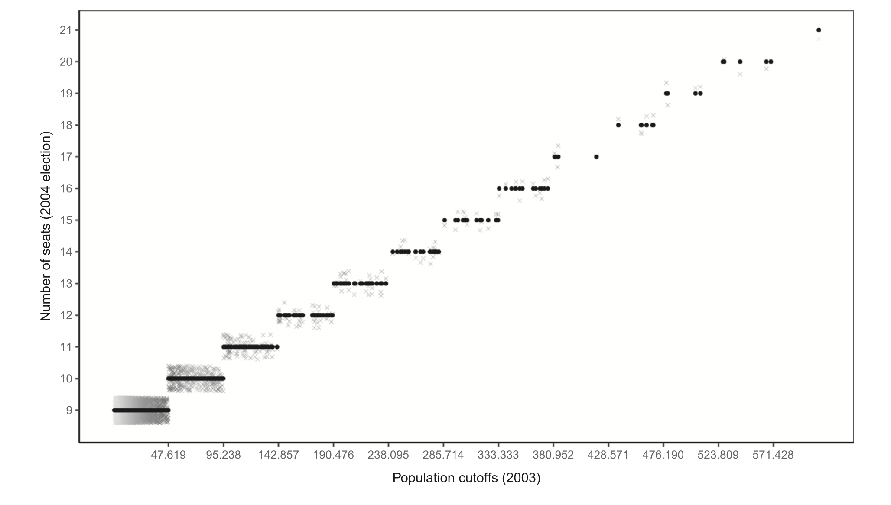

```{r setup, include=FALSE}
options(htmltools.dir.version = FALSE)
library(knitr)
opts_chunk$set(
  prompt = T,
  fig.align = "center",
  dpi = 300,
  cache = T,
  engine.opts = list(bash = "-l")
)

knit_hooks$set(
  prompt = function(before, options, envir) {
    options(
      prompt = if (options$engine %in% c("sh", "bash", "zsh")) "$ " else "R> ",
      continue = if (options$engine %in% c("sh", "bash", "zsh")) "$ " else "+ "
    )
  }
)

options(repos = c(CRAN = "https://cran.rstudio.com/"))

ensure <- function(pkg) {
  if (!require(pkg, character.only = TRUE)) {
    install.packages(pkg, dependencies = TRUE)
    library(pkg, character.only = TRUE)
  }
}
invisible(lapply(c("fontawesome", "estimatr", "rdrobust", "rddensity"), ensure))

suppressPackageStartupMessages(library(ggplot2))

# paleta de la casa (mismo par azul/rojo que 00-apertura.qmd)
azul <- "#2d4563"; rojo <- "#b85450"

tema_taller <- theme_minimal(base_size = 15) +
  theme(panel.grid.minor = element_blank(),
        plot.margin = margin(6, 10, 6, 6))

# los datos quedan cargados para todas las láminas siguientes
datos <- read.csv("datos/municipios.csv")
```

# Regresión discontinua: el contrafactual que encontrás {background-color="#2d4563"}

## El plan del bloque

:::{style="margin-top: 10px; font-size: 20px;"}
:::{.columns}
:::{.column width=34%}
[Las ideas]{.alert}

- La [aleatorización local]{.alert} y el contrafactual que se [encuentra]{.alert}, no se construye
- El efecto [local]{.alert} (LATE) y a quién le aplica de verdad
- Los tres supuestos y sus [chequeos]{.alert}: densidad, balance, placebo
- Qué cambia cuando hay [muchos umbrales]{.alert} en vez de uno
:::

:::{.column width=34%}
[El caso]{.alert}

- Concejos municipales y bienestar en [Brasil]{.alert}
- Nuestro paper en el [AJPS]{.alert} ([Mignozzetti, Cepaluni y Freire, 2025](https://doi.org/10.1111/ajps.12843))
- La regla del TSE de 2004 como [experimento accidental]{.alert}
- El [mecanismo político]{.alert} detrás del efecto sobre salud y educación
:::

:::{.column width=32%}
[Las herramientas]{.alert}

- `rdplot` para ver el [salto]{.alert} antes de estimar
- `rdrobust` para estimarlo con [ancho de banda óptimo]{.alert}
- `rddensity` para testear [manipulación]{.alert}
- Los chequeos como [rutina]{.alert}, no como adorno
:::
:::

:::{style="margin-top: 8px; border-left: 4px solid #2d4563; padding: 6px 18px; font-size: 20px;"}
Terminamos con una práctica guiada: corrés el código, lo leés y completás un par de líneas
:::
:::

## Antes de empezar: datos y paquetes

:::{style="margin-top: 16px; font-size: 20px;"}
Vas a necesitar el conjunto de datos y cuatro paquetes. Hacelo ahora, mientras arrancamos.

```{r instalar, echo=TRUE, eval=FALSE}
# 1. Instalar (solo la primera vez)
install.packages(c("estimatr", "rdrobust", "rddensity", "ggplot2"))

# 2. Cargar los datos (descargá municipios.csv del repo del taller)
datos <- read.csv("municipios.csv")
# Leélo directo desde la web, sin descargar nada:
# datos <- read.csv("https://raw.githubusercontent.com/danilofreire/taller-evidencia-ucu/main/diapositivas/datos/municipios.csv")
```

:::{style="margin-top: 8px; border-left: 4px solid #b85450; padding: 6px 18px; font-size: 18px;"}
`estimatr` da errores robustos; `rdrobust` y `rddensity` son el estándar para RDD hoy. La línea comentada te evita bajar el archivo a mano
:::
:::

# La historia: un resultado que costó creer {background-color="#2d4563"}

## El caso: concejos más grandes en Brasil

:::{style="margin-top: 10px; font-size: 19px;"}
:::{.columns}
:::{.column width=52%}
Pregunta: ¿el [tamaño del concejo municipal]{.alert} afecta el bienestar de la gente?

- Hasta 2004 cada municipio fijaba el tamaño de su propio concejo, y el [desbalance]{.alert} era enorme: Nova Russas (Ceará), 30.009 habitantes y 21 concejales (uno cada 1.429); Sorocaba (São Paulo), 528.735 habitantes y sólo 15 (uno cada 35.249)

- La regla surgió del caso [Mira Estrela]{.alert}, un pueblo de 2.651 personas que quiso recortar su concejo de 11 a 9 bancas por razones fiscales; la disputa llegó al Supremo Tribunal Federal

- En marzo de 2004 el Tribunal Superior Electoral fijó el número de concejales por [tramos de población]{.alert}: 9 bancas, más una cada 47.619 habitantes, hasta 21

- Los municipios [no eligen su población]{.alert}: cruzar un umbral es casi un sorteo. Comparás los que quedaron [apenas por encima y apenas por debajo]{.alert} ([Mignozzetti, Cepaluni y Freire, 2025](https://doi.org/10.1111/ajps.12843))
:::

:::{.column width=48%}
:::{style="text-align: center;"}
[{width="100%"}](#){data-modal-type="image" data-modal-url="figures/rdd-umbrales.png"}
:::
:::{style="text-align: center; font-size: 16px; color: #6E665C;"}
Cada escalón es un umbral: al cruzarlo, el concejo suma una banca
:::
:::
:::
:::

## La regla que crea el experimento

:::{style="margin-top: 6px; font-size: 19px;"}
:::{.columns}
:::{.column width=52%}
La ley funciona como el [mecanismo de asignación]{.alert}: 9 concejales, más uno cada 47.619 habitantes, hasta 21. Son [12 umbrales]{.alert} donde el número de bancas salta de golpe.

- La variable de asignación es la [proyección de población de 2003]{.alert} del IBGE, predeterminada: ningún municipio puede acomodarse para caer de un lado o del otro

- La regla llegó unos [siete meses antes]{.alert} de la elección de octubre de 2004: sin tiempo para que los candidatos ajustaran sus estrategias

- Los efectos se miden en el mandato [2005-2008]{.alert}, ya con los concejos nuevos funcionando

- Nadie diseñó un experimento: la [ley lo creó sin querer]{.alert}, y nosotros lo aprovechamos
:::

:::{.column width=48%}


:::{style="font-size: 15px; text-align: center; color: #555;"}
La Figura 1 del paper: el tamaño del concejo salta en cada umbral de población
:::
:::
:::
:::

## Lo que encontramos

:::{style="margin-top: 6px; font-size: 19px;"}
:::{.columns}
:::{.column width=50%}
Por cada [concejal extra]{.alert}, midiendo apenas alrededor de cada umbral:

- [Mortalidad infantil]{.alert}: −2,01 por mil nacidos vivos (~0,14 desvíos estándar)

- [Mortalidad postneonatal]{.alert}: −0,90 por mil (~0,14 DE)

- [Matrícula primaria]{.alert}: +2,58 chicos por aula (~0,20 DE)

- La [calidad educativa]{.alert} (IDEB) no cae ni sube: −0,02, no significativo. Los placebos también dan nulos

- Detrás de estos números hay una [historia política]{.alert}, y la vemos en unos minutos
:::

:::{.column width=50%}


:::{style="font-size: 15px; text-align: center; color: #555;"}
Estimados de bienestar por concejal extra, con sus placebos
:::
:::
:::

:::{style="margin-top: 6px; border-left: 4px solid #b85450; padding: 6px 18px; font-size: 17px;"}
Concejos más grandes, mejor salud y mejor educación: un resultado que, con toda razón, cuesta creer a primera vista
:::
:::

## De un resultado a una pregunta

:::{style="margin-top: 6px; font-size: 19px;"}
:::{.columns}
:::{.column width=62%}
Cuando presentamos esto, la primera reacción sana siempre fue la [sospecha]{.alert}.

:::{style="border-left: 4px solid #b85450; padding: 6px 18px; font-size: 18px;"}
"¿No será que esos municipios [ya eran distintos de entrada]{.alert}? Más poblados, más ricos, más urbanos"
:::

- Esa sospecha [ya tiene nombre]{.alert}, y la vimos a las 9:30: es el [sesgo de selección]{.alert}. Los municipios con concejos grandes son más poblados, más ricos, más urbanos; comparar todos contra todos [mezcla]{.alert} el efecto del concejo con todo lo demás

- La diferencia con el bloque anterior es dura: acá [nadie]{.alert} puede sortear bancas de concejales entre municipios, no hay experimento posible

- Entonces el contrafactual no se puede construir: hay que [encontrarlo]{.alert} ya hecho en el mundo
:::

:::{.column width=38%}
:::{style="text-align: center;"}


:::{style="font-size: 15px; color: #555;"}
Mignozzetti, Cepaluni y Freire (2025), *American Journal of Political Science*
:::
:::
:::
:::
:::

# La solución: regresión discontinua {background-color="#2d4563"}

## La idea: aleatorización local

:::{style="margin-top: 22px; font-size: 24px;"}
Cuando el tratamiento se decide por un [umbral]{.alert} en una variable continua, los que quedan [apenas por debajo]{.alert} y [apenas por encima]{.alert} son casi indistinguibles.

- Un municipio de 47.610 habitantes y otro de 47.630 se parecen en [todo]{.alert}, menos en que uno cruzó el corte y ganó una banca

- Cerca del umbral, recibir el tratamiento es [casi un sorteo]{.alert}

- Comparar justo ahí nos da un contrafactual creíble ([Lee y Lemieux, 2010](https://doi.org/10.1257/jel.48.2.281); [Cattaneo, Idrobo y Titiunik, 2020](https://doi.org/10.1017/9781108684606))

:::{style="margin-top: 10px; border-left: 4px solid #b85450; padding: 6px 18px; font-size: 21px;"}
El precio: lo que estimás es un [efecto local promedio]{.alert}, el LATE. Vale para municipios pegados al corte, no dice nada de un concejo de 40 bancas
:::
:::

## Gemelos en el umbral

:::{style="margin-top: 18px; font-size: 22px;"}
Si la idea es cierta, arriba y abajo del corte los municipios tienen que ser [gemelos]{.alert} en todo lo que se decidió antes. Mirá los que caen a menos de 4.000 habitantes del umbral:

```{r gemelos, echo=TRUE}
cerca <- subset(datos, abs(poblacion_c) < 4000)
aggregate(cbind(pib_pc, prop_pobres, bancas_2000, n_concejales)
          ~ concejo_grande, data = cerca, FUN = mean)
```

:::{style="margin-top: 8px; border-left: 4px solid #2d4563; padding: 6px 18px; font-size: 20px;"}
PIB, pobreza y bancas previas casi no se mueven entre los dos grupos. Lo único que cambia de golpe es [una banca]{.alert}: ese es el experimento que escribió la ley
:::
:::

## Una ecuación

:::{style="margin-top: 20px; font-size: 23px;"}
Con la población centrada en el umbral ($X_i = $ población $- 47.619$), estimamos:

:::{style="margin-top: 4px; font-size: 27px; text-align: center;"}
$$
Y_i = \beta_0 + \beta_1 X_i + \beta_2\, \mathbf{1}(X_i \ge 0) + \varepsilon_i
$$
:::

- $\beta_1 X_i$ deja que el resultado [varíe suave]{.alert} con la población (la tendencia, el confusor)

- $\mathbf{1}(X_i \ge 0)$ vale 1 arriba del corte; su coeficiente $\beta_2$ es [el salto]{.alert}

- Ese salto $\beta_2$ es el [efecto local]{.alert} que buscamos

- Acá el diseño es [sharp]{.alert}: cruzar el corte determina el tratamiento sin excepciones. Existen diseños [fuzzy]{.alert}, donde cruzar sólo cambia la probabilidad de tratarse; se estiman con una variante del mismo método

:::{style="margin-top: 8px; border-left: 4px solid #2d4563; padding: 6px 18px; font-size: 20px;"}
Supuesto clave: sin el tratamiento, el resultado habría seguido [la misma curva suave]{.alert} a través del corte. Todo salto abrupto es el tratamiento
:::
:::

## Los datos sintéticos

:::{style="margin-top: 14px; font-size: 20px;"}
Un conjunto simulado sobre el diseño del paper: 2.000 municipios, corte en 47.619 habitantes (9 → 10 concejales), efectos calcados de la investigación real.

:::{.columns}
:::{.column width=55%}
```{r cabeza, echo=TRUE}
head(datos[, c("municipio", "poblacion", "concejo_grande",
               "n_concejales", "mortalidad_infantil")], 4)
```
:::

:::{.column width=45%}
:::{style="font-size: 14px;"}
| Variable | Qué es |
|---|---|
| `poblacion_c` | Población − 47.619 |
| `concejo_grande` | 1 si cruzó el umbral |
| `n_concejales` | 9 o 10 bancas |
| `mortalidad_infantil` | Muertes por mil nacidos |
| `matricula_primaria` | Chicos por aula |
| `ideb` | Calidad educativa (0-10) |
| `pib_pc` | PIB per cápita (miles R$) |
| `prop_pobres` | Familias pobres (proporción) |
:::
:::
:::

:::{style="margin-top: 6px; border-left: 4px solid #b85450; padding: 6px 18px; font-size: 18px;"}
Es un solo umbral, para enseñar limpio; el resto de las variables está en la intro de la práctica. El paper real tiene [12 cortes]{.alert} (9 a 21 bancas); volvemos a esa complicación en un rato
:::
:::

## Ver el salto

:::{style="margin-top: 4px; font-size: 20px;"}
Antes de estimar nada, [mirá]{.alert} los datos: promedios por tramo de población, con la recta suave a cada lado del corte.

```{r salto, echo=FALSE, fig.height=4.0, fig.width=9}
d <- datos
brks <- seq(-30000, 30000, by = 2500)
d$bin <- cut(d$poblacion_c, breaks = brks)
ctr <- (head(brks, -1) + tail(brks, -1)) / 2
agg <- data.frame(centro = ctr,
                  y = as.numeric(tapply(d$mortalidad_infantil, d$bin, mean)))
agg <- agg[!is.na(agg$y), ]

ggplot() +
  geom_point(data = agg, aes(centro, y), colour = azul, size = 2.4) +
  geom_smooth(data = subset(d, poblacion_c < 0),
              aes(poblacion_c, mortalidad_infantil),
              method = "lm", se = FALSE, colour = azul, linewidth = 1) +
  geom_smooth(data = subset(d, poblacion_c >= 0),
              aes(poblacion_c, mortalidad_infantil),
              method = "lm", se = FALSE, colour = azul, linewidth = 1) +
  geom_vline(xintercept = 0, linetype = "dashed", colour = rojo, linewidth = 0.8) +
  labs(x = "Población centrada en el umbral (47.619 hab)",
       y = "Mortalidad infantil (por mil)") +
  tema_taller
```

:::{style="text-align: center; font-size: 18px; color: #6E665C;"}
El salto hacia abajo en el corte es el efecto; la pendiente es la tendencia que hay que descontar
:::
:::

## El mismo salto con `rdplot`

:::{style="margin-top: 16px; font-size: 21px;"}
Lo que armamos a mano lo hace `rdplot` en una línea: elige los bins de forma óptima y ajusta un polinomio a cada lado. Es el gráfico estándar de los papers de RDD:

```{r verrdplot, echo=TRUE, fig.height=4.0, fig.width=8.5}
rdplot(datos$mortalidad_infantil, datos$poblacion_c,
       x.label = "Población centrada en el umbral",
       y.label = "Mortalidad infantil (por mil)", title = "")
```

:::{style="margin-top: 6px; font-size: 19px;"}
Mismo salto que dibujamos recién, ahora sin trabajo manual. Ver que no hay magia atrás es lo que te deja [confiar]{.alert} en el atajo
:::
:::

## Comparación ingenua vs local

:::{style="margin-top: 14px; font-size: 21px;"}
La diferencia entre [todos]{.alert} los concejos grandes y chicos exagera el efecto, porque arrastra la tendencia:

```{r naive, echo=TRUE}
with(datos, mean(mortalidad_infantil[concejo_grande == 1]) -
            mean(mortalidad_infantil[concejo_grande == 0]))
```

La regresión [local]{.alert}, cerca del corte, descuenta esa pendiente:

```{r local, echo=TRUE}
cerca <- subset(datos, abs(poblacion_c) < 8000)
fit <- lm_robust(mortalidad_infantil ~ concejo_grande + poblacion_c +
                   concejo_grande:poblacion_c, data = cerca)
round(coef(summary(fit))["concejo_grande", 1:4], 3)
```

:::{style="margin-top: 4px; border-left: 4px solid #2d4563; padding: 6px 18px; font-size: 20px;"}
De [−3,36]{.alert} (ingenua) a [≈ −1,7]{.alert} (local): la brecha era sesgo de selección, no efecto
:::
:::

## Estimarlo bien: `rdrobust`

:::{style="margin-top: 12px; font-size: 21px;"}
`rdrobust` elige el ancho de banda de forma óptima y corrige el sesgo de los bordes ([Calonico, Cattaneo y Titiunik, 2014](https://doi.org/10.3982/ECTA11757)):

```{r rdrobust, echo=TRUE}
rd <- rdrobust(datos$mortalidad_infantil, datos$poblacion_c)
round(c(efecto = rd$coef[1], se = rd$se[1],
        p = rd$pv[1], ancho = rd$bws[1, 1]), 3)
```

:::{style="margin-top: 8px;"}
El efecto local es de [−1,84 muertes por mil]{.alert}. En el paper, con los datos reales y los 12 umbrales agrupados, da [−2,01]{.alert} (Tabla 4): la misma lógica, en su versión simulada y simplificada para enseñar. Un coeficiente negativo acá es [buena noticia]{.alert}: menos muertes
:::
:::

## El efecto en varias dimensiones

:::{style="margin-top: 10px; font-size: 20px;"}
El mismo salto, resultado por resultado:

```{r coda, echo=FALSE}
outs <- c(matricula_primaria = "Matrícula primaria (chicos/aula)",
          mortalidad_infantil = "Mortalidad infantil (por mil)",
          mortalidad_postneonatal = "Mortalidad postneonatal (por mil)",
          ideb = "Calidad educativa (IDEB, 0-10)",
          burocratas = "Cargos designados",
          proyectos_servicios = "Proyectos de servicios")
tab <- t(sapply(names(outs), function(v) {
  m <- rdrobust(datos[[v]], datos$poblacion_c)
  c(Efecto = round(m$coef[1], 2), p = round(m$pv[1], 3))
}))
rownames(tab) <- outs
knitr::kable(tab)
```

:::{style="margin-top: 2px; border-left: 4px solid #b85450; padding: 6px 18px; font-size: 19px;"}
Mejor salud, más matrícula, más cargos y proyectos. La [calidad (IDEB) no salta]{.alert}: entran más chicos al aula sin que el nivel medido caiga, igual que en el paper (−0,02, no significativo). Un nulo acá es [información]{.alert}, no un fracaso
:::
:::

## Muchos umbrales, una complicación

:::{style="margin-top: 22px; font-size: 23px;"}
El paper real no tiene un corte, tiene [doce]{.alert} (de 9 a 21 bancas).

- Si juntás todos los cortes [sin corregir]{.alert}, comparás municipios chicos (9-10 bancas) con grandes (20-21): aparece un desbalance de 1,63 concejales, y el estimador se sesga

- La solución del paper es [normalizar y agrupar]{.alert}: a cada municipio se lo mide como distancia a [su]{.alert} umbral más cercano, y después se apilan los doce cortes en un solo RDD ([Cattaneo, Titiunik, Vazquez-Bare y Keele, 2016](https://doi.org/10.1086/686802))

- Encima se suman controles: la [población de 2003]{.alert} (la variable que asigna cada umbral), el PIB per cápita, las bancas de 2000 y una dummy de Nordeste

:::{style="margin-top: 10px; border-left: 4px solid #2d4563; padding: 6px 18px; font-size: 21px;"}
Moraleja: un diseño creíble casi nunca es una sola línea de código. Es el diseño [más]{.alert} el cuidado con sus supuestos
:::
:::

## Para pensar: leer el coeficiente

:::{style="margin-top: 20px; font-size: 24px;"}
`rdrobust` devolvió un efecto de [−1,84]{.alert} sobre la mortalidad infantil. ¿Qué afirma, exactamente, ese número?

:::{.fragment style="margin-top: 14px; border-left: 4px solid #b85450; padding: 8px 20px; font-size: 22px;"}
:::{.incremental}
- Afirma que una banca más [baja]{.alert} la mortalidad infantil en unas 1,84 muertes por cada mil nacidos, cerca del corte

- Es un [LATE]{.alert}: vale para municipios pegados a las 47.619 personas, no dice nada de una ciudad de 300.000 ni de un concejo de 40 bancas

- Es [causal]{.alert} sólo si nada más salta en el umbral; lo que sigue se dedica a mostrar que así es
:::
:::
:::

# ¿Por qué un concejal más mejora el bienestar? {background-color="#2d4563"}

## El mecanismo: alineamiento con el intendente

:::{style="margin-top: 6px; font-size: 19px;"}
:::{.columns}
:::{.column width=52%}
¿Por qué una banca más se traduce en mejor bienestar? Empieza por la [política]{.alert}.

- Un concejal extra tiene [91%]{.alert} de chance de entrar a la coalición preelectoral del intendente (0,91, p<0,1): la banca marginal casi siempre [suma al oficialismo]{.alert}

- Eso baja los [costos de negociar]{.alert}: el intendente consigue aprobar su agenda con menos fricción

- ¿Cómo asegura ese apoyo? Con [cargos]{.alert}: +104 burócratas designados políticamente por banca extra

- Los burócratas de [carrera]{.alert} y los asistentes del concejo no se mueven: un [placebo interno]{.alert} que descarta que el municipio simplemente contrate más de todo
:::

:::{.column width=48%}


:::{style="font-size: 15px; text-align: center; color: #555;"}
Tabla 3 del paper: coalición y designados saltan; carrera y asistentes, no
:::
:::
:::
:::

## Lo que dicen los propios concejales

:::{style="margin-top: 6px; font-size: 19px;"}
:::{.columns}
:::{.column width=52%}
Encuestamos online a [174 ex concejales]{.alert} del mandato 2005-2008. ¿Con qué instrumentos los intendentes aseguran apoyo?

- [Designaciones]{.alert} de cargos: 65,9% de acuerdo

- [Favores personales]{.alert}: 59,0%

- [Obras]{.alert} que favorecen al concejal: 47,2%

- [Demandas]{.alert} de los votantes: 46,9%

- [Apoyo legislativo]{.alert} explícito: 26,6%

:::{style="border-left: 4px solid #b85450; padding: 6px 18px; font-size: 16px;"}
Una encuesta a políticos tiene sus propios sesgos (memoria, deseabilidad social): acá [triangula]{.alert} el mecanismo, no lo prueba por sí sola
:::
:::

:::{.column width=48%}


:::{style="font-size: 15px; text-align: center; color: #555;"}
Figura 2 del paper: qué instrumentos usan los intendentes, según los ex concejales
:::
:::
:::
:::

## Lo que muestran las leyes

:::{style="margin-top: 6px; font-size: 19px;"}
:::{.columns}
:::{.column width=52%}
Miramos también lo que el concejo [efectivamente hace]{.alert}: las leyes que aprueba.

- [346.553 leyes]{.alert} aprobadas entre 2005 y 2008, en 63 municipios que quedaron a menos de 10.000 habitantes de los cortes

- [3.466]{.alert} las codificamos a mano en cuatro categorías, y el resto lo clasificamos con [aprendizaje automático]{.alert} (SVM)

- Por cada concejal extra: +15,0% de leyes per cápita sobre [bienes públicos]{.alert}, y +19,7% de leyes de [salud y educación]{.alert}
:::

:::{.column width=48%}


:::{style="font-size: 15px; text-align: center; color: #555;"}
Figura 3 del paper: leyes aprobadas, municipios de control frente a los de tratamiento
:::
:::
:::

:::{style="margin-top: 6px; border-left: 4px solid #2d4563; padding: 6px 18px; font-size: 17px;"}
La cadena completa: [coalición]{.alert} más grande → [designaciones]{.alert} que aseguran apoyo → más [leyes de servicios]{.alert} → mejor [salud y educación]{.alert}
:::
:::

# Hacerlo creíble: validez y pruebas {background-color="#2d4563"}

## Tres supuestos

:::{style="margin-top: 22px; font-size: 23px;"}
El RDD del paper descansa en tres supuestos, y cada uno tiene su prueba:

1. [Nadie manipula el umbral]{.alert}: los municipios no pueden elegir de qué lado caer

2. [El salto es nítido]{.alert}: el concejo crece exactamente como manda la ley (RDD sharp)

3. [Las covariables previas no saltan]{.alert}: medidas antes de 2004, no deberían cambiar en el corte

Y una pregunta que le hacés [siempre]{.alert} a tu RDD: ¿cambia [otra política]{.alert} en el mismo umbral (transferencias, salarios, categorías administrativas)? Si la respuesta es sí, el salto mezcla los dos tratamientos y ya no medís sólo la banca.

:::{style="margin-top: 12px; border-left: 4px solid #2d4563; padding: 6px 18px; font-size: 21px;"}
Un supuesto no se declara: se [pone a prueba]{.alert}. Vamos una por una, y después rompemos el diseño a propósito
:::
:::

## Chequeo 1: ¿manipularon el umbral?

:::{style="margin-top: 14px; font-size: 21px;"}
Si los municipios se acomodaran para cruzar el corte, se [amontonarían]{.alert} de un lado. El test de densidad busca ese amontonamiento ([McCrary, 2008](https://doi.org/10.1016/j.jeconom.2007.05.005); [Cattaneo, Jansson y Ma, 2020](https://doi.org/10.1080/01621459.2019.1635480)):

```{r densidad, echo=TRUE}
dens <- rddensity(datos$poblacion_c)
round(c(T = dens$test$t_jk, p = dens$test$p_jk), 3)
```

:::{style="margin-top: 8px;"}
$p = 0{,}83$: [no hay salto]{.alert} en la densidad. La población de 2003 no se podía manipular, tal como esperábamos
:::

:::{style="margin-top: 6px; font-size: 17px; color: #555;"}
En el paper: los mismos tests tampoco rechazan en ningún corte; la proyección del IBGE no dependía de los municipios
:::
:::

## Chequeo 2: balance en covariables

:::{style="margin-top: 14px; font-size: 21px;"}
Las variables medidas [antes]{.alert} del tratamiento (PIB per cápita, pobreza) no deberían saltar en el umbral. Corremos el RDD sobre ellas como [placebo]{.alert}:

```{r balance, echo=TRUE}
sapply(c("pib_pc", "prop_pobres"), function(v) {
  m <- rdrobust(datos[[v]], datos$poblacion_c)
  round(m$pv[1], 3)
})
```

:::{style="margin-top: 8px;"}
Los dos $p$ son [altos]{.alert}: ningún salto donde no debería haberlo. Los grupos son comparables de entrada
:::

:::{style="margin-top: 6px; font-size: 17px; color: #555;"}
En el paper: bancas del período previo, población, PIB y familias de bajos ingresos (datos del TSE y del censo 2000) no saltan en el corte (Tabla 2)
:::
:::

## Chequeo 3: un corte placebo

:::{style="margin-top: 14px; font-size: 21px;"}
Si inventamos un umbral [falso]{.alert} donde la ley no cambia nada, no debería aparecer ningún efecto:

```{r placebo, echo=TRUE}
rdrobust(datos$mortalidad_infantil, datos$poblacion_c,
         c = -15000)$pv[1]
```

:::{style="margin-top: 8px;"}
$p \approx 0{,}16$: [nada]{.alert} en el corte inventado. El salto aparece sólo en el umbral verdadero
:::

:::{style="margin-top: 8px; border-left: 4px solid #2d4563; padding: 6px 18px; font-size: 20px;"}
Un efecto que aparece en umbrales placebo es una [señal de alarma]{.alert}: probablemente estás capturando la tendencia, no un salto
:::

:::{style="margin-top: 6px; font-size: 17px; color: #555;"}
En el paper: se ajustaron cortes falsos entre los umbrales reales; ninguno muestra efecto
:::
:::

## Chequeo 4: ¿depende del ancho de banda?

:::{style="margin-top: 2px; font-size: 20px;"}
Un resultado creíble no cambia de signo ni de tamaño según cuán ancha sea la ventana:

```{r ancho, echo=FALSE, fig.height=3.9, fig.width=9}
hs <- seq(4000, 16000, by = 2000)
est <- sapply(hs, function(h) {
  m <- rdrobust(datos$mortalidad_infantil, datos$poblacion_c, h = h)
  c(m$coef[1], m$se[1])
})
bw <- data.frame(h = hs, tau = est[1, ], se = est[2, ])

ggplot(bw, aes(h, tau)) +
  geom_hline(yintercept = 0, colour = "grey70") +
  geom_ribbon(aes(ymin = tau - 1.96 * se, ymax = tau + 1.96 * se),
              fill = azul, alpha = 0.15) +
  geom_line(colour = azul, linewidth = 1) +
  geom_point(colour = azul, size = 2.4) +
  labs(x = "Ancho de banda (habitantes)", y = "Efecto estimado") +
  tema_taller
```

:::{style="text-align: center; font-size: 18px; color: #6E665C;"}
El efecto se queda estable en torno a −1,8, ventana tras ventana
:::

:::{style="margin-top: 6px; font-size: 17px; color: #555;"}
En el paper: el ancho lo elige el método de Calonico, Cattaneo y Titiunik (2014), y los resultados aguantan variarlo
:::
:::

## Romperlo: saboteemos el diseño

:::{style="margin-top: 10px; font-size: 20px;"}
Para creerle a un chequeo, hay que verlo [fallar]{.alert} cuando debe. Empujamos a la mayoría de los que estaban justo por debajo a cruzar el corte, como si hubieran manipulado la población:

```{r sabotaje, echo=TRUE}
set.seed(1)
malo <- datos
borde <- malo$poblacion_c > -1500 & malo$poblacion_c < 0
mover <- borde & runif(nrow(malo)) < 0.7
malo$poblacion_c[mover] <- abs(malo$poblacion_c[mover]) + 200

# el test de densidad, antes limpio, ahora rechaza
round(rddensity(malo$poblacion_c)$test$p_jk, 4)
```

:::{style="margin-top: 6px; border-left: 4px solid #b85450; padding: 6px 18px; font-size: 19px;"}
De $p = 0{,}83$ a $p \approx 0$. El test [detecta]{.alert} la manipulación que fabricamos: por eso vale la pena correrlo
:::
:::

# Hacerlo en la región {background-color="#2d4563"}

## Cómo encontrar un buen RDD

:::{style="margin-top: 14px; font-size: 20px;"}
Un RDD vive donde una regla [asigna algo por un umbral]{.alert}. América Latina está llena de reglas así:

:::{.columns}
:::{.column width=50%}
- [Puntajes de focalización]{.alert}: SISBEN (Colombia), Cadastro Único (Brasil), Ficha CAS (Chile) deciden quién entra a un programa social

- [Umbrales de población]{.alert}: transferencias federales, categoría del municipio, o la cantidad de concejales de nuestro caso ([Mignozzetti, Cepaluni y Freire, 2025](https://doi.org/10.1111/ajps.12843))

- [Notas de corte]{.alert}: becas y admisión; en Ser Pilo Paga (Colombia), el puntaje del examen de Estado abría la puerta a una beca universitaria ([Londoño-Vélez, Rodríguez y Sánchez, 2020](https://doi.org/10.1257/pol.20180131))
:::

:::{.column width=50%}
- [Edad de elegibilidad]{.alert}: jubilaciones, pensiones no contributivas, entrada a la escuela

- [Elecciones cerradas]{.alert}: ganar por poco, alrededor del umbral del 50%, reparte cargos y recursos casi al azar

- [Fronteras administrativas]{.alert}: una política cambia de golpe al cruzar un límite municipal o estatal
:::
:::

:::{style="margin-top: 6px; border-left: 4px solid #2d4563; padding: 6px 18px; font-size: 18px;"}
Regla práctica: buscá primero la [ley o norma]{.alert} que crea el corte; si el umbral es arbitrario y no se puede manipular, tenés un candidato
:::
:::

## Dónde buscar los datos

:::{style="margin-top: 14px; font-size: 20px;"}
La región tiene mucha [microdata administrativa]{.alert} abierta, que es justo lo que un RDD necesita:

:::{.columns}
:::{.column width=50%}
- [Salud]{.alert}: DataSUS (Brasil) y los ministerios y observatorios de salud de cada país

- [Censos y hogares]{.alert}: IBGE, INE y los institutos nacionales; IPUMS International los deja comparables

- [Encuestas armonizadas]{.alert}: SEDLAC (CEDLAS y Banco Mundial), Latinobarómetro
:::

:::{.column width=50%}
- [Electorales]{.alert}: TSE (Brasil) y las autoridades electorales publican resultados por sección

- [Portales abiertos]{.alert}: datos.gob de cada país y los portales de transparencia

- [Multilaterales]{.alert}: BID (Números para el Desarrollo), CAF, Banco Mundial Microdata
:::
:::

:::{style="margin-top: 6px; border-left: 4px solid #b85450; padding: 6px 18px; font-size: 18px;"}
Pedí la variable de asignación [con la mayor resolución posible]{.alert}: el puntaje exacto, la población exacta. Sin eso, no hay salto que mirar
:::
:::

# Práctica {background-color="#2d4563"}

## De qué se trata la práctica {#sec:ejercicios}

:::{style="margin-top: 6px; font-size: 18px;"}
:::{.columns}
:::{.column width=56%}
Ahora te toca a vos: con `municipios.csv`, el archivo que cargaste al principio, vas a estimar un RDD sobre [otra variable]{.alert} y a ponerlo a prueba.

Objetivos:

- ver el [salto]{.alert} con un gráfico simple
- estimar el [efecto local]{.alert} con `rdrobust`
- correr los [chequeos de validez]{.alert} (densidad, placebo, balance) como rutina
- comparar la estimación [ingenua]{.alert} con la local y ver cuánto cambia
:::

:::{.column width=44%}
[Las variables]{.alert}

:::{style="font-size: 15px;"}
| Variable | Qué es |
|---|---|
| `poblacion` | Proyección de población 2003 |
| `poblacion_c` | Población menos 47.619 |
| `concejo_grande` | 1 si cruzó el umbral |
| `n_concejales` | 9 o 10 bancas |
| `mortalidad_infantil` | Muertes por mil nacidos |
| `matricula_primaria` | Chicos por aula |
| `pib_pc`, `prop_pobres` | Covariables previas al corte |
:::

Bajá los datos desde [la página del taller](https://danilofreire.github.io/taller-evidencia-ucu/materiales.html)
:::
:::

:::{style="margin-top: 6px; border-left: 4px solid #2d4563; padding: 6px 18px; font-size: 17px;"}
Tenés unos [25 minutos]{.alert}. Cada ejercicio tiene su [solución en el apéndice]{.alert}: intentalo primero, después revisá. No hace falta terminar los tres; lo importante es discutir lo que encontrás
:::
:::

## Ejercicio 1: estimá otro resultado {#sec:exercise01}

:::{style="margin-top: 16px; font-size: 19px;"}
**Tarea (8 min):** repetí el análisis, pero sobre la [matrícula primaria]{.alert} (`matricula_primaria`) en lugar de la mortalidad. Hacé el gráfico del salto y estimá el efecto con `rdrobust`.

```{r}
#| label: ej1-skeleton
#| eval: false
#| echo: true
#| prompt: false
datos <- read.csv("municipios.csv")

# 1. Ver el salto: promedios por tramo (o un scatter con dos rectas)
plot(___, ___)                 # TODO: matricula_primaria contra poblacion_c
abline(v = 0, col = "red")

# 2. Estimar el efecto local
rd <- rdrobust(datos$___, datos$___)   # TODO: resultado y variable de asignación
round(c(efecto = rd$coef[1], p = rd$pv[1]), 3)
```

:::{.callout-note appearance="simple" icon=false}
**Pista**: la variable de asignación es siempre `poblacion_c` (población centrada en el corte). ¿El signo del efecto tiene sentido?
:::

[[Apéndice: Solución]{.button}](#sec:appendix01)
:::

## Ejercicio 2: poné el diseño a prueba {#sec:exercise02}

:::{style="margin-top: 16px; font-size: 19px;"}
**Tarea (8 min):** ¿le creerías a tu estimación del Ejercicio 1? Corré los mismos chequeos que vimos: densidad, un corte placebo y balance en una covariable.

```{r}
#| label: ej2-skeleton
#| eval: false
#| echo: true
#| prompt: false
# a) manipulación: test de densidad
rddensity(datos$___)$test$p_jk          # TODO: variable de asignación

# b) corte placebo: un umbral falso donde no debería pasar nada
rdrobust(datos$matricula_primaria, datos$poblacion_c, c = ___)$pv[1]   # TODO: probá -15000

# c) balance: una covariable previa no debería saltar
rdrobust(datos$___, datos$poblacion_c)$pv[1]   # TODO: pib_pc o prop_pobres
```

:::{.callout-note appearance="simple" icon=false}
**Pista**: un $p$ alto en (a) y (c) es buena señal; en (b) también. ¿Cuál de los tres te preocuparía más si fallara?
:::

[[Apéndice: Solución]{.button}](#sec:appendix02)
:::

## Ejercicio 3: ingenua vs local, y a discutir {#sec:exercise03}

:::{style="margin-top: 16px; font-size: 19px;"}
**Tarea (9 min):** compará la diferencia [ingenua]{.alert} (todos los grandes vs todos los chicos) con la estimación [local]{.alert} del RDD, para `matricula_primaria`. Después, discutí con quien tengas al lado.

```{r}
#| label: ej3-skeleton
#| eval: false
#| echo: true
#| prompt: false
# diferencia ingenua
with(datos, mean(matricula_primaria[concejo_grande == 1]) -
            mean(matricula_primaria[concejo_grande == 0]))

# efecto local
rdrobust(datos$matricula_primaria, datos$poblacion_c)$coef[1]
```

:::{.callout-note appearance="simple" icon=false}
**Para discutir**: ¿por qué difieren los dos números? ¿Cuál reportarías y por qué? ¿Qué covariable podría explicar la brecha?
:::

[[Apéndice: Solución]{.button}](#sec:appendix03)
:::

## Para llevarte

:::{style="margin-top: 8px; font-size: 19px;"}
:::{.columns}
:::{.column width=50%}
[Las ideas]{.alert}

- El RDD [encuentra]{.alert} el contrafactual en una regla que ya estaba escrita

- Cerca del corte, caer de un lado o del otro es casi un [sorteo]{.alert}

- El efecto es [local]{.alert} (LATE): vale en el umbral, no en todos lados

- La credibilidad vive en los [chequeos]{.alert} (densidad, balance, placebo, ancho de banda), no en el estimador
:::

:::{.column width=50%}
[La caja de herramientas]{.alert}

- `rdplot` para [mirar]{.alert} antes de estimar

- `rdrobust` con [ancho de banda óptimo]{.alert}

- `rddensity` para testear [manipulación]{.alert}

- El sabotaje de los datos como prueba de que los chequeos [detectan]{.alert} lo que tienen que detectar
:::
:::

:::{style="margin-top: 8px; border-left: 4px solid #2d4563; padding: 6px 18px; font-size: 19px;"}
Ya sabés [construir]{.alert} un contrafactual (sortear) y [encontrarlo]{.alert} (un umbral); a la tarde vemos qué hacer cuando no hay ninguno de los dos, y cómo se [acumula]{.alert} la evidencia entre estudios
:::
:::

## Para seguir

:::{style="margin-top: 10px; font-size: 19px;"}
:::{.columns}
:::{.column width=50%}
[Para leer]{.alert}

- [Cattaneo, Idrobo y Titiunik (2020)](https://doi.org/10.1017/9781108684606), *A Practical Introduction to Regression Discontinuity Designs*: gratis online, la guía moderna

- [Lee y Lemieux (2010)](https://doi.org/10.1257/jel.48.2.281), el survey clásico en el *Journal of Economic Literature*

- [Angrist y Pischke (2015)](https://press.princeton.edu/books/paperback/9780691152844/mastering-metrics), *Mastering 'Metrics*: el capítulo de RDD

- Los papers de hoy están enlazados en las [referencias](#sec:referencias)
:::

:::{.column width=50%}
[Herramientas en R]{.alert}

- [rdpackages.github.io](https://rdpackages.github.io/), el hub de los paquetes RDD de Cattaneo y coautores

- [`rdrobust`](https://rdpackages.github.io/rdrobust/): estimación, inferencia y `rdplot`

- [`rddensity`](https://rdpackages.github.io/rddensity/): tests de manipulación

- [`rdlocrand`](https://rdpackages.github.io/rdlocrand/): inferencia de aleatorización local en ventanas chicas
:::
:::
:::

# Cierre de la mañana {background-color="#2d4563"}

## Dos contrafactuales, una pregunta

:::{style="margin-top: 10px; font-size: 20px;"}
Toda la mañana giró alrededor de una sola pregunta: [comparado con qué]{.alert}. El experimento y el RDD la responden distinto, pero apuntan al mismo lugar.

| | [Experimento]{.alert} | [RDD]{.alert} |
|---|---|---|
| ¿De dónde sale el contrafactual? | Lo [construís]{.alert} sorteando | Lo [encontrás]{.alert} en una regla que ya existe |
| ¿Qué supuesto lo sostiene? | El sorteo salió bien: [balance]{.alert} | Nada más salta en el umbral: [continuidad]{.alert} |
| ¿Qué estima? | ATE en la muestra experimental | LATE [en el umbral]{.alert} |
| ¿Cuándo lo podés usar? | Cuando podés [asignar]{.alert} el tratamiento | Cuando una norma ya asignó por [corte]{.alert} |

:::{style="margin-top: 10px; border-left: 4px solid #2d4563; padding: 6px 18px; font-size: 19px;"}
Cambian las herramientas y cambia el supuesto, pero la pregunta es siempre la misma: ¿comparado con qué?
:::
:::

## Elegí tu diseño

:::{style="margin-top: 12px; font-size: 21px;"}
Cinco minutos, en parejas. Para cada escenario: ¿[experimento]{.alert}, [RDD]{.alert}, o ninguno de los dos? ¿Y cuál es la [mayor amenaza]{.alert} a la validez?

:::{style="margin-top: 10px; border-left: 4px solid #b85450; padding: 8px 20px; font-size: 20px;"}
a) El MEC quiere evaluar una [beca]{.alert} nueva que se otorga a los estudiantes que superan un [puntaje de corte]{.alert} en una prueba estandarizada de egreso

b) Una intendencia va a lanzar una [app de reclamos viales]{.alert} y puede elegir en qué [barrios]{.alert} activarla primero

c) Una [ley nacional]{.alert} de etiquetado frontal de alimentos entró en vigor el mismo día en [todo el país]{.alert}
:::

:::{style="margin-top: 10px; font-size: 19px;"}
Las respuestas, a la vuelta del almuerzo: el escenario (c) conecta justo con las herramientas del Bloque 3
:::
:::

## Para discutir

:::{style="margin-top: 12px; font-size: 21px;"}
Cinco minutos más, de a dos o tres, sobre estas dos consignas:

:::{style="margin-top: 10px; border-left: 4px solid #b85450; padding: 8px 20px; font-size: 20px;"}
a) Te ofrecen dos evaluaciones del mismo programa: un [experimento]{.alert} con 200 personas o un [RDD]{.alert} con 20.000. ¿Cuál preferís y qué le preguntás a cada uno antes de creerle?

b) El RDD de los concejos vale cerca de [47.619]{.alert} habitantes. ¿Qué le decís al intendente de una ciudad de 300.000 que te pregunta si le conviene un [concejo más grande]{.alert}?
:::
:::

## Cuando no hay umbral ni sorteo

:::{style="margin-top: 10px; font-size: 20px;"}
:::{.columns}
:::{.column width=50%}
[Diferencias en diferencias]{.alert}

Comparás el antes y después de un grupo tratado contra un control que sigue una [tendencia paralela]{.alert} ([Card y Krueger, 1994](https://www.jstor.org/stable/2118030))

[Control sintético]{.alert}

Construís un "clon" del caso tratado como promedio ponderado de casos no tratados; hoy admite varios tratados ([Abadie, 2021](https://doi.org/10.1257/jel.20191450))
:::

:::{.column width=50%}
[Cuidado con el matching]{.alert}

Emparejar por características observables [no]{.alert} resuelve la selección en lo que no observás. Ya no lo tomamos como un diseño creíble por sí solo; usalo sólo si no te queda otra ([King y Nielsen, 2019](https://doi.org/10.1017/pan.2019.11))
:::
:::

:::{style="margin-top: 10px; border-left: 4px solid #2d4563; padding: 6px 18px; font-size: 19px;"}
Esto es exactamente lo de la tarde: a las 13:30 usamos las [trayectorias]{.alert} en el tiempo como contrafactual, cuando no hay ni umbral ni sorteo
:::
:::

# Nos vemos a la tarde 🍽️ {background-color="#2d4563"}

## Referencias {#sec:referencias}

:::{style="font-size: 15px;"}
:::{.columns}
:::{.column width=50%}
Abadie, A. (2021). Using synthetic controls: feasibility, data requirements, and methodological aspects. *Journal of Economic Literature* 59(2):391–425. [doi](https://doi.org/10.1257/jel.20191450)

Angrist, J. y Pischke, J.-S. (2015). *Mastering 'Metrics: The Path from Cause to Effect*. Princeton University Press. [enlace](https://press.princeton.edu/books/paperback/9780691152844/mastering-metrics)

Calonico, S., Cattaneo, M. y Titiunik, R. (2014). Robust nonparametric confidence intervals for regression-discontinuity designs. *Econometrica* 82(6):2295–2326. [doi](https://doi.org/10.3982/ECTA11757)

Card, D. y Krueger, A. (1994). Minimum wages and employment: a case study of the fast-food industry in New Jersey and Pennsylvania. *American Economic Review* 84(4):772–793. [enlace](https://www.jstor.org/stable/2118030)

Cattaneo, M., Idrobo, N. y Titiunik, R. (2020). *A Practical Introduction to Regression Discontinuity Designs: Foundations*. Cambridge University Press. [doi](https://doi.org/10.1017/9781108684606)

Cattaneo, M., Jansson, M. y Ma, X. (2020). Simple local polynomial density estimators. *Journal of the American Statistical Association* 115(531):1449–1455. [doi](https://doi.org/10.1080/01621459.2019.1635480)
:::

:::{.column width=50%}
Cattaneo, M., Titiunik, R., Vazquez-Bare, G. y Keele, L. (2016). Interpreting regression discontinuity designs with multiple cutoffs. *The Journal of Politics* 78(4):1229–1248. [doi](https://doi.org/10.1086/686802)

King, G. y Nielsen, R. (2019). Why propensity scores should not be used for matching. *Political Analysis* 27(4):435–454. [doi](https://doi.org/10.1017/pan.2019.11)

Lee, D. y Lemieux, T. (2010). Regression discontinuity designs in economics. *Journal of Economic Literature* 48(2):281–355. [doi](https://doi.org/10.1257/jel.48.2.281)

Londoño-Vélez, J., Rodríguez, C. y Sánchez, F. (2020). Upstream and downstream impacts of college merit-based financial aid for low-income students: Ser Pilo Paga in Colombia. *American Economic Journal: Economic Policy* 12(2):193–227. [doi](https://doi.org/10.1257/pol.20180131)

McCrary, J. (2008). Manipulation of the running variable in the regression discontinuity design: a density test. *Journal of Econometrics* 142(2):698–714. [doi](https://doi.org/10.1016/j.jeconom.2007.05.005)

Mignozzetti, U., Cepaluni, G. y Freire, D. (2025). Legislature size and welfare: evidence from Brazil. *American Journal of Political Science* 69(3):831–846. [doi](https://doi.org/10.1111/ajps.12843)
:::
:::
:::

# Apéndice: soluciones {background-color="#2d4563"}

## Solución Ejercicio 1 {#sec:appendix01}

:::{style="margin-top: 12px; font-size: 18px;"}
```{r}
#| label: ej1-sol
#| eval: true
#| echo: true
datos <- read.csv("datos/municipios.csv")

# efecto local sobre la matrícula primaria
rd <- rdrobust(datos$matricula_primaria, datos$poblacion_c)
round(c(efecto = rd$coef[1], se = rd$se[1], p = rd$pv[1]), 3)
```

El efecto es [positivo]{.alert} (unos 3 a 4 chicos más por aula) y significativo: cruzar el umbral, y ganar una banca, sube la matrícula. El signo coincide con el mecanismo de más [bienes públicos]{.alert}

[[Volver al ejercicio]{.button}](#sec:exercise01)
:::

## Solución Ejercicio 2 {#sec:appendix02}

:::{style="margin-top: 12px; font-size: 18px;"}
```{r}
#| label: ej2-sol
#| eval: true
#| echo: true
c(densidad = round(rddensity(datos$poblacion_c)$test$p_jk, 3),
  placebo  = round(rdrobust(datos$matricula_primaria, datos$poblacion_c, c = -15000)$pv[1], 3),
  balance  = round(rdrobust(datos$pib_pc, datos$poblacion_c)$pv[1], 3))
```

Los tres $p$ son altos: no hay amontonamiento en el corte, no hay salto en el umbral falso, y el PIB per cápita no salta. El diseño [aguanta]{.alert}. El chequeo más grave si fallara sería el de [densidad]{.alert}: manipulación en el umbral rompe toda la comparación

[[Volver al ejercicio]{.button}](#sec:exercise02)
:::

## Solución Ejercicio 3 {#sec:appendix03}

:::{style="margin-top: 12px; font-size: 18px;"}
```{r}
#| label: ej3-sol
#| eval: true
#| echo: true
ingenua <- with(datos, mean(matricula_primaria[concejo_grande == 1]) -
                       mean(matricula_primaria[concejo_grande == 0]))
local   <- rdrobust(datos$matricula_primaria, datos$poblacion_c)$coef[1]
round(c(ingenua = ingenua, local = local), 2)
```

La diferencia ingenua arrastra la [tendencia]{.alert}: los municipios más grandes ya tenían más matrícula por otras razones (más recursos, más urbanos). La estimación local descuenta esa pendiente. Reportás la [local]{.alert}; la brecha entre ambas es, otra vez, [sesgo de selección]{.alert}

[[Volver al ejercicio]{.button}](#sec:exercise03)
:::
