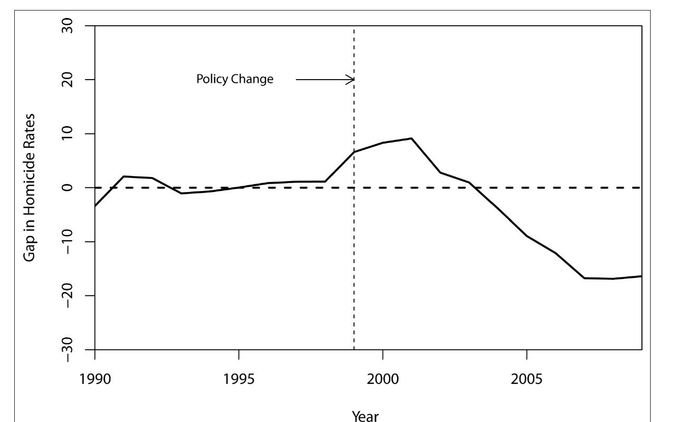

```{r setup, include=FALSE}
options(htmltools.dir.version = FALSE)
library(knitr)
opts_chunk$set(
  prompt = T,
  fig.align = "center",
  dpi = 300,
  cache = T,
  engine.opts = list(bash = "-l")
)

knit_hooks$set(
  prompt = function(before, options, envir) {
    options(
      prompt = if (options$engine %in% c("sh", "bash", "zsh")) "$ " else "R> ",
      continue = if (options$engine %in% c("sh", "bash", "zsh")) "$ " else "+ "
    )
  }
)

options(repos = c(CRAN = "https://cran.rstudio.com/"))

ensure <- function(pkg) {
  if (!require(pkg, character.only = TRUE)) {
    install.packages(pkg, dependencies = TRUE)
    library(pkg, character.only = TRUE)
  }
}
invisible(lapply(c("fontawesome", "dplyr", "tidysynth"), ensure))

suppressPackageStartupMessages({
  library(ggplot2); library(dplyr); library(tidysynth)
})

# paleta de la casa (mismo par azul/rojo que 01-apertura.qmd)
azul <- "#2d4563"; rojo <- "#b85450"

tema_taller <- theme_minimal(base_size = 15) +
  theme(panel.grid.minor = element_blank(),
        plot.margin = margin(6, 10, 6, 6))

# los datos quedan cargados para todas las láminas siguientes
datos <- read.csv("datos/homicidios.csv")
```

<!--
BLOQUE 3 · DIFERENCIAS EN DIFERENCIAS Y CONTROL SINTÉTICO (13:30-14:15).
Extensiones: clean-revealjs (tema grantmcdermott/clean) + multimodal (zoom de imágenes),
ambas ya instaladas en _extensions/ del repo (las usa 01-apertura.qmd).
Estilo de la casa (ver plan/01-guia-estilo.md): dos columnas, wrappers :::{style="font-size:..."},
[término]{.alert} para enfatizar, callouts #2d4563 / #b85450,
citas [Autor (año)](url) juntadas en ## Referencias, español rioplatense, sin guiones largos.
Práctica pre-cocinada con apéndice y botones .button (patrón de los labs de introduccion-ia-ucu).

Datos: datos/homicidios.csv, simulado con datos/generar-homicidios.R sobre el caso de
Freire (2018, LARR): São Paulo tratado desde 2000, 15 donantes, panel 1990-2005.
OJO: en el paper las políticas arrancan en 1999 y el panel real llega a 2009; la simulación
es la "versión simplificada para enseñar". Números de la práctica: DiD 2x2 ~ -11,
brecha sintética ~ -15/-16 hacia 2005, placebo con un donante ~ 0.

ARCO: plan -> tercera respuesta -> setup -> DiD (2x2, gráfico, tendencias paralelas,
cuándo se rompe, región, puente) -> control sintético (caso, receta, resultado, brecha,
placebos, PCC, extensiones/gsynth, qué mirar y límites) -> práctica -> apéndice.
-->

# El contrafactual que armás {background-color="#2d4563"}

## El plan del bloque

:::{style="margin-top: 10px; font-size: 20px;"}
:::{.columns}
:::{.column width=34%}
[Las ideas]{.alert}

- La [tercera respuesta]{.alert} a "¿comparado con qué?"
- [Tendencias paralelas]{.alert} y cuándo se rompen
- De dos grupos a un [donante a medida]{.alert}
- Los [placebos]{.alert} como forma de inferencia
:::

:::{.column width=34%}
[El caso]{.alert}

- Los [homicidios]{.alert} en São Paulo
- Nuestro paper en la *LARR* ([Freire, 2018](https://doi.org/10.25222/larr.334))
- La [explicación rival]{.alert}: el PCC y las cárceles
:::

:::{.column width=32%}
[Las herramientas]{.alert}

- El [2×2 a mano]{.alert} con `dplyr`
- `tidysynth` en un solo [pipe]{.alert}
- `plot_trends()`, `plot_differences()` y `plot_placebos()`
:::
:::

:::{style="margin-top: 8px; border-left: 4px solid #2d4563; padding: 6px 18px; font-size: 20px;"}
Cerramos con una práctica corta: corrés el análisis completo del caso en unos pocos comandos
:::
:::

## La tercera respuesta

:::{style="margin-top: 10px; font-size: 20px;"}
Después del almuerzo, volvemos a la misma pregunta de toda la mañana: [comparado con qué]{.alert}. Ya vimos dos formas de responderla; ahora suma la tercera.

| Diseño | ¿De dónde sale el contrafactual? | ¿Cuándo? |
|---|---|---|
| [Experimento]{.alert} | Lo [construís]{.alert} sorteando | 9:30 |
| [RDD]{.alert} | Lo [encontrás]{.alert} en una regla con umbral | 11:00 |
| [DiD y control sintético]{.alert} | Lo [armás]{.alert} con las trayectorias de otras unidades | ahora |

Cuándo necesitás esta tercera vía:

- tenés una [sola unidad tratada]{.alert} (un estado, un país), no un montón de casos para sortear
- la política [ya pasó]{.alert}: no hubo forma de aleatorizar antes de que ocurriera
- no hay [umbral]{.alert} que separe tratados de controles, ni [sorteo]{.alert} posible

:::{style="margin-top: 8px; border-left: 4px solid #2d4563; padding: 6px 18px; font-size: 19px;"}
Lo que sí tenés es [tiempo]{.alert}: muchos años de datos, para el caso tratado y para otros que le pueden servir de espejo
:::
:::

## Antes de empezar: datos y paquetes

:::{style="margin-top: 16px; font-size: 20px;"}
Vas a necesitar el conjunto de datos y tres paquetes. Hacelo ahora, mientras arrancamos.

```{r instalar, echo=TRUE, eval=FALSE}
# 1. Instalar (solo la primera vez)
install.packages(c("dplyr", "ggplot2", "tidysynth"))

# 2. Cargar los datos (descargá homicidios.csv del repo del taller)
datos <- read.csv("homicidios.csv")
# Leélo directo desde la web, sin descargar nada:
# datos <- read.csv("https://raw.githubusercontent.com/danilofreire/taller-evidencia-ucu/main/diapositivas/datos/homicidios.csv")
```

:::{style="margin-top: 8px; border-left: 4px solid #b85450; padding: 6px 18px; font-size: 18px;"}
`tidysynth` arma el control sintético en un pipe de `dplyr`: apila las funciones que generan los pesos, estiman el contrafactual y dibujan los diagnósticos. La línea comentada te evita bajar el archivo a mano
:::
:::

# Diferencias en diferencias {background-color="#2d4563"}

## La idea en una tabla

:::{style="margin-top: 6px; font-size: 20px;"}
:::{.columns}
:::{.column width=50%}
El estimador más simple sale de [cuatro promedios]{.alert}: São Paulo y los donantes, antes y después de 2000.

```{r did-tabla, echo=TRUE}
datos |>
  group_by(tratado, post) |>
  summarise(tasa = round(mean(tasa_homicidios), 1),
            .groups = "drop")
```

Cada celda es un número que podés señalar con el dedo: `tratado = 1` es São Paulo, `post = 1` es de 2000 en adelante.
:::

:::{.column width=50%}
La doble resta:

- São Paulo pasó de [30,7]{.alert} a [26,2]{.alert}: cayó unos 4,6 puntos
- Pero los donantes [subieron]{.alert}, de 31,2 a 37,5: ganaron 6,3 puntos en el mismo período
- La diferencia de las diferencias es $(-4{,}6) - (+6{,}3) \approx {}$[$-10{,}9$]{.alert} por 100.000

:::{style="margin-top: 8px; border-left: 4px solid #2d4563; padding: 6px 18px; font-size: 18px;"}
La primera resta saca lo [fijo]{.alert} de São Paulo (lo que no cambia en el tiempo); la segunda saca lo que le pasó [a todos]{.alert} (la tendencia común). Lo que queda es el efecto
:::
:::
:::
:::

## La idea en un gráfico

:::{style="margin-top: 4px; font-size: 20px;"}
La misma cuenta, dibujada: São Paulo contra el promedio de sus 15 donantes.

```{r did-grafico, echo=FALSE, fig.height=4, fig.width=9}
sp <- datos |>
  filter(tratado == 1) |>
  transmute(anio, tasa = tasa_homicidios, grupo = "São Paulo")

donantes <- datos |>
  filter(tratado == 0) |>
  group_by(anio) |>
  summarise(tasa = mean(tasa_homicidios), .groups = "drop") |>
  mutate(grupo = "Promedio de los 15 donantes")

serie <- bind_rows(sp, donantes)

# contrafactual DiD: São Paulo desde 1999, movido con la tendencia de los donantes
sp_99  <- sp$tasa[sp$anio == 1999]
don_99 <- donantes$tasa[donantes$anio == 1999]
contraf <- donantes |>
  filter(anio >= 1999) |>
  transmute(anio, tasa = sp_99 + (tasa - don_99), grupo = "Contrafactual DiD")

ggplot(serie, aes(anio, tasa, color = grupo)) +
  geom_line(linewidth = 1.1) +
  geom_point(size = 1.8) +
  geom_line(data = contraf, aes(anio, tasa), color = "grey45",
            linetype = "dotted", linewidth = 0.9, inherit.aes = FALSE) +
  geom_vline(xintercept = 1999.5, linetype = "dashed", color = rojo,
             linewidth = 0.8) +
  scale_color_manual(values = c("São Paulo" = azul,
                                "Promedio de los 15 donantes" = "grey55")) +
  labs(x = NULL, y = "Homicidios por 100.000", color = NULL) +
  tema_taller +
  theme(legend.position = "top")
```

:::{style="text-align: center; font-size: 17px; color: #6E665C;"}
La línea punteada gris es el contrafactual: São Paulo si hubiera seguido la tendencia de los donantes. La distancia vertical entre São Paulo y ese contrafactual [es]{.alert} el estimado DiD
:::
:::

## El supuesto: tendencias paralelas

:::{style="margin-top: 6px; font-size: 20px;"}
:::{.columns}
:::{.column width=50%}
Toda la lógica se apoya en un supuesto: sin la política, São Paulo se habría movido [en paralelo]{.alert} a los donantes.

- Es una afirmación sobre un mundo que [nunca vemos]{.alert}: el São Paulo sin el programa
- Por eso [no se puede testear]{.alert} directamente después del tratamiento
- Lo que sí podés mirar son las [pre-tendencias]{.alert}: si antes de 2000 las dos líneas ya iban parejas, el supuesto se vuelve más creíble
:::

:::{.column width=50%}
```{r pre-tendencias, echo=FALSE, fig.height=3.6, fig.width=5}
serie_pre <- bind_rows(
  datos |>
    filter(tratado == 1) |>
    transmute(anio, tasa = tasa_homicidios, grupo = "São Paulo"),
  datos |>
    filter(tratado == 0) |>
    group_by(anio) |>
    summarise(tasa = mean(tasa_homicidios), .groups = "drop") |>
    mutate(grupo = "Promedio de los 15 donantes")
) |>
  filter(anio <= 1999)

ggplot(serie_pre, aes(anio, tasa, color = grupo)) +
  geom_line(linewidth = 1.1) +
  geom_point(size = 1.8) +
  scale_color_manual(values = c("São Paulo" = azul,
                                "Promedio de los 15 donantes" = "grey55")) +
  labs(x = NULL, y = "Homicidios por 100.000", color = NULL) +
  tema_taller +
  theme(legend.position = "top",
        legend.text = element_text(size = 9))
```

:::{style="text-align: center; font-size: 15px; color: #555;"}
Sólo 1990-1999: las dos líneas van casi paralelas antes de la política
:::
:::
:::

:::{style="margin-top: 4px; border-left: 4px solid #b85450; padding: 6px 18px; font-size: 18px;"}
Ojo con la trampa: pre-tendencias parecidas son [evidencia circunstancial]{.alert}, no una garantía. Que dos líneas fueran paralelas ayer no obliga a que lo sigan siendo mañana
:::
:::

## Cuándo se rompe

:::{style="margin-top: 8px; font-size: 19px;"}
El paralelismo falla cuando algo, además del tratamiento, mueve a los dos grupos de forma distinta. Tres casos típicos:

- La política llegó [justo porque]{.alert} el resultado se estaba desviando. Es el "Ashenfelter dip": los programas de capacitación reclutan gente que acaba de perder ingresos, gente que iba a [rebotar sola]{.alert} aunque no la capacitaras. El antes-después le atribuye al programa un rebote que ya venía

- [Anticipación]{.alert}: la gente cambia su conducta [antes]{.alert} de la fecha oficial. Si se sabe que viene la política, el "antes" ya está contaminado y deja de ser un buen punto de partida

- [Composición]{.alert}: quiénes están en cada grupo cambia con el tiempo. Si hay migración entre estados, el São Paulo de 2005 no está hecho de la misma gente que el de 1995, y comparás dos poblaciones distintas

:::{style="margin-top: 8px; border-left: 4px solid #2d4563; padding: 6px 18px; font-size: 18px;"}
Por eso el gráfico de pre-tendencias es [lo primero]{.alert} que un lector busca: es la única ventana que tenemos hacia un supuesto que no se puede probar de frente
:::
:::

## DiD en la región

:::{style="margin-top: 10px; font-size: 20px;"}
:::{.columns}
:::{.column width=50%}
[El clásico]{.alert}

[Card y Krueger (1994)](https://www.jstor.org/stable/2118030) compararon el empleo en locales de comida rápida de [New Jersey]{.alert}, que subió el salario mínimo, contra [Pennsylvania]{.alert}, que no lo tocó.

- Es el estudio que mencionamos a la mañana
- Contra la predicción de manual, el empleo [no cayó]{.alert} en New Jersey
- El antes-después de un estado, contrastado con el otro, es DiD en su forma más pura
:::

:::{.column width=50%}
[El clásico latinoamericano]{.alert}

[Galiani, Gertler y Schargrodsky (2005)](https://doi.org/10.1086/426041) estudiaron la [privatización del agua]{.alert} en Argentina y la mortalidad infantil.

- Compararon municipios que privatizaron contra los que no, [antes y después]{.alert} del cambio
- La mortalidad infantil [cayó más]{.alert} donde el agua se privatizó
- El efecto se concentró en los municipios [más pobres]{.alert}, justo donde el servicio era peor
:::
:::

:::{style="margin-top: 8px; border-left: 4px solid #2d4563; padding: 6px 18px; font-size: 18px;"}
En los dos casos, el control es un grupo real que [siguió su propia tendencia]{.alert}, y esa tendencia hace de contrafactual para el grupo tratado
:::
:::

## De dos grupos a un donante a medida

:::{style="margin-top: 12px; font-size: 21px;"}
El DiD usa el [promedio de todos]{.alert} los donantes como contrafactual. Está bien para empezar, pero es un poco [tosco]{.alert}.

- ¿Por qué Maranhão, tan distinto de São Paulo, pesaría [igual]{.alert} que Rio de Janeiro en ese promedio?

- Con una sola unidad tratada y muchos donantes, conviene [ponderarlos]{.alert}: darle más peso a los estados que de verdad se parecen a São Paulo

- La idea es elegir los pesos para que el promedio ponderado [calque]{.alert} la trayectoria de São Paulo antes de la política

Eso, exactamente, es el [control sintético]{.alert}: en lugar de un donante promedio, un São Paulo sintético hecho a medida.

:::{style="margin-top: 8px; border-left: 4px solid #2d4563; padding: 6px 18px; font-size: 19px;"}
La receta para elegir esos pesos, y cómo `tidysynth` la resuelve en un pipe, en la próxima sección
:::
:::

# Control sintético {background-color="#2d4563"}

## El caso: homicidios en São Paulo

:::{style="margin-top: 10px; font-size: 19px;"}
:::{.columns}
:::{.column width=58%}
Brasil venía [violentísimo]{.alert}: 56.337 homicidios en 2012, y una tasa nacional que casi se duplicó desde 1985.

- São Paulo estaba entre lo peor: en 1996-1999, distritos como Jardim Ângela llegaban a [116 muertes violentas]{.alert} por 100.000 habitantes

- Y sin embargo, en una década São Paulo bajó su tasa un [70%]{.alert}: pasó de estar entre los peores a parecerse a un país tranquilo

- La pregunta es la de siempre, ahora en el tiempo: ¿cuánto de esa caída fue [la política]{.alert} y cuánto habría pasado [igual]{.alert}, sin hacer nada?
:::

:::{.column width=42%}
:::{style="text-align: center;"}


:::{style="font-size: 15px; color: #555;"}
Freire (2018), *Latin American Research Review*
:::
:::
:::
:::
:::

## Qué hizo São Paulo

:::{style="margin-top: 10px; font-size: 19px;"}
:::{.columns}
:::{.column width=52%}
En 1998 el gobernador Mário Covas prometió [reducir la criminalidad a la mitad]{.alert}, y su sucesor siguió la misma línea. El paquete arranca en 1999:

- [Encarcelamiento masivo]{.alert}: unos 200.000 presos, el 35% de toda la población carcelaria de Brasil, sumando 15.000 por año

- [Control de armas]{.alert} en el estado, después reforzado por el Estatuto del Desarme nacional de 2003

- [Inteligencia policial]{.alert}: Infocrim mapea los hot spots geocodificados desde 1999, y Fotocrim arma una base de fotos de sospechosos

- Lo que se puede estimar es el efecto del [paquete completo]{.alert}, no de cada pieza por separado
:::

:::{.column width=48%}


:::{style="font-size: 15px; text-align: center; color: #555;"}
Figura 1 del paper: São Paulo cae desde 1999 mientras el resto de Brasil sube
:::
:::
:::
:::

## La receta

:::{style="margin-top: 8px; font-size: 19px;"}
:::{.columns}
:::{.column width=54%}
La idea: buscar [pesos]{.alert} sobre los estados no tratados para que su promedio ponderado [calque]{.alert} al São Paulo previo a 1999, en el resultado y en los predictores. Ese clon es el contrafactual.

- Los pesos [son]{.alert} la comparación, y son [transparentes]{.alert}: cualquiera puede leerlos y discutir si tienen sentido ([Abadie y Gardeazabal, 2003](https://doi.org/10.1257/000282803321455188); [Abadie, Diamond y Hainmueller, 2010](https://doi.org/10.1198/jasa.2009.ap08746))

- De 27 estados posibles, sólo [seis]{.alert} entran con peso no nulo

- Entre los predictores, la escolaridad (0,469), el PIB per cápita (0,275) y la tasa de homicidios previa (0,241) se llevan casi todo el peso
:::

:::{.column width=46%}
:::{style="font-size: 18px;"}
| Estado | Peso |
|---|---|
| Santa Catarina | 0,274 |
| Distrito Federal | 0,210 |
| Espírito Santo | 0,209 |
| Rio de Janeiro | 0,169 |
| Roraima | 0,137 |
| Pernambuco | 0,001 |
:::

:::{style="font-size: 15px; text-align: center; color: #555; margin-top: 6px;"}
Tabla 1 del paper: el São Paulo sintético
:::
:::
:::
:::

## El resultado

:::{style="margin-top: 8px; font-size: 20px;"}
:::{.columns}
:::{.column width=62%}


:::{style="font-size: 15px; text-align: center; color: #555;"}
Figura 2 del paper: São Paulo real frente a su clon sintético
:::
:::

:::{.column width=38%}
El ajuste antes de 1999 es [apretado]{.alert}: el sintético sigue a São Paulo año a año durante una década.

- Desde 1999 las dos líneas [se abren]{.alert}

- En 2009 el São Paulo real está en 15 por 100.000, y su sintético queda [arriba de 30]{.alert}
:::
:::
:::

## La brecha

:::{style="margin-top: 8px; font-size: 20px;"}
:::{.columns}
:::{.column width=58%}


:::{style="font-size: 15px; text-align: center; color: #555;"}
Figura 3 del paper: la distancia entre las dos líneas, año a año
:::
:::

:::{.column width=42%}
La brecha es el efecto estimado: la distancia entre São Paulo y su clon, año a año.

- Llega a unos [−20 por 100.000]{.alert} en 2009

- Acumulando 1999-2009: unas [20.300 vidas salvadas]{.alert}
:::
:::

:::{style="margin-top: 8px; border-left: 4px solid #b85450; padding: 6px 18px; font-size: 18px;"}
Es el efecto del [paquete completo]{.alert}, no de ninguna política individual: no separa cuánto vino de las cárceles, cuánto de las armas y cuánto de la inteligencia policial
:::
:::

## ¿Y si es casualidad? Placebos

:::{style="margin-top: 6px; font-size: 19px;"}
:::{.columns}
:::{.column width=52%}
El control sintético no usa errores estándar: hace [inferencia con placebos]{.alert}. Corrés el mismo método sobre cada estado no tratado, como si él hubiera recibido la política. La línea de São Paulo tiene que ser [la extrema]{.alert}, y lo es.

- Placebo [en el tiempo]{.alert}: si ponés un tratamiento falso en 1994, no aparece ninguna brecha

- [Leave-one-out]{.alert}: sacás cada donante de a uno y el resultado aguanta

- Un chequeo bayesiano independiente da [96,3%]{.alert} de probabilidad de efecto causal (esperado 32,3 contra observado 15,2 en 2009)
:::

:::{.column width=48%}


:::{style="font-size: 15px; text-align: center; color: #555;"}
Figura 6 del paper: los 26 estados en gris, São Paulo en negro
:::
:::
:::

:::{style="margin-top: 6px; border-left: 4px solid #2d4563; padding: 6px 18px; font-size: 18px;"}
Es la misma lógica que los [cortes placebo]{.alert} del RDD de la mañana: rompés el diseño a propósito y mostrás que el efecto sólo aparece donde debe
:::
:::

## ¿Y si fue otra cosa? El PCC

:::{style="margin-top: 6px; font-size: 19px;"}
:::{.columns}
:::{.column width=50%}
La hipótesis rival más seria: el [PCC]{.alert} (Primeiro Comando da Capital), la facción nacida en las cárceles que impone disciplina interna y "regula" la violencia entre bandas.

Si el PCC causó la caída, el mérito no es de la política, y todo el argumento se cae.
:::

:::{.column width=50%}
Las tres respuestas del paper:

- [Timing]{.alert}: la caída empieza en 1999, pero el PCC se consolida recién a mediados de los 2000

- La baja fue [pareja]{.alert} en todos los estratos, también en grupos y zonas donde el PCC no manda (ancianos, mujeres de mediana edad)

- La evidencia georreferenciada de estudios posteriores encuentra un efecto del PCC [real pero menor]{.alert}
:::
:::

:::{style="margin-top: 6px; border-left: 4px solid #2d4563; padding: 6px 18px; font-size: 18px;"}
Buscá siempre la [explicación rival]{.alert} y tomátela en serio: para el efecto del paquete completo, acá el PCC [modera]{.alert} el efecto más de lo que lo confunde, y el debate sigue abierto
:::
:::

## Más allá del caso clásico

:::{style="margin-top: 8px; font-size: 19px;"}
El control sintético clásico pide [una]{.alert} unidad tratada y una sola fecha de tratamiento. La investigación no se quedó ahí:

- El [control sintético generalizado]{.alert} ([Xu, 2017](https://doi.org/10.1017/pan.2016.2)) admite [varias unidades tratadas]{.alert} y [adopción escalonada]{.alert}, usando modelos de efectos fijos interactivos; el ejemplo del propio paper de Xu son las leyes de registro de votantes el mismo día (EDR) en varios estados de Estados Unidos y su efecto sobre la participación electoral

- En R lo corrés con los paquetes [`gsynth`](https://yiqingxu.org/packages/gsynth/) y [`fect`](https://yiqingxu.org/packages/fect/), del mismo autor

- Hoy hay toda una familia que combina lo mejor de DiD y sintético: el [synthetic DiD]{.alert} y los controles sintéticos aumentados ([Arkhangelsky et al., 2021](https://doi.org/10.1257/aer.20190159))

:::{style="margin-top: 8px; border-left: 4px solid #2d4563; padding: 6px 18px; font-size: 18px;"}
La lección práctica: si tu caso tiene varios tratados o fechas distintas, no fuerces el método clásico; hay una herramienta pensada para eso
:::
:::

## Qué mirar cuando leas un control sintético

:::{style="margin-top: 8px; font-size: 19px;"}
:::{.columns}
:::{.column width=50%}
[Las preguntas de rutina]{.alert}

- ¿El [ajuste pre]{.alert} es bueno, o el sintético nunca calcó al tratado antes del tratamiento?

- ¿Los [pesos]{.alert} son pocos y tienen sentido sustantivo, o salen donantes de otro mundo?

- ¿Mostraron el [gráfico de placebos]{.alert}, con el tratado como caso extremo?

- ¿El efecto sobrevive [leave-one-out]{.alert}?

- ¿Hay [spillovers]{.alert}? El crimen pudo mudarse a los estados donantes, y eso contamina el contrafactual
:::

:::{.column width=50%}
[Los límites que no se tapan]{.alert}

- Pocos años [pre]{.alert} tratamiento hacen el ajuste frágil

- Predictores elegidos [post hoc]{.alert} para que el ajuste dé lindo

- Una sola unidad tratada: [nada]{.alert} de errores estándar clásicos, toda la inferencia vive en los placebos
:::
:::

:::{style="margin-top: 8px; border-left: 4px solid #2d4563; padding: 6px 18px; font-size: 19px;"}
La credibilidad vive en estos chequeos, igual que en el RDD de la mañana: el método no te salva solo, te salva el cuidado con sus supuestos
:::
:::

# Práctica {background-color="#2d4563"}

## De qué se trata la práctica {#sec:ejercicios}

:::{style="margin-top: 6px; font-size: 18px;"}
:::{.columns}
:::{.column width=56%}
Con `homicidios.csv` vas a reproducir el análisis completo del bloque: el 2×2 de DiD [a mano]{.alert}, el control sintético en [un solo pipe]{.alert} con `tidysynth`, y un [placebo]{.alert} para creerle (o no).

Objetivos:

- calcular el 2×2 de DiD con [dplyr]{.alert} y leer la doble resta
- armar el [sintético]{.alert} de São Paulo en un pipe
- mirar la brecha con `plot_trends` y `plot_differences`
- correr un [placebo]{.alert} y ver por qué te deja más tranquilo
:::

:::{.column width=44%}
[Las variables]{.alert}

:::{style="font-size: 15px;"}
| Variable | Qué es |
|---|---|
| `estado` | Estado brasileño (16 en total) |
| `anio` | Año, de 1990 a 2005 |
| `tasa_homicidios` | Homicidios por 100.000 |
| `pib_pc` | PIB per cápita |
| `gini` | Desigualdad de ingresos |
| `poblacion_urbana` | Proporción urbana |
| `jovenes_pct` | Porcentaje de jóvenes |
| `tratado` | 1 si es São Paulo |
| `post` | 1 desde el año 2000 |
:::

Bajá los datos desde [la página del taller](https://danilofreire.github.io/taller-evidencia-ucu/materiales.html)
:::
:::

:::{style="margin-top: 6px; border-left: 4px solid #2d4563; padding: 6px 18px; font-size: 17px;"}
Tenés unos [10 minutos]{.alert}; el código ya está escrito, la idea es correrlo y leerlo; la solución del ejercicio está en el apéndice
:::
:::

## El 2×2 a mano

:::{style="margin-top: 12px; font-size: 19px;"}
```{r}
#| label: did-2x2
#| echo: true
#| eval: true
medias <- datos |>
  group_by(tratado, post) |>
  summarise(tasa = mean(tasa_homicidios), .groups = "drop")
medias

(26.17 - 30.74) - (37.46 - 31.16)
```

Los donantes suben de 31,2 a 37,5 y São Paulo baja de 30,7 a 26,2; la doble resta da ≈ [−10,9]{.alert}. Esto vale sólo si, sin la política, São Paulo hubiera seguido la misma [tendencia]{.alert} que los donantes: un supuesto, no un dato
:::

## El control sintético en un pipe

:::{style="margin-top: 12px; font-size: 18px;"}
```{r}
#| label: sc-pipe
#| echo: true
#| eval: true
#| message: false
#| warning: false
#| results: hide
sc <- datos |>
  synthetic_control(outcome = tasa_homicidios,   # resultado
                    unit = estado,               # unidad
                    time = anio,                 # tiempo
                    i_unit = "São Paulo",        # la unidad tratada
                    i_time = 1999,               # último año sin política
                    generate_placebos = TRUE) |> # placebos para inferencia
  generate_predictor(time_window = 1990:1999,    # promedios pre-política
                     pib = mean(pib_pc), gini_m = mean(gini),
                     urb = mean(poblacion_urbana), jov = mean(jovenes_pct)) |>
  generate_predictor(time_window = 1990:1999, tasa_pre = mean(tasa_homicidios)) |>
  generate_weights() |>                          # elige los pesos
  generate_control()                             # arma el sintético
```

Cada paso del pipe hace una cosa: definís el problema, elegís los [predictores]{.alert} pre-política, dejás que el método elija los [pesos]{.alert} y armás el control. Leelo de arriba a abajo, como una receta
:::

## Ver el resultado

:::{style="margin-top: 10px; font-size: 18px;"}
```{r}
#| label: sc-trends
#| echo: true
#| eval: true
#| fig.height: 4
sc |> plot_trends()
```

Buen ajuste antes de 2000 y una brecha de unos [15-16 puntos]{.alert} hacia 2005: el São Paulo real cae por debajo de su clon sintético. Para ver la brecha sola, `sc |> plot_differences()`; los pesos, con `sc |> grab_unit_weights()`.

:::{style="margin-top: 8px; border-left: 4px solid #b85450; padding: 6px 18px; font-size: 17px;"}
En el paper, con los datos reales, 27 donantes y la serie hasta 2009, la brecha llega a unos [20 puntos]{.alert}. Esta es la versión simulada y simplificada, más chica y más corta
:::
:::

## Probá vos: el placebo {#sec:ej-placebo}

:::{style="margin-top: 14px; font-size: 20px;"}
:::{style="border-left: 4px solid #b85450; padding: 8px 20px; font-size: 20px;"}
[Cambiá la unidad tratada por un donante cualquiera (probá "Paraná") y volvé a correr el pipe. ¿Qué le pasa a la brecha? ¿Y por qué eso te deja más tranquilo sobre São Paulo?]{.alert}
:::

```{r}
#| label: placebo-skeleton
#| eval: false
#| echo: true
#| prompt: false
placebo <- datos |>
  filter(estado != "São Paulo") |>            # sacá al tratado real del pool
  synthetic_control(outcome = tasa_homicidios, unit = estado, time = anio,
                    i_unit = "___", i_time = 1999,   # TODO: un donante, probá "Paraná"
                    generate_placebos = FALSE) |>
  generate_predictor(time_window = 1990:1999,
                     pib = mean(pib_pc), gini_m = mean(gini),
                     urb = mean(poblacion_urbana), jov = mean(jovenes_pct)) |>
  generate_predictor(time_window = 1990:1999, tasa_pre = mean(tasa_homicidios)) |>
  generate_weights() |>
  generate_control()

placebo |> plot_trends()
```

[[Apéndice: Solución]{.button}](#sec:sol-placebo)
:::

## Para llevarte

:::{style="margin-top: 8px; font-size: 19px;"}
:::{.columns}
:::{.column width=50%}
[Las ideas]{.alert}

- La tercera respuesta: el contrafactual se arma con las [trayectorias]{.alert} de otras unidades

- Tendencias paralelas es un [supuesto]{.alert}, no un test

- Los pesos del sintético [son]{.alert} el contrafactual, y son transparentes

- La inferencia va por [placebos]{.alert}, no por una tabla de significancia
:::

:::{.column width=50%}
[La caja de herramientas]{.alert}

- El 2×2 con `dplyr`: `group_by` y una resta

- `tidysynth` en un [pipe]{.alert}, de la definición al control

- `plot_trends`, `plot_differences`, `plot_placebos`

- `gsynth` y `fect` cuando hay [varios tratados]{.alert}
:::
:::

:::{style="margin-top: 8px; border-left: 4px solid #2d4563; padding: 6px 18px; font-size: 19px;"}
Ya tenés las [tres respuestas]{.alert} a "¿comparado con qué?"; a las 14:15 vemos qué pasa cuando juntás muchos estudios: cómo se [acumula]{.alert} (y a veces se tuerce) la evidencia
:::
:::

## Para seguir

:::{style="margin-top: 10px; font-size: 19px;"}
:::{.columns}
:::{.column width=50%}
[Para leer]{.alert}

- [Abadie (2021)](https://doi.org/10.1257/jel.20191450), el survey del *Journal of Economic Literature*

- [Abadie, Diamond y Hainmueller (2010)](https://doi.org/10.1198/jasa.2009.ap08746), el paper canónico (el programa antitabaco de California)

- [Cunningham (2021)](https://mixtape.scunning.com/), *Causal Inference: The Mixtape*: gratis online, los capítulos de DiD y control sintético
:::

:::{.column width=50%}
[Herramientas en R]{.alert}

- [`tidysynth`](https://github.com/edunford/tidysynth), el que usamos hoy

- [`gsynth`](https://yiqingxu.org/packages/gsynth/) y [`fect`](https://yiqingxu.org/packages/fect/) para varios tratados y adopción escalonada

- [`fixest`](https://lrberge.github.io/fixest/) para DiD con efectos fijos a escala
:::
:::
:::

# De un estudio a la evidencia 📚 {background-color="#2d4563"}

## Referencias {#sec:referencias}

:::{style="font-size: 15px;"}
:::{.columns}
:::{.column width=50%}
Abadie, A. (2021). Using synthetic controls: feasibility, data requirements, and methodological aspects. *Journal of Economic Literature* 59(2):391–425. [doi](https://doi.org/10.1257/jel.20191450)

Abadie, A. y Gardeazabal, J. (2003). The economic costs of conflict: a case study of the Basque Country. *American Economic Review* 93(1):113–132. [doi](https://doi.org/10.1257/000282803321455188)

Abadie, A., Diamond, A. y Hainmueller, J. (2010). Synthetic control methods for comparative case studies: estimating the effect of California's tobacco control program. *Journal of the American Statistical Association* 105(490):493–505. [doi](https://doi.org/10.1198/jasa.2009.ap08746)

Arkhangelsky, D., Athey, S., Hirshberg, D., Imbens, G. y Wager, S. (2021). Synthetic difference-in-differences. *American Economic Review* 111(12):4088–4118. [doi](https://doi.org/10.1257/aer.20190159)

Card, D. y Krueger, A. (1994). Minimum wages and employment: a case study of the fast-food industry in New Jersey and Pennsylvania. *American Economic Review* 84(4):772–793. [enlace](https://www.jstor.org/stable/2118030)
:::

:::{.column width=50%}
Cunningham, S. (2021). *Causal Inference: The Mixtape*. Yale University Press. [enlace](https://mixtape.scunning.com/)

Freire, D. (2018). Evaluating the effect of homicide prevention strategies in São Paulo, Brazil: a synthetic control approach. *Latin American Research Review* 53(2):231–249. [doi](https://doi.org/10.25222/larr.334)

Galiani, S., Gertler, P. y Schargrodsky, E. (2005). Water for life: the impact of the privatization of water services on child mortality. *Journal of Political Economy* 113(1):83–120. [doi](https://doi.org/10.1086/426041)

Xu, Y. (2017). Generalized synthetic control method: causal inference with interactive fixed effects models. *Political Analysis* 25(1):57–76. [doi](https://doi.org/10.1017/pan.2016.2)
:::
:::
:::

# Apéndice: soluciones {background-color="#2d4563"}

## Solución: el placebo {#sec:sol-placebo}

:::{style="margin-top: 12px; font-size: 18px;"}
```{r}
#| label: placebo-sol
#| echo: true
#| eval: true
#| fig.height: 3.8
#| message: false
#| warning: false
placebo <- datos |>
  filter(estado != "São Paulo") |>
  synthetic_control(outcome = tasa_homicidios, unit = estado, time = anio,
                    i_unit = "Paraná", i_time = 1999,
                    generate_placebos = FALSE) |>
  generate_predictor(time_window = 1990:1999,
                     pib = mean(pib_pc), gini_m = mean(gini),
                     urb = mean(poblacion_urbana), jov = mean(jovenes_pct)) |>
  generate_predictor(time_window = 1990:1999, tasa_pre = mean(tasa_homicidios)) |>
  generate_weights() |>
  generate_control()

placebo |> plot_trends()
```

Para Paraná el "sintético" lo sigue [también después de 2000]{.alert}: la brecha queda cerca de cero (entre 0 y −3 puntos). Eso [valida]{.alert} el método: la brecha grande aparece sólo donde hubo política. Es la misma lógica del corte placebo del RDD

[[Volver al ejercicio]{.button}](#sec:ej-placebo)
:::
