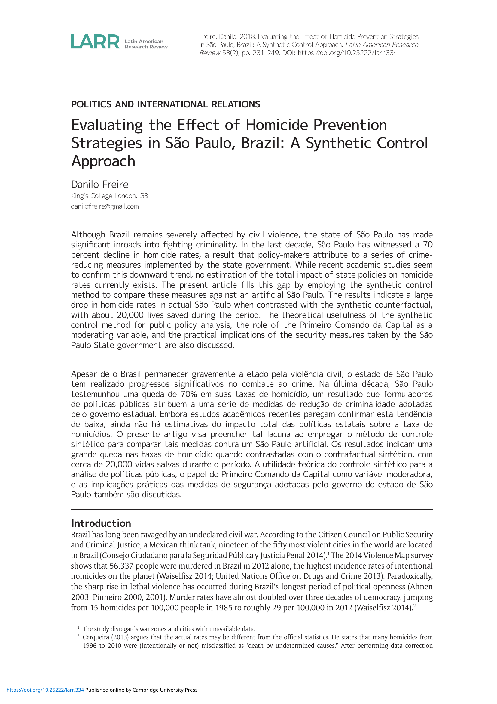
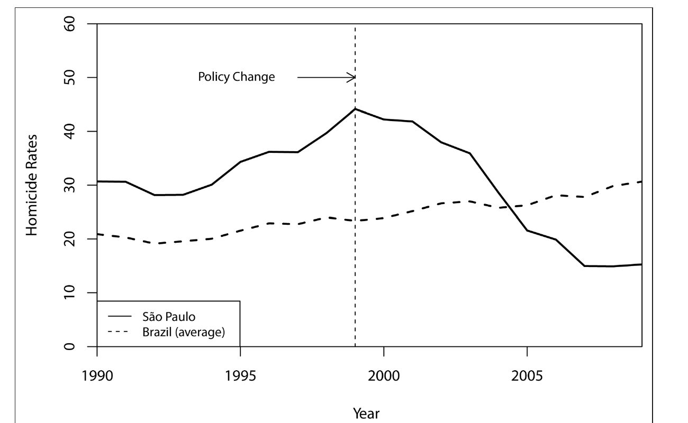
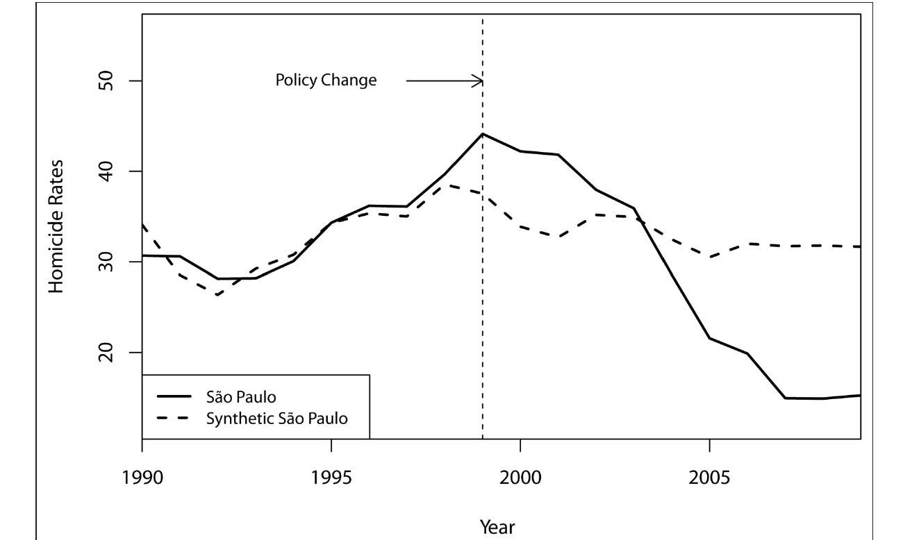
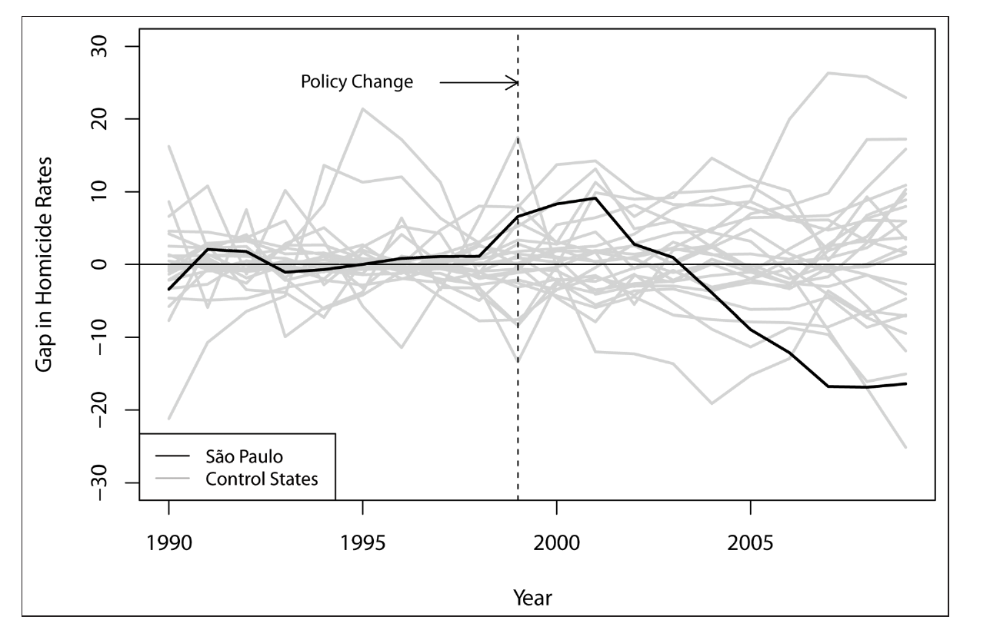
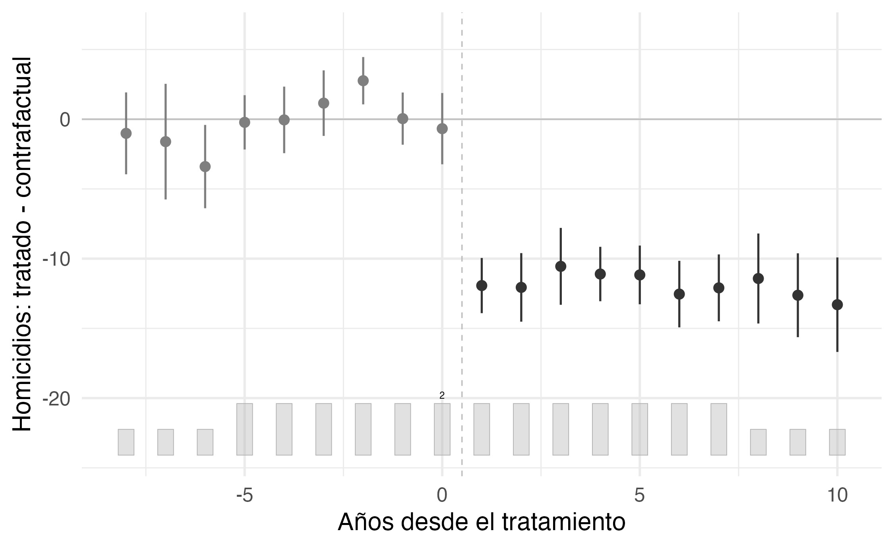

```{r setup, include=FALSE}
options(htmltools.dir.version = FALSE)
library(knitr)
opts_chunk$set(
  echo = FALSE,
  fig.align = "center",
  dpi = 300,
  cache = FALSE
)

options(repos = c(CRAN = "https://cran.rstudio.com/"))

ensure <- function(pkg) {
  if (!require(pkg, character.only = TRUE)) {
    install.packages(pkg, dependencies = TRUE)
    library(pkg, character.only = TRUE)
  }
}
invisible(lapply(c("ggplot2", "dplyr", "tidysynth", "fabricatr", "estimatr"),
                 ensure))

suppressPackageStartupMessages({
  library(ggplot2); library(dplyr); library(tidysynth); library(fabricatr)
  library(estimatr)
})

# paleta de la casa (mismo par azul/rojo que 01-apertura.qmd)
azul <- "#2d4563"; rojo <- "#b85450"

tema_taller <- theme_minimal(base_size = 15) +
  theme(panel.grid.minor = element_blank(),
        plot.margin = margin(6, 10, 6, 6))

# los datos del caso: simulados con fabricatr (paneles con add_level), el
# MISMO generador que se muestra en la slide "Generá los datos del caso"
# (con los huecos completos). Semilla fija => completar los huecos
# reproduce exactamente datos/homicidios.csv.
set.seed(1)
datos <- fabricate(
  unidad = add_level(
    N = 16,
    estado  = c("São Paulo", "Rio de Janeiro", "Minas Gerais", "Bahia",
                "Paraná", "Rio Grande do Sul", "Pernambuco", "Ceará", "Pará",
                "Santa Catarina", "Goiás", "Maranhão", "Espírito Santo",
                "Paraíba", "Amazonas", "Mato Grosso"),
    tratado = as.integer(estado == "São Paulo"),
    base    = ifelse(tratado == 1, 30, runif(N, 15, 45)),
    pib_pc  = round(rlnorm(N, log(12000), 0.25)),
    gini    = round(runif(N, 0.48, 0.62), 3),
    poblacion_urbana = round(runif(N, 0.55, 0.95), 3),
    jovenes_pct      = round(runif(N, 0.16, 0.24), 3)
  ),
  periodo = add_level(
    N = 16,
    anio   = 1990:2005,
    post   = as.integer(anio >= 2000),
    efecto = -14.5 * (1 - exp(-(anio - 1999))) * tratado * post,
    tasa_homicidios = pmax(0, round(base + 0.8 * (anio - 1990)
                                    + efecto + rnorm(N, 0, 1.5), 1))
  )
)
datos <- datos[, c("estado", "anio", "tasa_homicidios", "pib_pc", "gini",
                   "poblacion_urbana", "jovenes_pct", "tratado", "post")]
```

# El contrafactual que armás {background-color="#2d4563"}

## El plan del bloque

:::{style="margin-top: 10px; font-size: 24px;"}
:::{.columns}
:::{.column width=50%}
[Las ideas]{.alert}

- La [tercera respuesta]{.alert} a "¿comparado con qué?"
- [Tendencias paralelas]{.alert} y cuándo se rompen
- De dos grupos a un [donante a medida]{.alert}
- Los [placebos]{.alert} como forma de inferencia
- Más allá del caso clásico: [varios tratados]{.alert} y fechas distintas
:::

:::{.column width=50%}
[Las herramientas]{.alert}

- `fabricatr` para [generar]{.alert} el panel del caso, ahora con `add_level`
- `lm_robust` para el DiD como una [interacción]{.alert}
- `tidysynth` para el sintético, en un solo [pipe]{.alert}
- `plot_trends()` y `plot_placebos()` para ver la brecha
- `grab_significance()` para la [inferencia]{.alert} sin errores estándar
:::
:::

:::{style="margin-top: 15px; border-left: 4px solid #2d4563; padding: 6px 18px; font-size: 23px;"}
Un caso de nuestra propia [investigación en la región]{.alert}: los homicidios en São Paulo ([Freire, 2018](https://doi.org/10.25222/larr.334), *LARR*), y una práctica corta donde generás los datos y corrés el análisis completo
:::
:::

## La tercera respuesta

:::{style="margin-top: 10px; font-size: 23px;"}
Después del almuerzo, volvemos a la misma pregunta de toda la mañana: [comparado con qué]{.alert}. Ya vimos dos formas de responderla; ahora suma la tercera.

| Diseño | ¿De dónde sale el contrafactual? | ¿Cuándo? |
|---|---|---|
| [Experimento]{.alert} | Lo [construís]{.alert} sorteando | 9:30 |
| [RDD]{.alert} | Lo [encontrás]{.alert} en una regla con umbral | 11:00 |
| [DiD y control sintético]{.alert} | Lo [armás]{.alert} con las trayectorias de otras unidades | ahora |

Cuándo necesitás esta tercera vía:

- tenés [una o pocas unidades tratadas]{.alert} (un estado, un país), no un montón de casos para sortear
- la política [ya pasó]{.alert}: no hubo forma de aleatorizar antes de que ocurriera
- no hay [umbral]{.alert} que separe tratados de controles, ni [sorteo]{.alert} posible

:::{style="margin-top: 8px; border-left: 4px solid #2d4563; padding: 6px 18px; font-size: 21px;"}
Lo que sí tenés es [tiempo]{.alert}: muchos años de datos, para el caso tratado y para otros que le pueden servir de espejo
:::
:::

## Antes de empezar: los paquetes

:::{style="margin-top: 16px; font-size: 24px;"}
Vas a necesitar cinco paquetes. Instalalos ahora, mientras arrancamos.

```{r instalar, echo=TRUE, eval=FALSE}
# Instalar (solo la primera vez)
install.packages(c("dplyr", "ggplot2", "tidysynth", "fabricatr", "estimatr"))

# Los datos los generamos nosotros en un momento, con fabricatr.
# ¿Preferís bajar el CSV ya armado? Leélo directo desde la web:
# datos <- read.csv("https://raw.githubusercontent.com/danilofreire/taller-evidencia-ucu/main/diapositivas/datos/homicidios.csv")
```

:::{style="margin-top: 40px; border-left: 4px solid #b85450; padding: 6px 18px; font-size: 22px;"}
`tidysynth` arma el control sintético en un pipe de `dplyr`; `estimatr` nos da el DiD con errores estándar robustos, como a la mañana. La línea comentada te evita generar los datos a mano
:::
:::

## Generá los datos del caso

:::{style="margin-top: 4px; font-size: 22px;"}
Con `fabricatr` simulamos el [panel]{.alert} del caso: 16 estados por 16 años (1990-2005). La novedad es `add_level`: un nivel para los estados, otro para los años. Leamos el código juntos:

:::{.columns}
:::{.column width=62%}
:::{style="margin-top: 6px; font-size: 16px;"}
```{r gen-datos-show, echo=TRUE, eval=FALSE}
library(fabricatr)
set.seed(1)

datos <- fabricate(
  unidad = add_level(              # nivel 1: amuestra de 16 estados
    N = 16,
    estado  = c("São Paulo", "Rio de Janeiro", "Minas Gerais",
                "Bahia", "Paraná", "Rio Grande do Sul",
                "Pernambuco", "Ceará", "Pará", "Santa Catarina",
                "Goiás", "Maranhão", "Espírito Santo",
                "Paraíba", "Amazonas", "Mato Grosso"),
    tratado = as.integer(estado == "São Paulo"),  # sólo SP se trata
    base    = ifelse(tratado == 1, 30, runif(N, 15, 45)),
    pib_pc  = round(rlnorm(N, log(12000), 0.25)),
    gini    = round(runif(N, 0.48, 0.62), 3),
    poblacion_urbana = round(runif(N, 0.55, 0.95), 3),
    jovenes_pct      = round(runif(N, 0.16, 0.24), 3)
  ),
  periodo = add_level(             # nivel 2: 16 años por estado
    N = 16,
    anio   = 1990:2005,
    post   = as.integer(anio >= 2000),            # la política arranca en 2000
    # el efecto sólo actúa si tratado y post valen 1: la brecha crece y se estabiliza
    efecto = -14.5 * (1 - exp(-(anio - 1999))) * tratado * post,
    tasa_homicidios = pmax(0, round(base + 0.8 * (anio - 1990)
                                    + efecto + rnorm(N, 0, 1.5), 1))
  )
)
```
:::
:::

:::{.column width=38%}
:::{style="margin-top: 6px; font-size: 22px;"}
```{r gen-datos-head, echo=TRUE, eval=TRUE, message=FALSE, warning=FALSE}
datos |>
  select(estado, anio,
         tasa_homicidios) |>
  head(4)
```
:::

:::{style="margin-top: 6px; font-size: 21px; color: #555;"}
Las dos líneas que importan son `tratado` (quién) y `post` (cuándo): su producto enciende el `efecto`. El resto son covariables que después nos ayudan a elegir los pesos
:::

:::{style="margin-top: 6px; font-size: 18px; color: #555;"}
El mismo código está en el script de la práctica; el CSV del repo es idéntico (misma semilla)
:::
:::
:::
:::

# Diferencias en diferencias {background-color="#2d4563"}

## La idea, en una tabla y en un gráfico

:::{style="margin-top: 4px; font-size: 20px;"}
El estimador sale de [cuatro promedios]{.alert}: São Paulo y los donantes, antes y después de 2000. La misma cuenta, dibujada a la derecha:

:::{.columns}
:::{.column width=42%}
```{r did-tabla, echo=TRUE}
datos |>
  group_by(tratado, post) |>
  summarise(
    tasa = round(mean(tasa_homicidios), 2),
    .groups = "drop")
```

- São Paulo: [33,8]{.alert} → [27,8]{.alert} ($-6{,}1$)
- Donantes: 34,5 → 41,0 ($+6{,}4$)
- DiD: $(-6{,}1)-(+6{,}4)\approx$ [$-12{,}5$]{.alert}
- La doble resta a mano no trae [incertidumbre]{.alert}. La misma cuenta es una regresión con interacción, que veremos en breve
:::

:::{.column width=58%}
```{r did-grafico, echo=FALSE, fig.height=3.9, fig.width=6}
sp <- datos |>
  filter(tratado == 1) |>
  transmute(anio, tasa = tasa_homicidios, grupo = "São Paulo")

donantes <- datos |>
  filter(tratado == 0) |>
  group_by(anio) |>
  summarise(tasa = mean(tasa_homicidios), .groups = "drop") |>
  mutate(grupo = "Promedio de los 15 donantes")

serie <- bind_rows(sp, donantes)

# contrafactual DiD: São Paulo desde 1999, con la tendencia de los donantes
sp_99  <- sp$tasa[sp$anio == 1999]
don_99 <- donantes$tasa[donantes$anio == 1999]
contraf <- donantes |>
  filter(anio >= 1999) |>
  transmute(anio, tasa = sp_99 + (tasa - don_99), grupo = "Contrafactual DiD")

ggplot(serie, aes(anio, tasa, color = grupo)) +
  geom_line(linewidth = 1.1) +
  geom_point(size = 1.8) +
  geom_line(data = contraf, aes(anio, tasa), color = "grey45",
            linetype = "dotted", linewidth = 0.9, inherit.aes = FALSE) +
  geom_vline(xintercept = 1999.5, linetype = "dashed", color = rojo,
             linewidth = 0.8) +
  scale_color_manual(values = c("São Paulo" = azul,
                                "Promedio de los 15 donantes" = "grey55")) +
  labs(x = NULL, y = "Homicidios por 100.000", color = NULL) +
  tema_taller +
  theme(legend.position = "top", legend.text = element_text(size = 9))
```

:::{style="text-align: center; font-size: 16px; color: #555;"}
La punteada es el contrafactual DiD; su distancia vertical con São Paulo es el estimado
:::
:::
:::
:::

## El supuesto: tendencias paralelas

:::{style="margin-top: 6px; font-size: 22px;"}
:::{.columns}
:::{.column width=50%}
Toda la lógica se apoya en un supuesto: sin la política, São Paulo se habría movido [en paralelo]{.alert} a los donantes

- Es una afirmación sobre un mundo que [nunca vemos]{.alert}: el São Paulo sin el programa
- Por eso [no se puede testear]{.alert} directamente después del tratamiento
- Lo que sí podés mirar son las [pre-tendencias]{.alert}: si antes de 2000 las dos líneas ya iban parejas, el supuesto se vuelve más creíble
:::

:::{.column width=50%}
```{r pre-tendencias, echo=FALSE, fig.height=3.6, fig.width=5}
serie_pre <- bind_rows(
  datos |>
    filter(tratado == 1) |>
    transmute(anio, tasa = tasa_homicidios, grupo = "São Paulo"),
  datos |>
    filter(tratado == 0) |>
    group_by(anio) |>
    summarise(tasa = mean(tasa_homicidios), .groups = "drop") |>
    mutate(grupo = "Promedio de los 15 donantes")
) |>
  filter(anio <= 1999)

ggplot(serie_pre, aes(anio, tasa, color = grupo)) +
  geom_line(linewidth = 1.1) +
  geom_point(size = 1.8) +
  scale_color_manual(values = c("São Paulo" = azul,
                                "Promedio de los 15 donantes" = "grey55")) +
  labs(x = NULL, y = "Homicidios por 100.000", color = NULL) +
  tema_taller +
  theme(legend.position = "top",
        legend.text = element_text(size = 9))
```

:::{style="text-align: center; font-size: 18px; color: #555;"}
Sólo 1990-1999: las dos líneas van casi paralelas antes de la política
:::
:::
:::

:::{style="margin-top: 4px; border-left: 4px solid #b85450; padding: 6px 18px; font-size: 19px;"}
Pre-tendencias parecidas son [evidencia circunstancial]{.alert}, no una garantía. El paralelismo se rompe con la [anticipación]{.alert} o los cambios de [composición]{.alert}. Por eso ese gráfico es [lo primero]{.alert} que busca un lector
:::
:::

## De dos grupos a un donante a medida

:::{style="margin-top: 12px; font-size: 24px;"}
El DiD usa el [promedio de todos]{.alert} los donantes como contrafactual. Está bien para empezar, pero es un poco [rudimentario]{.alert}

- ¿Por qué Maranhão, tan distinto de São Paulo, pesaría [igual]{.alert} que Rio de Janeiro en ese promedio?

- Con una sola unidad tratada y muchos donantes, conviene [ponderarlos]{.alert}: darle más peso a los estados que de verdad se parecen a São Paulo

- La idea es elegir los pesos para que el promedio ponderado [calque]{.alert} la trayectoria de São Paulo antes de la política

Eso, exactamente, es el [control sintético]{.alert}: en lugar de un donante promedio, un São Paulo sintético hecho a medida.

:::{style="margin-top: 8px; border-left: 4px solid #2d4563; padding: 6px 18px; font-size: 21px;"}
La receta para elegir esos pesos, y cómo `tidysynth` la resuelve en un pipe, en la próxima sección
:::
:::

# Control sintético {background-color="#2d4563"}

## El caso: homicidios en São Paulo

:::{style="margin-top: 10px; font-size: 25px;"}
:::{.columns}
:::{.column width=58%}
Brasil venía [violentísimo]{.alert}: 56.337 homicidios en 2012, y una tasa nacional que casi se duplicó desde 1985

- São Paulo estaba entre lo peor: en 1996-1999, distritos como Jardim Ângela llegaban a [116 muertes violentas]{.alert} por 100.000 habitantes

- Y sin embargo, en una década São Paulo bajó su tasa un [70%]{.alert}: pasó de estar entre los peores a parecerse a un país tranquilo

- La pregunta es la de siempre, ahora en el tiempo: ¿cuánto de esa caída fue [la política]{.alert} y cuánto habría pasado [igual]{.alert}, sin hacer nada?
:::

:::{.column width=42%}
:::{style="text-align: center;"}
[{width="74%"}](#){data-modal-type="image" data-modal-url="figures/sintetico-paper.png"}

:::{style="font-size: 18px; color: #555;"}
Freire (2018), *Latin American Research Review*
:::
:::
:::
:::
:::

## Qué hizo São Paulo

:::{style="margin-top: 10px; font-size: 24px;"}
:::{.columns}
:::{.column width=52%}
En 1998 el gobernador Mário Covas prometió [reducir la criminalidad a la mitad]{.alert}, y su sucesor siguió la misma línea. El paquete arranca en 1999:

- [Encarcelamiento masivo]{.alert}: unos 200.000 presos, el 35% de toda la población carcelaria de Brasil, sumando 15.000 por año

- [Control de armas]{.alert} en el estado, después reforzado por el Estatuto del Desarme nacional de 2003

- [Inteligencia policial]{.alert}: Infocrim mapea los hot spots geocodificados desde 1999, y Fotocrim arma una base de fotos de sospechosos

- Lo que se puede estimar es el efecto del [paquete completo]{.alert}, no de cada pieza por separado
:::

:::{.column width=48%}
:::{style="text-align: center;"}
[{width="100%"}](#){data-modal-type="image" data-modal-url="figures/sintetico-fig1-brasil.png"}
:::

:::{style="font-size: 18px; text-align: center; color: #555;"}
Figura 1 del paper: São Paulo cae desde 1999 mientras el resto de Brasil sube
:::
:::
:::
:::

## La receta

:::{style="margin-top: 8px; font-size: 24px;"}
:::{.columns}
:::{.column width=54%}
La idea: buscar [pesos]{.alert} sobre los estados no tratados para que su promedio ponderado [calque]{.alert} al São Paulo previo a 1999, en el resultado y en los predictores. Ese clon es el contrafactual.

- Los pesos [son]{.alert} la comparación, y son [transparentes]{.alert}: cualquiera puede leerlos y discutir si tienen sentido ([Abadie y Gardeazabal, 2003](https://doi.org/10.1257/000282803321455188); [Abadie, Diamond y Hainmueller, 2010](https://doi.org/10.1198/jasa.2009.ap08746))

- De 27 estados posibles, sólo [seis]{.alert} entran con peso no nulo

- Entre los predictores, la escolaridad (0,469), el PIB per cápita (0,275) y la tasa de homicidios previa (0,241) se llevan casi todo el peso
:::

:::{.column width=46%}
:::{style="font-size: 23px; margin-top: 40px;"}
| Estado | Peso |
|:--|:--|
| Santa Catarina | 0,274 |
| Distrito Federal | 0,210 |
| Espírito Santo | 0,209 |
| Rio de Janeiro | 0,169 |
| Roraima | 0,137 |
| Pernambuco | 0,001 |
:::

:::{style="font-size: 23px; text-align: center; color: #555; margin-top: 6px;"}
Tabla 1 del paper: el São Paulo sintético
:::
:::
:::
:::

## El resultado: São Paulo y su clon

:::{style="margin-top: 8px; font-size: 22px;"}
:::{.columns}
:::{.column width=60%}
:::{style="text-align: center;"}
[{width="100%"}](#){data-modal-type="image" data-modal-url="figures/sintetico-fig2-trends.png"}
:::

:::{style="font-size: 18px; text-align: center; color: #555;"}
Figura 2 del paper: São Paulo real frente a su clon sintético
:::
:::

:::{.column width=40%}
El ajuste antes de 1999 es [apretado]{.alert}: el sintético sigue a São Paulo durante una década. Desde 1999 las líneas [se abren]{.alert}.

- En 2009: São Paulo real en 15, su clon [arriba de 30]{.alert}

- La [brecha]{.alert} (la distancia entre ambos) llega a ≈ [−20 por 100.000]{.alert}

- Acumulado 1999-2009: unas [20.300 vidas]{.alert}
:::
:::

:::{style="margin-top: 8px; border-left: 4px solid #b85450; padding: 6px 18px; font-size: 21px;"}
Es el efecto del [paquete completo]{.alert}, no de ninguna política individual: no separa cuánto vino de las cárceles, cuánto de las armas y cuánto de la inteligencia policial
:::
:::

## ¿Y si es casualidad? Placebos

:::{style="margin-top: 6px; font-size: 22px;"}
:::{.columns}
:::{.column width=52%}
El control sintético no usa errores estándar: hace [inferencia con placebos]{.alert}. Corrés el mismo método sobre cada estado no tratado, como si él hubiera recibido la política. La línea de São Paulo tiene que ser [la extrema]{.alert}, y lo es.

- Placebo [en el tiempo]{.alert}: si ponés un tratamiento falso en 1994, no aparece ninguna brecha

- [Leave-one-out]{.alert}: sacás cada donante de a uno y el resultado aguanta

- Un chequeo bayesiano independiente da [96,3%]{.alert} de probabilidad de efecto causal (esperado 32,3 contra observado 15,2 en 2009)
:::

:::{.column width=48%}
:::{style="text-align: center;"}
[{width="100%"}](#){data-modal-type="image" data-modal-url="figures/sintetico-fig6-placebos.png"}
:::

:::{style="font-size: 18px; text-align: center; color: #555;"}
Figura 6 del paper: los 26 estados en gris, São Paulo en negro
:::
:::
:::

:::{style="margin-top: 6px; border-left: 4px solid #2d4563; padding: 6px 18px; font-size: 21px;"}
Es la misma lógica que los [cortes placebo]{.alert} del RDD de la mañana: rompés el diseño a propósito y mostrás que el efecto sólo aparece donde debe
:::
:::

## Más allá del caso clásico: `gsynth`

:::{style="margin-top: 4px; font-size: 20px;"}
El control sintético clásico pide [una]{.alert} unidad tratada y una sola fecha. El [control sintético generalizado]{.alert} ([Xu, 2017](https://doi.org/10.1017/pan.2016.2)) admite [varios tratados]{.alert} y [adopción escalonada]{.alert} con efectos fijos interactivos, y se corre con [`gsynth`](https://yiqingxu.org/packages/gsynth/) y [`fect`](https://yiqingxu.org/packages/fect/). Un panel donde el clásico no sirve, dos tratados en fechas distintas:

:::{.columns}
:::{.column width=46%}
:::{style="margin-top: 4px; font-size: 18px;"}
```{r gsynth-demo, echo=TRUE, eval=FALSE}
library(gsynth)

# panel simulado: 20 estados, DOS tratados
# en años distintos. El generador está en
# datos/generar-gsynth-ejemplo.R

out <- gsynth(y ~ tratado, data = panel,
              index = c("estado", "ano"),
              force = "two-way", se = TRUE)

plot(out, type = "gap")
```
:::

:::{style="margin-top: 6px; font-size: 18px; color: #555;"}
- `index` nombra las dos dimensiones del panel; `force = "two-way"` pide efectos fijos de estado [y]{.alert} de año
- Hay toda una familia que combina DiD y sintético: el [synthetic DiD]{.alert} y los controles aumentados ([Arkhangelsky et al., 2021](https://doi.org/10.1257/aer.20190159))
- Si tu caso tiene [varios tratados o fechas distintas]{.alert}, no fuerces el método clásico
:::
:::

:::{.column width=54%}
:::{style="text-align: center;"}
[{width="100%"}](#){data-modal-type="image" data-modal-url="figures/gsynth-ejemplo.png"}
:::

:::{style="margin-top: 4px; font-size: 18px; color: #555;"}
Cada tratado se alinea con [su propia]{.alert} fecha. La pre-tendencia es plana; después, la brecha promedio cae a ≈ −12 (ATT −11,8), cerca del efecto verdadero
:::
:::
:::
:::

# Práctica {background-color="#2d4563"}

## De qué se trata la práctica {#sec:ejercicios}

:::{style="margin-top: 6px; font-size: 22px;"}
:::{.columns}
:::{.column width=56%}
Con los datos que [generaste]{.alert} vas a reproducir el análisis completo del bloque: el DiD como [regresión]{.alert}, el control sintético en [un solo pipe]{.alert} con `tidysynth`, y los [placebos]{.alert} para creerle (o no).

Objetivos:

- estimar el DiD con una [interacción]{.alert} y leer sus coeficientes
- armar el [sintético]{.alert} de São Paulo en un pipe
- mirar la brecha con `plot_trends` y `plot_differences`
- correr un [placebo]{.alert} e interpretar la [inferencia]{.alert} que sale de ellos
:::

:::{.column width=44%}
[Las variables]{.alert}

:::{style="font-size: 20px;"}
| Variable | Qué es |
|:--|:--|
| `estado` | Estado brasileño (16 en total) |
| `anio` | Año, de 1990 a 2005 |
| `tasa_homicidios` | Homicidios por 100.000 |
| `pib_pc` | PIB per cápita |
| `gini` | Desigualdad de ingresos |
| `poblacion_urbana` | Proporción urbana |
| `jovenes_pct` | Porcentaje de jóvenes |
| `tratado` | 1 si es São Paulo |
| `post` | 1 desde el año 2000 |
:::

Usamos los datos que creamos, pero también podés bajarlos desde [la página del taller](https://danilofreire.github.io/taller-evidencia-ucu/materiales.html)
:::
:::

:::{style="margin-top: 6px; border-left: 4px solid #2d4563; padding: 6px 18px; font-size: 20px;"}
Tenés unos [10 minutos]{.alert}; el esqueleto del código ya está escrito y vos completás los [huecos]{.alert}; cada ejercicio tiene su solución en el apéndice, a un botón de distancia
:::
:::

## Probá vos: el DiD como regresión {#sec:ej-did}

:::{style="margin-top: 8px; font-size: 20px;"}
Para estimar el DiD alcanza con [dos dummies y su interacción]{.alert}. Tenés:

- [`tratado`]{.alert}: vale 1 si la unidad recibió la política (São Paulo) y 0 si es donante. No cambia en el tiempo
- [`post`]{.alert}: vale 1 desde el año de la política (2000 en adelante) y 0 antes. Es igual para todas las unidades

:::{style="border-left: 4px solid #b85450; padding: 8px 20px; font-size: 21px;"}
[Te dejamos la variable dependiente; escribí vos el resto de la fórmula]{.alert}
:::

```{r}
#| label: did-ej
#| echo: true
#| eval: false
did <- lm_robust(tasa_homicidios ~ ___, data = datos)
round(coef(summary(did))[, 1:4], 2)
```

:::{style="margin-top: 6px; font-size: 20px; color: #555;"}
Pista: hay un operador que pide las dos dummies [más]{.alert} su interacción de una sola vez, sin escribir los tres términos a mano. Ya lo usaste a la mañana
:::

[[Ver solución](#sec:sol-did)]{.button}
:::

## Probá vos: el control sintético en un pipe {#sec:ej-pipe}

:::{style="margin-top: 8px; font-size: 19px;"}
:::{style="border-left: 4px solid #b85450; padding: 8px 20px; font-size: 21px;"}
[Los cinco huecos son el [diseño]{.alert}: qué medís, quién es la unidad, cuál es el tiempo, quién se trató y desde cuándo. Los comentarios te dicen qué va en cada uno]{.alert}
:::

```{r}
#| label: sc-pipe-ej
#| echo: true
#| eval: false
sc <- datos |>
  synthetic_control(outcome = ___,               # resultado
                    unit = ___,                  # unidad
                    time = ___,                  # tiempo
                    i_unit = ___,                # la unidad tratada
                    i_time = ___,                # último año sin política
                    generate_placebos = TRUE) |> # placebos para inferencia
  generate_predictor(time_window = 1990:1999,    # promedios pre-política
                     pib = mean(pib_pc), gini_m = mean(gini),
                     urb = mean(poblacion_urbana), jov = mean(jovenes_pct)) |>
  generate_predictor(time_window = 1990:1999, tasa_pre = mean(tasa_homicidios)) |>
  generate_weights() |>                          # elige los pesos
  generate_control()                             # arma el sintético
```

```{r}
#| label: sc-pipe-real
#| include: false
#| message: false
#| warning: false
# la versión completa, para que las slides siguientes tengan el objeto sc
sc <- datos |>
  synthetic_control(outcome = tasa_homicidios, unit = estado, time = anio,
                    i_unit = "São Paulo", i_time = 1999,
                    generate_placebos = TRUE) |>
  generate_predictor(time_window = 1990:1999,
                     pib = mean(pib_pc), gini_m = mean(gini),
                     urb = mean(poblacion_urbana), jov = mean(jovenes_pct)) |>
  generate_predictor(time_window = 1990:1999, tasa_pre = mean(tasa_homicidios)) |>
  generate_weights() |>
  generate_control()
```

:::{style="margin-top: 4px; font-size: 19px; color: #555;"}
`i_time` es el [último año sin]{.alert} la política, no el primero con ella. Del resto del pipe no toques nada: elige los predictores, los pesos y arma el control
:::

[[Ver solución](#sec:sol-pipe)]{.button}
:::

## Ver el resultado

:::{style="margin-top: 10px; font-size: 20px;"}
```{r}
#| label: sc-trends
#| echo: true
#| eval: true
#| fig.height: 4
sc |> plot_trends()
```

Buen ajuste antes de 2000 y una brecha de unos [15 puntos]{.alert} hacia 2005: el São Paulo real cae por debajo de su clon sintético. Para ver la brecha sola, `sc |> plot_differences()`; los pesos, con `sc |> grab_unit_weights()`
:::

## Probá vos: el placebo {#sec:ej-placebo}

:::{style="margin-top: 14px; font-size: 22px;"}
:::{style="border-left: 4px solid #b85450; padding: 8px 20px; font-size: 22px;"}
[Cambiá la unidad tratada por un donante cualquiera (probá "Paraná") y volvé a correr el pipe. ¿Qué le pasa a la brecha? ¿Y por qué eso te deja más tranquilo sobre São Paulo?]{.alert}
:::

```{r}
#| label: placebo-skeleton
#| eval: false
#| echo: true
placebo <- datos |>
  filter(estado != "São Paulo") |>            # sacá al tratado real del pool
  synthetic_control(outcome = tasa_homicidios, unit = estado, time = anio,
                    i_unit = "___", i_time = ___,    # TODO: un donante y el año
                    generate_placebos = FALSE) |>
  generate_predictor(time_window = 1990:1999,
                     pib = mean(pib_pc), gini_m = mean(gini),
                     urb = mean(poblacion_urbana), jov = mean(jovenes_pct)) |>
  generate_predictor(time_window = 1990:1999, tasa_pre = mean(tasa_homicidios)) |>
  generate_weights() |>
  generate_control()

placebo |> plot_trends()
```

[[Ver solución](#sec:sol-placebo)]{.button}
:::

## Para interpretar: la inferencia por placebos

:::{style="margin-top: 6px; font-size: 19px;"}
El control sintético no usa errores estándar: compara a São Paulo contra los placebos de [todos]{.alert} los donantes. Corré estas dos líneas y [leé]{.alert} lo que sale:

:::{.columns}
:::{.column width=52%}
```{r}
#| label: inferencia-plot
#| echo: true
#| eval: true
#| fig.height: 3.1
#| message: false
#| warning: false
sc |> plot_placebos()
```
:::

:::{.column width=48%}
```{r}
#| label: inferencia-sig
#| echo: true
#| eval: true
sc |> grab_significance() |>
  select(unit_name, mspe_ratio,
         rank, fishers_exact_pvalue) |>
  head(3)
```
:::
:::

:::{style="margin-top: 4px; border-left: 4px solid #b85450; padding: 8px 20px; font-size: 20px;"}
[¿Qué significan estos resultados?]{.alert} 

(a) ¿Qué te dice que São Paulo sea la línea [más extrema]{.alert} del gráfico? 

(b) ¿Por qué el $p$ da [0,0625]{.alert} y no menos, si ningún placebo se le acerca?
:::

:::{style="margin-top: 4px; font-size: 18px; color: #555;"}
Para (b): con 16 unidades, el valor más chico posible es $1/16$. ¿Eso quiere decir que el efecto no es significativo ($p=0,0625$)?
:::
:::

## Para llevarte

:::{style="margin-top: 8px; font-size: 22px;"}
:::{.columns}
:::{.column width=50%}
[Las ideas]{.alert}

- La tercera respuesta: el contrafactual se arma con las [trayectorias]{.alert} de otras unidades

- Tendencias paralelas es un [supuesto]{.alert}, no un test

- Los pesos del sintético [son]{.alert} el contrafactual, y son transparentes

- La inferencia va por [placebos]{.alert}, no por una tabla de significancia

- Con varios tratados o fechas distintas, [`gsynth`]{.alert} generaliza el método
:::

:::{.column width=50%}
[La caja de herramientas]{.alert}

- `fabricatr` con `add_level` para [generar paneles]{.alert}

- `lm_robust(y ~ tratado * post)`: el DiD [es]{.alert} la interacción

- `tidysynth` en un [pipe]{.alert}, de la definición al control

- `plot_trends`, `plot_differences`, `plot_placebos`

- `grab_significance` para el [ranking]{.alert} y el p-valor

- `gsynth` y `fect` cuando hay [varios tratados]{.alert}
:::
:::

:::{style="margin-top: 8px; border-left: 4px solid #2d4563; padding: 6px 18px; font-size: 21px;"}
Ya tenés las [tres respuestas]{.alert} a "¿comparado con qué?"; a las 14:15 vemos qué pasa cuando juntás muchos estudios: cómo se [acumula]{.alert} (y a veces se tuerce) la evidencia
:::
:::

## Para seguir

:::{style="margin-top: 8px; font-size: 20px;"}
:::{.columns}
:::{.column width=50%}
[Para leer]{.alert}

- [Abadie (2021)](https://doi.org/10.1257/jel.20191450), el survey del *Journal of Economic Literature*

- [Abadie, Diamond y Hainmueller (2010)](https://doi.org/10.1198/jasa.2009.ap08746), el paper canónico (el programa antitabaco de California)

- Los capítulos de DiD y control sintético de [*The Mixtape*](https://mixtape.scunning.com/) (Cunningham, 2021) y de [*The Effect*](https://theeffectbook.net/) (Huntington-Klein, 2021), gratis online

[Nuestro caso de hoy]{.alert}

- [Freire (2018)](https://doi.org/10.25222/larr.334): los homicidios en São Paulo

- [Pantaleão (2025)](https://doi.org/10.1017/S0003055425101354), un paper excelente con otra hipótesis para la caída: la [gobernanza criminal]{.alert} del PCC, que al monopolizar el mercado criminal regula y reduce la violencia

- Fichas completas en las [referencias](#sec:referencias)
:::

:::{.column width=50%}
[Herramientas en R]{.alert}

- [`tidysynth`](https://github.com/edunford/tidysynth), el que usamos hoy

- [`gsynth`](https://yiqingxu.org/packages/gsynth/) y [`fect`](https://yiqingxu.org/packages/fect/) para varios tratados y adopción escalonada

- [`fixest`](https://lrberge.github.io/fixest/) para DiD con efectos fijos a escala

- [`synthdid`](https://synth-inference.github.io/synthdid/): el synthetic DiD de Arkhangelsky et al. (2021)

- [`did`](https://bcallaway11.github.io/did/) (Callaway y Sant'Anna) para DiD escalonado con muchos grupos
:::
:::
:::

# Apéndice: soluciones {background-color="#2d4563"}

## Solución: el DiD como regresión {#sec:sol-did}

:::{style="margin-top: 8px; font-size: 20px;"}
```{r}
#| label: did-sol
#| echo: true
#| eval: true
# el operador * pide las dos dummies MÁS su interacción
did <- lm_robust(tasa_homicidios ~ tratado * post, data = datos)
round(coef(summary(did))[, 1:4], 2)
```

Cada coeficiente es una parte del 2×2: el [intercepto]{.alert} es el donante típico antes (34,5); [`tratado`]{.alert} es la brecha que ya existía antes de la política (−0,7); [`post`]{.alert} es la tendencia común que subió a todos (+6,5); y la [interacción]{.alert} es lo que le pasó [sólo]{.alert} a São Paulo [sólo]{.alert} después: [−12,5]{.alert}

Escribir `tratado * post` es lo mismo que `tratado + post + tratado:post`, igual que el `tratamiento * zona` de la mañana

:::{style="margin-top: 6px; border-left: 4px solid #b85450; padding: 6px 18px; font-size: 18px;"}
Cuidado con leer ese $p$ como una garantía: hay [una sola]{.alert} unidad tratada, así que el error estándar descansa en la variación año a año, no en muchos São Paulos. Por eso el control sintético hace inferencia con [placebos]{.alert}
:::

[[Volver al ejercicio](#sec:ej-did)]{.button}
:::

## Solución: el control sintético en un pipe {#sec:sol-pipe}

:::{style="margin-top: 8px; font-size: 18px;"}
```{r}
#| label: sc-pipe-sol
#| echo: true
#| eval: false
sc <- datos |>
  synthetic_control(outcome = tasa_homicidios,   # resultado
                    unit = estado,               # unidad
                    time = anio,                 # tiempo
                    i_unit = "São Paulo",        # la unidad tratada
                    i_time = 1999,               # último año sin política
                    generate_placebos = TRUE) |> # placebos para inferencia
  generate_predictor(time_window = 1990:1999,    # promedios pre-política
                     pib = mean(pib_pc), gini_m = mean(gini),
                     urb = mean(poblacion_urbana), jov = mean(jovenes_pct)) |>
  generate_predictor(time_window = 1990:1999, tasa_pre = mean(tasa_homicidios)) |>
  generate_weights() |>                          # elige los pesos
  generate_control()                             # arma el sintético
```

Los cinco huecos son el diseño entero: `outcome` es lo que medís, `unit` y `time` son las dos dimensiones del panel, `i_unit` es quién recibió la política y `i_time` es el [último año sin]{.alert} ella (1999, no 2000). El nombre del estado va [entre comillas]{.alert}; los de las columnas, no

:::{style="margin-top: 6px; border-left: 4px solid #2d4563; padding: 6px 18px; font-size: 17px;"}
Cada paso del pipe hace una cosa: definís el problema, elegís los [predictores]{.alert} pre-política, dejás que el método elija los [pesos]{.alert} y armás el control. Leelo de arriba a abajo, como una receta
:::

[[Volver al ejercicio](#sec:ej-pipe)]{.button}
:::

## Solución: el placebo {#sec:sol-placebo}

:::{style="margin-top: 12px; font-size: 20px;"}
```{r}
#| label: placebo-sol
#| echo: true
#| eval: true
#| fig.height: 3.8
#| message: false
#| warning: false
placebo <- datos |>
  filter(estado != "São Paulo") |>
  synthetic_control(outcome = tasa_homicidios, unit = estado, time = anio,
                    i_unit = "Paraná", i_time = 1999,
                    generate_placebos = FALSE) |>
  generate_predictor(time_window = 1990:1999,
                     pib = mean(pib_pc), gini_m = mean(gini),
                     urb = mean(poblacion_urbana), jov = mean(jovenes_pct)) |>
  generate_predictor(time_window = 1990:1999, tasa_pre = mean(tasa_homicidios)) |>
  generate_weights() |>
  generate_control()

placebo |> plot_trends()
```

Para Paraná el "sintético" lo sigue [también después de 2000]{.alert}: la brecha queda cerca de cero (a lo sumo ±2 puntos). Eso [valida]{.alert} el método: la brecha grande aparece sólo donde hubo política. Es la misma lógica del corte placebo del RDD

[[Volver al ejercicio](#sec:ej-placebo)]{.button}
:::

## Apéndice: DiD en la región

:::{style="margin-top: 10px; font-size: 22px;"}
:::{.columns}
:::{.column width=50%}
[El clásico]{.alert}

[Card y Krueger (1994)](https://www.jstor.org/stable/2118030) compararon el empleo en comida rápida de [New Jersey]{.alert}, que subió el salario mínimo, contra [Pennsylvania]{.alert}, que no lo tocó

- Contra la predicción de manual, el empleo [no cayó]{.alert} en New Jersey
- El antes-después de un estado, contrastado con el otro, es DiD en su forma más pura
:::

:::{.column width=50%}
[El clásico latinoamericano]{.alert}

[Galiani, Gertler y Schargrodsky (2005)](https://doi.org/10.1086/426041) estudiaron la [privatización del agua]{.alert} en Argentina y la mortalidad infantil

- La mortalidad infantil [cayó más]{.alert} donde el agua se privatizó
- El efecto se concentró en los municipios [más pobres]{.alert}, donde el servicio era peor
:::
:::

:::{style="margin-top: 8px; border-left: 4px solid #2d4563; padding: 6px 18px; font-size: 21px;"}
En los dos casos, el control es un grupo real que [siguió su propia tendencia]{.alert}, y esa tendencia hace de contrafactual para el grupo tratado
:::
:::

## Apéndice: qué mirar cuando leas un control sintético

:::{style="margin-top: 8px; font-size: 22px;"}
:::{.columns}
:::{.column width=50%}
[Las preguntas de rutina]{.alert}

- ¿El [ajuste pre]{.alert} es bueno, o el sintético nunca calcó al tratado antes del tratamiento?

- ¿Los [pesos]{.alert} son pocos y tienen sentido sustantivo, o salen donantes de otro mundo?

- ¿Mostraron el [gráfico de placebos]{.alert}, con el tratado como caso extremo?

- ¿El efecto sobrevive [leave-one-out]{.alert}?

- ¿Hay [spillovers]{.alert}? El crimen pudo mudarse a los estados donantes, y eso contamina el contrafactual
:::

:::{.column width=50%}
[Los límites que no se tapan]{.alert}

- Pocos años [pre]{.alert} tratamiento hacen el ajuste frágil

- Predictores elegidos [post hoc]{.alert} para que el ajuste dé lindo

- Una sola unidad tratada: [nada]{.alert} de errores estándar clásicos, toda la inferencia vive en los placebos
:::
:::

:::{style="margin-top: 8px; border-left: 4px solid #2d4563; padding: 6px 18px; font-size: 21px;"}
La credibilidad vive en estos chequeos, igual que en el RDD de la mañana: el método no te salva solo, te salva el cuidado con sus supuestos
:::
:::

## Referencias {#sec:referencias}

:::{style="font-size: 15px;"}
:::{.columns}
:::{.column width=50%}
Abadie, A. (2021). Using synthetic controls: feasibility, data requirements, and methodological aspects. *Journal of Economic Literature* 59(2):391–425. [doi](https://doi.org/10.1257/jel.20191450)

Abadie, A. y Gardeazabal, J. (2003). The economic costs of conflict: a case study of the Basque Country. *American Economic Review* 93(1):113–132. [doi](https://doi.org/10.1257/000282803321455188)

Abadie, A., Diamond, A. y Hainmueller, J. (2010). Synthetic control methods for comparative case studies: estimating the effect of California's tobacco control program. *Journal of the American Statistical Association* 105(490):493–505. [doi](https://doi.org/10.1198/jasa.2009.ap08746)

Arkhangelsky, D., Athey, S., Hirshberg, D., Imbens, G. y Wager, S. (2021). Synthetic difference-in-differences. *American Economic Review* 111(12):4088–4118. [doi](https://doi.org/10.1257/aer.20190159)

Card, D. y Krueger, A. (1994). Minimum wages and employment: a case study of the fast-food industry in New Jersey and Pennsylvania. *American Economic Review* 84(4):772–793. [enlace](https://www.jstor.org/stable/2118030)
:::

:::{.column width=50%}
Callaway, B. y Sant'Anna, P. (2021). Difference-in-differences with multiple time periods. *Journal of Econometrics* 225(2):200–230. [doi](https://doi.org/10.1016/j.jeconom.2020.12.001)

Cunningham, S. (2021). *Causal Inference: The Mixtape*. Yale University Press. [enlace](https://mixtape.scunning.com/)

Freire, D. (2018). Evaluating the effect of homicide prevention strategies in São Paulo, Brazil: a synthetic control approach. *Latin American Research Review* 53(2):231–249. [doi](https://doi.org/10.25222/larr.334)

Galiani, S., Gertler, P. y Schargrodsky, E. (2005). Water for life: the impact of the privatization of water services on child mortality. *Journal of Political Economy* 113(1):83–120. [doi](https://doi.org/10.1086/426041)

Huntington-Klein, N. (2021). *The Effect: An Introduction to Research Design and Causality*. Chapman & Hall/CRC. [enlace](https://theeffectbook.net/)

Pantaleão, B. (2025). Peace dividends: criminal governance, rational violence, and economic development. *American Political Science Review* (avance en línea):1–13. [doi](https://doi.org/10.1017/S0003055425101354)

Xu, Y. (2017). Generalized synthetic control method: causal inference with interactive fixed effects models. *Political Analysis* 25(1):57–76. [doi](https://doi.org/10.1017/pan.2016.2)
:::
:::
:::

