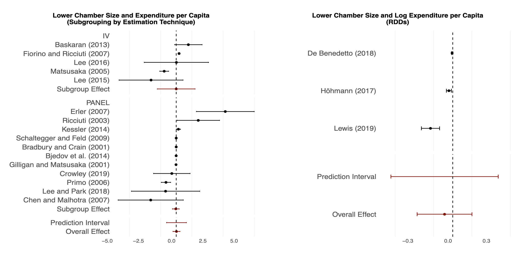

```{r setup, include=FALSE}
options(htmltools.dir.version = FALSE)
library(knitr)
opts_chunk$set(
  prompt = T,
  fig.align = "center",
  dpi = 300,
  cache = T,
  engine.opts = list(bash = "-l")
)

knit_hooks$set(
  prompt = function(before, options, envir) {
    options(
      prompt = if (options$engine %in% c("sh", "bash", "zsh")) "$ " else "R> ",
      continue = if (options$engine %in% c("sh", "bash", "zsh")) "$ " else "+ "
    )
  }
)

options(repos = c(CRAN = "https://cran.rstudio.com/"))

ensure <- function(pkg) {
  if (!require(pkg, character.only = TRUE)) {
    install.packages(pkg, dependencies = TRUE)
    library(pkg, character.only = TRUE)
  }
}
invisible(lapply(c("fontawesome", "metafor"), ensure))

suppressPackageStartupMessages({
  library(ggplot2); library(metafor)
})

# paleta de la casa (mismo par azul/rojo que 01-apertura.qmd)
azul <- "#2d4563"; rojo <- "#b85450"

tema_taller <- theme_minimal(base_size = 15) +
  theme(panel.grid.minor = element_blank(),
        plot.margin = margin(6, 10, 6, 6))

# los datos quedan cargados para todas las láminas siguientes
datos <- read.csv("datos/meta_estudios.csv")
```

<!--
BLOQUE 4 · ACUMULACIÓN DE EVIDENCIA (14:15-15:15).
Extensiones: clean-revealjs (tema grantmcdermott/clean) + multimodal (zoom de imágenes),
ambas ya instaladas en _extensions/ del repo (las usa 01-apertura.qmd).
Estilo de la casa (ver plan/01-guia-estilo.md): dos columnas, wrappers :::{style="font-size:..."},
[término]{.alert} para enfatizar, callouts #2d4563 / #b85450,
citas [Autor (año)](url) juntadas en ## Referencias, español rioplatense, sin guiones largos.

Datos: datos/meta_estudios.csv, simulado con datos/generar-meta.R. 20 estudios, efecto
verdadero 0,15 con tau 0,08; los estudios chicos (ee > 0,12) sólo "se publican" si son
significativos. Números de la práctica: rma combinado 0,21 [0,15; 0,26]; Egger p = 0,011;
sólo estudios grandes (ee <= 0,12) baja a 0,16.
Caso ancla: el meta-análisis del tamaño de las legislaturas (Freire, Mignozzetti,
Roman y Alptekin 2023, BJPS): la pregunta del RDD de la mañana, ahora entre estudios.
Demo en vivo: diapositivas/demo-reproducible/ (informe.qmd + datos.csv).

ARCO: plan -> un estudio no es evidencia -> setup -> sesgo de publicación (cajón,
funnel, región, qué se hace) -> meta-análisis (idea, forest, el caso BJPS, hallazgos,
límites, detectar) -> práctica (rma, forest, funnel/Egger, probá vos) -> crisis de
replicación (tres erres, medida, desde adentro, muchos analistas) -> demo reproducible ->
para llevarte -> referencias -> apéndice.
-->

# Acumulación: ¿cuándo un resultado se vuelve evidencia? {background-color="#2d4563"}

## El plan del bloque

:::{style="margin-top: 10px; font-size: 20px;"}
:::{.columns}
:::{.column width=34%}
[Las ideas]{.alert}

- Un estudio [no]{.alert} es evidencia: hace falta más de un número
- El [cajón]{.alert} de los resultados nulos y el sesgo de publicación
- El [meta-análisis]{.alert} como promedio ponderado por precisión
- La [crisis de replicación]{.alert} contada desde adentro, y reproducible en diez minutos
:::

:::{.column width=34%}
[El caso]{.alert}

- El tamaño de las legislaturas, [otra vez]{.alert}
- La pregunta del RDD de la mañana, ahora contra la [literatura entera]{.alert}
- Nuestro meta-análisis en el *BJPS* ([Freire, Mignozzetti, Roman y Alptekin, 2023](https://doi.org/10.1017/S0007123422000552))
:::

:::{.column width=32%}
[Las herramientas]{.alert}

- `metafor`: `rma()`, `forest()`, `funnel()`, `regtest()`
- Quarto para el informe que se [reescribe solo]{.alert}
:::
:::

:::{style="margin-top: 8px; border-left: 4px solid #2d4563; padding: 6px 18px; font-size: 20px;"}
Cerramos con una práctica corta: un meta-análisis completo en cuatro comandos
:::
:::

## Un estudio no es evidencia

:::{style="margin-top: 10px; font-size: 20px;"}
La mañana y el bloque 3 produjeron [estimaciones creíbles]{.alert}: un experimento, un RDD, un sintético. Pero una estimación creíble sigue siendo [un solo número]{.alert}, de [una]{.alert} muestra, con [una]{.alert} suerte particular.

- La pregunta de la tarde: ¿cuándo muchas estimaciones se vuelven [conocimiento]{.alert}?

- El camino de este bloque: qué se publica (y qué no) → cómo se combina lo publicado → si lo publicado [aguanta]{.alert} cuando otros lo revisan

:::{style="margin-top: 10px; border-left: 4px solid #2d4563; padding: 6px 18px; font-size: 20px;"}
La respuesta corta: un resultado se vuelve evidencia cuando [sobrevive]{.alert} a la síntesis y a la replicación
:::
:::

## Antes de empezar: datos y paquetes

:::{style="margin-top: 16px; font-size: 20px;"}
Vas a necesitar el conjunto de datos y un paquete. Hacelo ahora, mientras arrancamos.

```{r instalar, echo=TRUE, eval=FALSE}
# 1. Instalar (solo la primera vez)
install.packages("metafor")

# 2. Cargar los datos (descargá meta_estudios.csv del repo del taller)
datos <- read.csv("meta_estudios.csv")
# Leélo directo desde la web, sin descargar nada:
# datos <- read.csv("https://raw.githubusercontent.com/danilofreire/taller-evidencia-ucu/main/diapositivas/datos/meta_estudios.csv")
```

:::{style="margin-top: 8px; border-left: 4px solid #b85450; padding: 6px 18px; font-size: 18px;"}
`metafor` es el paquete estándar para meta-análisis en R ([Viechtbauer, 2010](https://doi.org/10.18637/jss.v036.i03)). La línea comentada te evita bajar el archivo a mano
:::
:::

# Sesgo de publicación {background-color="#2d4563"}

## ¿Se acuerdan del cero?

:::{style="margin-top: 6px; font-size: 19px;"}
:::{.columns}
:::{.column width=54%}
A las 10:15 les mostramos nuestro experimento con [resultado nulo]{.alert}, el programa de rendición de cuentas que no movió nada, y discutimos por qué un nulo creíble casi nunca llega a una revista ([Freire, Galdino y Mignozzetti, 2020](https://doi.org/10.1177/2053168020914444)).

- La pregunta de esa discusión: ¿[quién gana]{.alert} con ese sesgo?

- Ahora la cobramos: ¿qué le pasa a un campo entero cuando los ceros [desaparecen]{.alert}?
:::

:::{.column width=46%}
:::{style="text-align: center;"}


:::{style="font-size: 15px; color: #555;"}
Freire, Galdino y Mignozzetti (2020), *Research & Politics*: el nulo de la mañana
:::
:::
:::
:::
:::

## El cajón de los resultados nulos

:::{style="margin-top: 8px; font-size: 20px;"}
El [file-drawer problem]{.alert} ([Rosenthal, 1979](https://doi.org/10.1037/0033-2909.86.3.638)): los estudios que no rechazan la hipótesis nula quedan [en el cajón]{.alert}, sin publicarse.

- [Franco, Malhotra y Simonovits (2014)](https://doi.org/10.1126/science.1255484) siguieron más de 200 estudios con datos de calidad idéntica (el programa TESS): los resultados [fuertes]{.alert} tuvieron unos 40 puntos porcentuales más de probabilidad de publicarse que los [nulos]{.alert}, y cerca del 65% de los nulos [ni siquiera se escribió]{.alert}

- Todos empujan para el mismo lado: las revistas prefieren efectos, los referees piden significancia, y los autores anticipan el rechazo y ni intentan

:::{style="margin-top: 8px; border-left: 4px solid #2d4563; padding: 6px 18px; font-size: 19px;"}
El problema no es un estudio sesgado: es una [literatura]{.alert} sesgada
:::
:::

## Cómo se ve el sesgo: el funnel plot

:::{style="margin-top: 4px; font-size: 19px;"}
```{r funnel-demo, echo=FALSE, fig.height=4.2, fig.width=8}
m_demo <- rma(yi = efecto, sei = ee, data = datos)
funnel(m_demo, xlab = "Efecto estimado", ylab = "Error estándar")
```

Cada punto es un estudio: el efecto en el eje x, la [precisión]{.alert} en el eje y (los grandes arriba, los chicos abajo). Sin sesgo, la nube es un [embudo simétrico]{.alert}: los estudios chicos varían más, pero para los dos lados. Acá falta [la esquina de abajo a la izquierda]{.alert}, los estudios chicos con efectos chicos o negativos, justo los que van al cajón

:::{style="margin-top: 4px; font-size: 16px; color: #6E665C;"}
Estos son los 20 estudios simulados del bloque; los vamos a analizar en la práctica
:::
:::

## Por qué nos toca de cerca

:::{style="margin-top: 14px; font-size: 21px;"}
El filtro de la significancia pega más fuerte en la región, y por razones concretas:

- Presupuestos y muestras más chicos → más estudios con poca potencia, justo los más sensibles al [filtro de la significancia]{.alert}

- Menos replicaciones: pocas revistas premian repetir un estudio hecho en otro país de la región

- La evidencia local termina [importada]{.alert}: si lo que se publica de acá está filtrado, las políticas se diseñan con la mitad de la foto
:::

## Qué se está haciendo

:::{style="margin-top: 10px; font-size: 20px;"}
- [Pre-registro]{.alert}: declarar hipótesis y análisis [antes]{.alert} de ver los datos, en plataformas como OSF, el registro de la AEA o EGAP ([Nosek et al., 2018](https://doi.org/10.1073/pnas.1708274114))

- [Registered reports]{.alert}: la revista acepta o rechaza por el [diseño]{.alert}, antes de conocer los resultados, así que el nulo se publica igual

- [Planes de pre-análisis]{.alert} (PAP): el documento que fija todo por adelantado; los enseño en mis cursos de métodos experimentales

:::{style="margin-top: 10px; border-left: 4px solid #2d4563; padding: 6px 18px; font-size: 19px;"}
Ninguna de estas herramientas es censura: podés desviarte del plan, pero queda [registrado]{.alert} qué era exploración y qué era confirmación
:::
:::

# Meta-análisis {background-color="#2d4563"}

## La idea: promediar con pesas

:::{style="margin-top: 10px; font-size: 20px;"}
El [pooling]{.alert} de estimaciones: muchos estudios de la misma pregunta, cada uno con su efecto y su error estándar. El meta-análisis los combina en un [promedio ponderado por precisión]{.alert}.

:::{style="margin-top: 4px; font-size: 24px; text-align: center;"}
$$\hat\tau = \frac{\sum_k w_k \hat\tau_k}{\sum_k w_k}, \qquad w_k = \frac{1}{ee_k^2}$$
:::

- Los estudios [grandes]{.alert} (error chico) pesan más

- Efectos [fijos]{.alert} asume un único efecto verdadero para todos

- Efectos [aleatorios]{.alert} deja que el efecto varíe entre contextos, lo razonable en ciencias sociales, y estima además esa variación ($\tau^2$, $I^2$)
:::

## Cómo leer un forest plot

:::{style="margin-top: 4px; font-size: 19px;"}
```{r forest-demo, echo=FALSE, fig.height=4.6, fig.width=8.5}
m_demo <- rma(yi = efecto, sei = ee, data = datos)
forest(m_demo, slab = datos$estudio, xlab = "Efecto estimado")
```

Cada fila es un estudio: el cuadrado es su efecto (el tamaño del cuadrado, su peso) y la línea, su intervalo. El [rombo]{.alert} de abajo es el efecto combinado, y su ancho es el intervalo del conjunto. Mirá cuánto [desacuerdo]{.alert} hay entre filas antes de creerle al rombo
:::

## El caso: las legislaturas, otra vez

:::{style="margin-top: 6px; font-size: 19px;"}
:::{.columns}
:::{.column width=58%}
A la mañana vimos UN estudio: nuestro RDD en Brasil, más concejales, mejor salud y educación. La literatura de la [ley de 1/n]{.alert} ([Weingast, Shepsle y Johnsen, 1981](https://doi.org/10.1086/260997)) pregunta por el [gasto]{.alert}.

- La lógica: con más distritos (n), cada legislador carga sólo [1/n]{.alert} del costo impositivo de sus proyectos, así que a todos les conviene sobregastar y repartir la cuenta. Predicción: más legisladores, más gasto

- Décadas de resultados en conflicto: positivos, negativos y nulos; hicimos el primer meta-análisis de esa literatura
:::

:::{.column width=42%}
:::{style="text-align: center;"}


:::{style="font-size: 15px; color: #555;"}
Freire, Mignozzetti, Roman y Alptekin (2023), *British Journal of Political Science*
:::
:::
:::
:::
:::

## Cómo se arma la muestra

:::{style="margin-top: 6px; font-size: 19px;"}
:::{.columns}
:::{.column width=52%}
Una búsqueda [sistemática]{.alert}, no una lista de favoritos:

- Tres bases (Scopus, Microsoft Academic, Google Scholar) + palabras clave + páginas de los autores

- [2.664 registros]{.alert} → filtrado [PRISMA]{.alert} con dos codificadores independientes → [30 estudios]{.alert} cuantitativos comparables (45 coeficientes principales; 162 con todos los modelos)

- El criterio de inclusión se fija [antes]{.alert}: qué variables, qué métodos, qué idiomas

:::{style="margin-top: 6px; border-left: 4px solid #2d4563; padding: 6px 18px; font-size: 17px;"}
La mitad del valor de un meta-análisis está acá: cualquiera puede [auditar]{.alert} qué entró y qué quedó afuera, y por qué
:::
:::

:::{.column width=48%}


:::{style="font-size: 15px; text-align: center; color: #555;"}
El diagrama PRISMA de la primera búsqueda: de 2.664 registros a 28 artículos
:::
:::
:::
:::

## Lo que encontramos

:::{style="margin-top: 6px; font-size: 19px;"}
:::{.columns}
:::{.column width=50%}
El efecto agregado es [nulo]{.alert} en las siete combinaciones de tamaño × gasto.

- Ejemplo, cámara baja × gasto per cápita: [0,022]{.alert}, IC 95% [−0,26; 0,30], p = 0,87, 16 estudios

- La heterogeneidad es [altísima]{.alert}: I² arriba de 80% en todas

- Matiz de las meta-regresiones: el efecto 1/n aparece en legislaturas [unicamerales]{.alert} y cámaras altas, sobre todo con OLS
:::

:::{.column width=50%}


:::{style="font-size: 15px; text-align: center; color: #555;"}
El forest plot del paper: 16 estudios, efecto global pegado a cero
:::
:::
:::
:::

## El método importa (otra vez)

:::{style="margin-top: 6px; font-size: 19px;"}


:::{style="font-size: 15px; text-align: center; color: #555;"}
Figura 2 del paper: por método, los tres RDD a la derecha, todos negativos
:::

:::{style="margin-top: 6px; font-size: 19px;"}
Los subgrupos por método cuentan otra historia: IV repartido, panel nulo, y los [RDD]{.alert} todos negativos y significativos. Cuanto mejor la [identificación]{.alert}, más cerca de cero-a-negativo el efecto: la "[ley inversa de 1/n]{.alert}". Los diseños que aprendieron hoy no son un lujo metodológico, [cambian la respuesta]{.alert}
:::
:::

## Lo que el meta-análisis no arregla

:::{style="margin-top: 8px; font-size: 20px;"}
- [Basura entra, basura sale]{.alert}: combinar 30 estudios sesgados da un promedio sesgado con un intervalo angosto, y encima más confianza en el número equivocado

- [Heterogeneidad]{.alert}: ¿tiene sentido promediar un RDD municipal en Italia con un panel de estados en EE.UU.? A veces no, y el I² te lo grita

- El [sesgo de publicación]{.alert} contamina el pozo: si los nulos faltan, el promedio sobra

:::{style="margin-top: 8px; border-left: 4px solid #b85450; padding: 6px 18px; font-size: 18px;"}
En NUESTRO caso los funnel plots no muestran asimetría: esta literatura publica positivos, negativos y nulos. El sesgo se [chequea]{.alert}, no se presume, y en la práctica van a ver un caso donde sí aparece
:::
:::

## Detectar el sesgo (y qué hacer)

:::{style="margin-top: 10px; font-size: 20px;"}
- El [funnel plot]{.alert} es el primer diagnóstico visual: mirás si el embudo está torcido

- El test de [Egger]{.alert}: una regresión de los efectos sobre sus errores estándar; si la pendiente es distinta de cero, el embudo está torcido ([Egger et al., 1997](https://doi.org/10.1136/bmj.315.7109.629))

- Correcciones como [trim-and-fill]{.alert} rellenan los estudios que "faltan", pero son curitas: la solución de fondo es que los nulos [se publiquen]{.alert}

:::{style="margin-top: 8px; border-left: 4px solid #2d4563; padding: 6px 18px; font-size: 19px;"}
Todo esto lo corrés vos en cinco minutos, ahora
:::
:::

# Práctica {background-color="#2d4563"}

## De qué se trata la práctica {#sec:ejercicios}

:::{style="margin-top: 6px; font-size: 18px;"}
:::{.columns}
:::{.column width=56%}
Con `meta_estudios.csv`, el archivo que cargaste al principio, corrés un meta-análisis completo y después te hacés una pregunta incómoda sobre el resultado.

Objetivos:

- estimar el [efecto combinado]{.alert} con `rma()`
- leer el [forest plot]{.alert}, estudio por estudio
- mirar el [funnel plot]{.alert} y su [test de asimetría]{.alert}
- un experimento: ¿qué pasa si te quedás sólo con los estudios [grandes]{.alert}?
:::

:::{.column width=44%}
[Las variables]{.alert}

:::{style="font-size: 15px;"}
| Variable | Qué es |
|---|---|
| `estudio` | Nombre del estudio |
| `pais` | País donde se hizo |
| `diseno` | RDD, DiD u OLS |
| `n` | Tamaño de la muestra |
| `ee` | Error estándar del efecto |
| `efecto` | Efecto estimado |
:::

Bajá los datos desde [la página del taller](https://danilofreire.github.io/taller-evidencia-ucu/materiales.html)
:::
:::

:::{style="margin-top: 6px; border-left: 4px solid #2d4563; padding: 6px 18px; font-size: 17px;"}
Tenés unos [10 minutos]{.alert}. El código ya está escrito: sólo hay que correrlo y leerlo. La solución del ejercicio final está en el [apéndice]{.alert}
:::
:::

## El modelo: cuatro comandos

:::{style="margin-top: 14px; font-size: 20px;"}
El corazón del meta-análisis entra en cuatro líneas: cada estudio pesa según su precisión, y `rma` combina todo en un solo número.

```{r}
#| label: rma
#| echo: true
#| eval: true
m <- rma(yi = efecto,   # el efecto de cada estudio
         sei = ee,      # su error estándar
         data = datos)  # efectos aleatorios por defecto
m
```

:::{style="margin-top: 8px; border-left: 4px solid #2d4563; padding: 6px 18px; font-size: 19px;"}
El efecto combinado da [0,21]{.alert}, con IC 95% [0,15; 0,26]: positivo y bien medido... ¿o no? El I² dice que un [41%]{.alert} de la variación es heterogeneidad real entre estudios, no ruido de muestreo
:::
:::

## El forest plot

:::{style="margin-top: 14px; font-size: 20px;"}
Cada estudio es una fila; el largo de la línea es su intervalo; el rombo de abajo es el efecto combinado.

```{r}
#| label: forest
#| echo: true
#| eval: true
#| fig.height: 4.6
forest(m, slab = datos$estudio, xlab = "Efecto estimado")
```

:::{style="margin-top: 6px; font-size: 19px;"}
Veinte filas, un rombo. Fijate qué estudios tiran el rombo para arriba: ¿los [grandes]{.alert} o los [chicos]{.alert}?
:::
:::

## El funnel plot y el test de Egger

:::{style="margin-top: 12px; font-size: 20px;"}
El embudo cruza cada efecto contra su error estándar. Si la literatura está completa, tiene que ser [simétrico]{.alert}.

```{r}
#| label: funnel
#| echo: true
#| eval: true
#| fig.height: 4
funnel(m, xlab = "Efecto estimado", ylab = "Error estándar")
regtest(m)
```

:::{style="margin-top: 6px; font-size: 19px;"}
El embudo está [torcido]{.alert}: abajo a la izquierda faltan puntos. El test de Egger lo confirma: p = [0,011]{.alert}, la asimetría no es casualidad
:::

:::{style="margin-top: 6px; border-left: 4px solid #b85450; padding: 6px 18px; font-size: 17px;"}
Acá el sesgo se fabricó a propósito en la simulación: los estudios chicos sólo "se publicaron" si salían significativos. En tu literatura real no vas a saberlo: por eso [siempre]{.alert} se chequea
:::
:::

## Probá vos: sólo los grandes {#sec:ej-grandes}

:::{style="margin-top: 14px; font-size: 20px;"}
:::{style="border-left: 4px solid #b85450; padding: 8px 20px; font-size: 21px;"}
[Reestimá el modelo usando sólo los estudios grandes (ee <= 0.12), que se publican con cualquier resultado. ¿Hacia dónde se mueve el efecto combinado? ¿Por qué?]{.alert}
:::

```{r}
#| label: ej-skeleton
#| eval: false
#| echo: true
#| prompt: false
grandes <- subset(datos, ___)        # TODO: la condición sobre ee
rma(yi = efecto, sei = ee, data = grandes)
```

[[Apéndice: Solución]{.button}](#sec:sol-grandes)
:::

## Qué aprendimos del ejercicio

:::{style="margin-top: 10px; font-size: 20px;"}
Con los 20 estudios, el efecto combinado da [0,21]{.alert}. Con sólo los 10 grandes da [0,16]{.alert}. Y el efecto verdadero de la simulación era [0,15]{.alert}: el promedio completo estaba [inflado]{.alert} por los estudios chicos que sobrevivieron al filtro de la significancia.

- El meta-análisis no falló: hizo su trabajo con la literatura que le dieron
- El sesgo estaba en [qué llegó a publicarse]{.alert}, no en la fórmula
- Quedarte con los grandes recupera casi el valor real, porque esos estudios entran a la revista con cualquier resultado

:::{style="margin-top: 8px; border-left: 4px solid #2d4563; padding: 6px 18px; font-size: 19px;"}
Por eso el orden del bloque: primero preguntá [qué falta]{.alert} en la literatura, después promediá
:::
:::

# La crisis de replicación, desde adentro {background-color="#2d4563"}

## Reproducible, replicable, robusto

:::{style="margin-top: 8px; font-size: 19px;"}
:::{.columns}
:::{.column width=52%}
Las Academias Nacionales de EE.UU. ([NASEM, 2019](https://doi.org/10.17226/25303)) separan tres cosas que solemos confundir:

- [Reproducibilidad]{.alert}: tus mismos datos y tu mismo código, ¿el mismo número?

- [Replicabilidad]{.alert}: un estudio nuevo con datos nuevos, ¿la misma conclusión?

- [Robustez]{.alert}: mismos datos, otras decisiones defendibles, ¿sobrevive?
:::

:::{.column width=48%}
:::{style="font-size: 16px;"}
| | Datos | Análisis | Pregunta |
|---|---|---|---|
| [Reproducir]{.alert} | mismos | mismo | ¿el mismo número? |
| [Replicar]{.alert} | nuevos | nuevo | ¿la misma conclusión? |
| [Robustez]{.alert} | mismos | otro | ¿sobrevive? |
:::
:::
:::

:::{style="margin-top: 8px; border-left: 4px solid #2d4563; padding: 6px 18px; font-size: 18px;"}
La reproducibilidad es el [piso]{.alert}, no el techo: un resultado puede reproducirse al decimal y estar equivocado, pero si no se reproduce no hay nada que discutir
:::
:::

## La crisis, medida

:::{style="margin-top: 8px; font-size: 19px;"}
:::{.columns}
:::{.column width=50%}
[Replicación]{.alert} (datos nuevos)

- Psicología: se replicó el [36%]{.alert} de 100 estudios, con el efecto medio a la mitad ([Open Science Collaboration, 2015](https://doi.org/10.1126/science.aac4716))

- Economía experimental: [11 de 18]{.alert} (61%), con efectos más chicos ([Camerer et al., 2016](https://doi.org/10.1126/science.aaf0918))
:::

:::{.column width=50%}
[Reproducción]{.alert} (mismo código, mismos datos)

- 110 artículos de revistas líderes: [~85%]{.alert} reproducible, la robustez cae al 70%, y un 25% tenía errores de código ([Brodeur et al., 2024](https://doi.org/10.2139/ssrn.4790780))

- De 9.000+ scripts de R, el [74%]{.alert} falló a la primera ([Trisovic et al., 2022](https://doi.org/10.1038/s41597-022-01143-6))
:::
:::

:::{style="margin-top: 8px; border-left: 4px solid #b85450; padding: 6px 18px; font-size: 18px;"}
No es un problema de una disciplina ni de un método: aparece cada vez que alguien se toma el trabajo de [volver a correr]{.alert} las cuentas
:::
:::

## Lo estudié desde adentro: 100 estudios, 457 analistas

:::{style="margin-top: 6px; font-size: 18px;"}
:::{.columns}
:::{.column width=52%}
En [Aczél, Szászi, Nosek et al. (2026)](https://doi.org/10.1038/s41586-025-09844-9), en *Nature*, 457 analistas reanalizaron una muestra aleatoria de 100 estudios sociales (2009-2018), cada uno con sus propias decisiones defendibles (somos coautores).

- Sólo el [34%]{.alert} de los reanálisis dio el mismo resultado que el original

- El [74%]{.alert} llegó a la misma conclusión; un 2%, a la opuesta

- En el [81%]{.alert} de los estudios los analistas reportaron estadísticos distintos

- Ciencia política: la [menos robusta]{.alert} de las disciplinas grandes (24% de los estudios robusto, frente al 41% en psicología)
:::

:::{.column width=48%}


:::{style="font-size: 15px; text-align: center; color: #555;"}
Robustez por disciplina, del paper en *Nature*
:::
:::
:::
:::

## Muchos analistas, muchas respuestas

:::{style="margin-top: 8px; font-size: 19px;"}
:::{.columns}
:::{.column width=58%}
[Breznau et al. (2022)](https://doi.org/10.1073/pnas.2203150119), en *PNAS*: 73 equipos analizaron los [mismos]{.alert} datos con la [misma]{.alert} pregunta (¿la inmigración reduce el apoyo a las políticas sociales?).

- Los resultados se repartieron entre [positivos, negativos y nulos]{.alert}

- Ni la experiencia ni las creencias previas de los equipos explican la dispersión

- La explican las [decisiones de análisis]{.alert}: cientos de bifurcaciones chicas que nadie registra
:::

:::{.column width=42%}
:::{style="border-left: 4px solid #b85450; padding: 6px 18px; font-size: 18px;"}
No es fraude: es el [jardín de senderos que se bifurcan]{.alert}
:::
:::
:::

:::{style="margin-top: 8px; border-left: 4px solid #2d4563; padding: 6px 18px; font-size: 18px;"}
La transparencia total del flujo (datos, código, decisiones) es lo único que permite ver por qué dos análisis honestos difieren
:::
:::

# Demo: reproducible en diez minutos {background-color="#2d4563"}

## Del copiar y pegar al documento que se rehace solo

:::{style="margin-top: 10px; font-size: 20px;"}
El flujo habitual [copia y pega]{.alert} números del análisis al documento, y cada copia es un lugar donde texto y análisis se desincronizan en silencio.

- `statcheck` halló que cerca del [50%]{.alert} de los artículos de psicología tenía una inconsistencia entre un estadístico y su p-valor, y un [12,5%]{.alert} una grave, que daba vuelta la conclusión ([Nuijten et al., 2016](https://doi.org/10.3758/s13428-015-0664-2))

- La alternativa es la [programación literaria]{.alert} ([Knuth, 1984](https://doi.org/10.1093/comjnl/27.2.97)): prosa, código y salida en una sola fuente

- Quarto lo implementa: los números del texto se [calculan al renderizar]{.alert}, no se escriben a mano

:::{style="margin-top: 8px; border-left: 4px solid #2d4563; padding: 6px 18px; font-size: 19px;"}
Si el número vive en el código, no puede contradecir a la tabla: es el mismo número, calculado una sola vez
:::
:::

## La demo, en vivo

:::{style="margin-top: 10px; font-size: 20px;"}
Un "Informe de reclamos viales" de una página, donde [cada número]{.alert} del texto sale de código R en línea. Lo hacemos juntos:

1. Abrimos `informe.qmd` y vemos que el total de reclamos, el % respondido a tiempo y el barrio con peor tasa son [código]{.alert}, no texto escrito a mano

2. Corremos `quarto render informe.qmd` y abrimos el HTML

3. Editamos [un solo número]{.alert} en `datos.csv`: los reclamos respondidos del Cerro

4. Volvemos a renderizar: el texto, el porcentaje y el [gráfico]{.alert} se actualizan solos, sin tocar una coma de la prosa

:::{style="margin-top: 8px; border-left: 4px solid #2d4563; padding: 6px 18px; font-size: 19px;"}
El informe entero se rehace en tres segundos, y ningún número quedó escrito a mano. El proyectito está en el repo del taller (`diapositivas/demo-reproducible/`): llevátelo de plantilla
:::
:::

## Para empezar el lunes

:::{style="margin-top: 8px; font-size: 19px;"}
:::{.columns}
:::{.column width=54%}
El kit mínimo, sin ejercicio:

- una [carpeta autocontenida]{.alert} con rutas relativas

- un script (o un `informe.qmd`) que corre todo [de arriba a abajo]{.alert}

- los números del informe [calculados, no pegados]{.alert}

- si ya usás git, commits chicos y frecuentes

- cada paso vale por sí solo: no hace falta adoptar todo el lunes
:::

:::{.column width=46%}
[Dónde seguir]{.alert}

- [The Turing Way](https://the-turing-way.netlify.app/), manual abierto de ciencia reproducible

- [Gentzkow y Shapiro (2014)](https://web.stanford.edu/~gentzkow/research/CodeAndData.pdf), *Code and Data for the Social Sciences*

- [Harrer et al. (2021)](https://bookdown.org/MathiasHarrer/Doing_Meta_Analysis_in_R/), *Doing Meta-Analysis with R*, gratis online
:::
:::
:::

## Para llevarte

:::{style="margin-top: 8px; font-size: 19px;"}
:::{.columns}
:::{.column width=50%}
[Las ideas]{.alert}

- Un estudio no es evidencia: la evidencia es un diseño creíble que [sobrevive]{.alert} a la síntesis y a la replicación

- Los nulos que faltan tuercen el promedio de todos

- El meta-análisis es tan bueno como la literatura que traga

- La reproducibilidad es el [piso]{.alert} que vuelve todo lo demás verificable
:::

:::{.column width=50%}
[La caja de herramientas]{.alert}

- `rma()`, `forest()`, `funnel()`, `regtest()`

- el chequeo "sólo los grandes" como reflejo

- Quarto para informes que se rehacen solos
:::
:::

:::{style="margin-top: 8px; border-left: 4px solid #2d4563; padding: 6px 18px; font-size: 19px;"}
En quince minutos cerramos el día: el mapa completo de las dos preguntas, y una mirada a lo que viene
:::
:::

# Última parada 🚏 {background-color="#2d4563"}

## Referencias {#sec:referencias}

:::{style="font-size: 14px;"}
:::{.columns}
:::{.column width=50%}
Aczél, Szászi, Nosek et al. (2026). Investigating the analytical robustness of the social and behavioural sciences. *Nature* 652:135. [doi](https://doi.org/10.1038/s41586-025-09844-9)

Breznau, Rinke, Wuttke et al. (2022). Observing many researchers using the same data and hypothesis reveals a hidden universe of uncertainty. *PNAS* 119(44):e2203150119. [doi](https://doi.org/10.1073/pnas.2203150119)

Brodeur, Mikola, Cook et al. (2024). Mass reproducibility and replicability: a new hope. *I4R Discussion Paper* 107. [doi](https://doi.org/10.2139/ssrn.4790780)

Camerer et al. (2016). Evaluating replicability of laboratory experiments in economics. *Science* 351(6280):1433–1436. [doi](https://doi.org/10.1126/science.aaf0918)

Egger, M., Davey Smith, G., Schneider, M. y Minder, C. (1997). Bias in meta-analysis detected by a simple, graphical test. *British Medical Journal* 315(7109):629–634. [doi](https://doi.org/10.1136/bmj.315.7109.629)

Franco, A., Malhotra, N. y Simonovits, G. (2014). Publication bias in the social sciences: unlocking the file drawer. *Science* 345(6203):1502–1505. [doi](https://doi.org/10.1126/science.1255484)

Freire, D., Galdino, M. y Mignozzetti, U. (2020). Bottom-up accountability and public service provision: evidence from a field experiment in Brazil. *Research & Politics* 7(2). [doi](https://doi.org/10.1177/2053168020914444)

Freire, D., Mignozzetti, U., Roman, C. y Alptekin, H. (2023). The effect of legislature size on public spending: a meta-analysis. *British Journal of Political Science* 53(2):776–788. [doi](https://doi.org/10.1017/S0007123422000552)

Gentzkow, M. y Shapiro, J. (2014). *Code and Data for the Social Sciences: A Practitioner's Guide*. [pdf](https://web.stanford.edu/~gentzkow/research/CodeAndData.pdf)
:::

:::{.column width=50%}
Harrer, M., Cuijpers, P., Furukawa, T. y Ebert, D. (2021). *Doing Meta-Analysis with R: A Hands-On Guide*. Chapman & Hall/CRC. [enlace](https://bookdown.org/MathiasHarrer/Doing_Meta_Analysis_in_R/)

Knuth, D. (1984). Literate programming. *The Computer Journal* 27(2):97–111. [doi](https://doi.org/10.1093/comjnl/27.2.97)

NASEM (2019). *Reproducibility and Replicability in Science*. The National Academies Press. [doi](https://doi.org/10.17226/25303)

Nosek, B., Ebersole, C., DeHaven, A. y Mellor, D. (2018). The preregistration revolution. *PNAS* 115(11):2600–2606. [doi](https://doi.org/10.1073/pnas.1708274114)

Nuijten et al. (2016). The prevalence of statistical reporting errors in psychology (1985–2013). *Behavior Research Methods* 48(4):1205–1226. [doi](https://doi.org/10.3758/s13428-015-0664-2)

Open Science Collaboration (2015). Estimating the reproducibility of psychological science. *Science* 349(6251):aac4716. [doi](https://doi.org/10.1126/science.aac4716)

Rosenthal, R. (1979). The file drawer problem and tolerance for null results. *Psychological Bulletin* 86(3):638–641. [doi](https://doi.org/10.1037/0033-2909.86.3.638)

Trisovic, A., Lau, M., Pasquier, T. y Crosas, M. (2022). A large-scale study on research code quality and execution. *Scientific Data* 9:60. [doi](https://doi.org/10.1038/s41597-022-01143-6)

Viechtbauer, W. (2010). Conducting meta-analyses in R with the metafor package. *Journal of Statistical Software* 36(3):1–48. [doi](https://doi.org/10.18637/jss.v036.i03)

Weingast, B., Shepsle, K. y Johnsen, C. (1981). The political economy of benefits and costs: a neoclassical approach to distributive politics. *Journal of Political Economy* 89(4):642–664. [doi](https://doi.org/10.1086/260997)
:::
:::
:::

# Apéndice: soluciones {background-color="#2d4563"}

## Solución: sólo los grandes {#sec:sol-grandes}

:::{style="margin-top: 12px; font-size: 18px;"}
```{r}
#| label: ej-sol
#| echo: true
#| eval: true
grandes <- subset(datos, ee <= 0.12)
rma(yi = efecto, sei = ee, data = grandes)
```

Quedan 10 estudios y el efecto baja de [0,21]{.alert} a [0,16]{.alert}, pegado al 0,15 verdadero de la simulación: los grandes se publican con cualquier resultado, así que no arrastran el filtro de la significancia. No es una regla mágica (tirás la mitad de la información y podés introducir otros sesgos), pero es un [chequeo de sensibilidad]{.alert} que cuesta una línea

[[Volver al ejercicio]{.button}](#sec:ej-grandes)
:::
