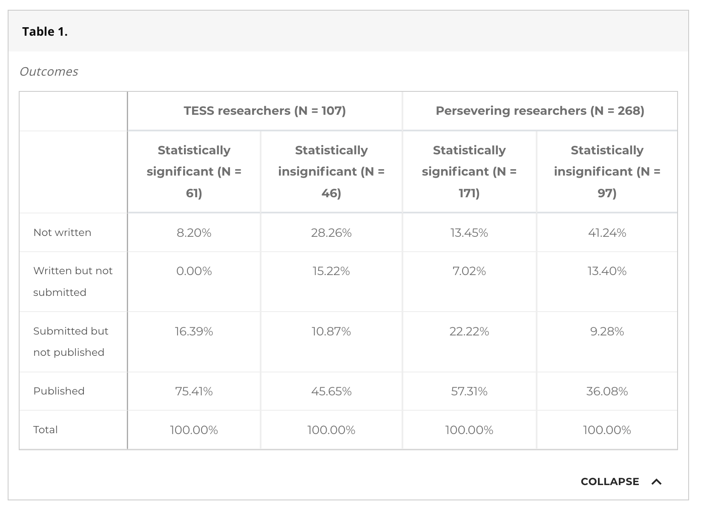
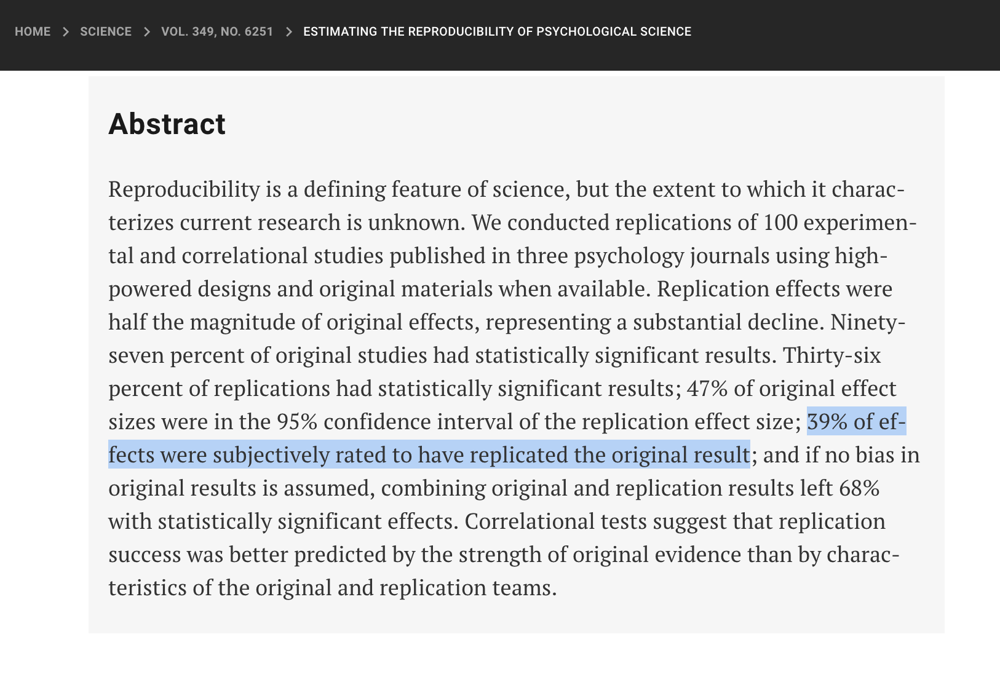
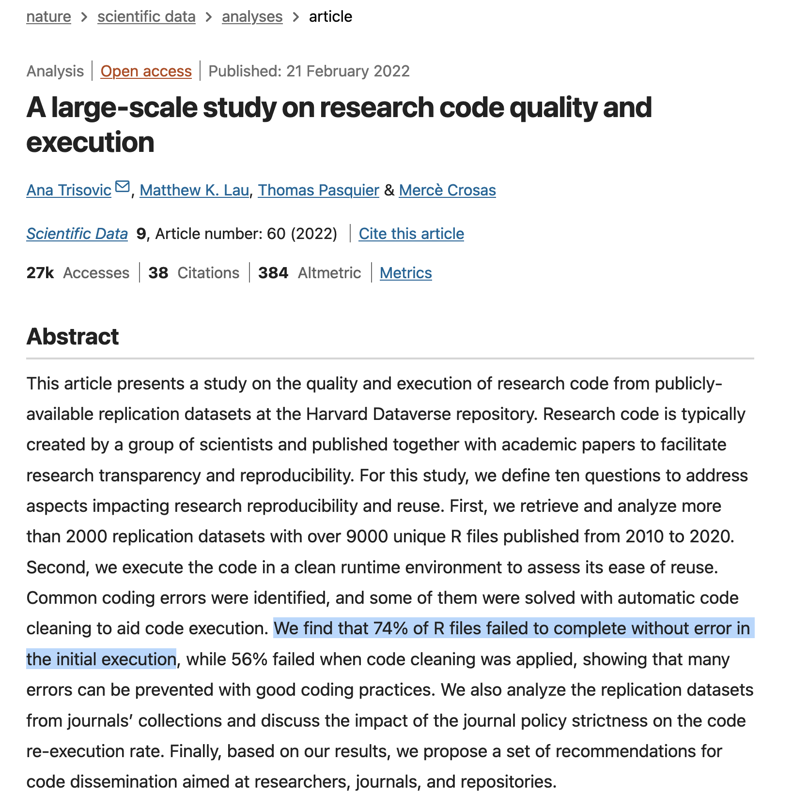
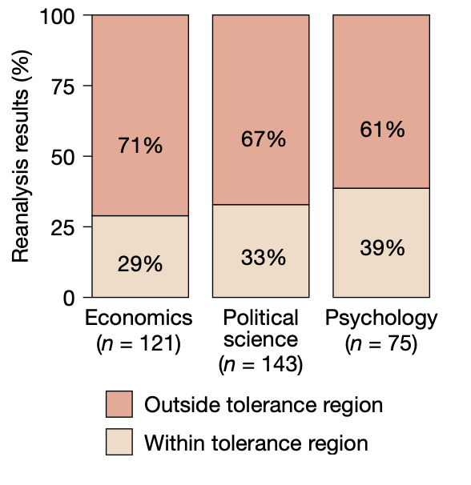
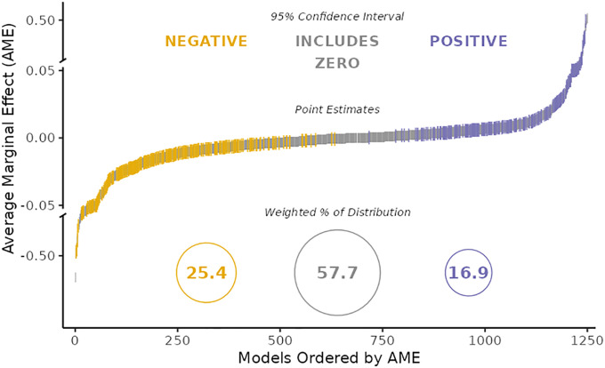
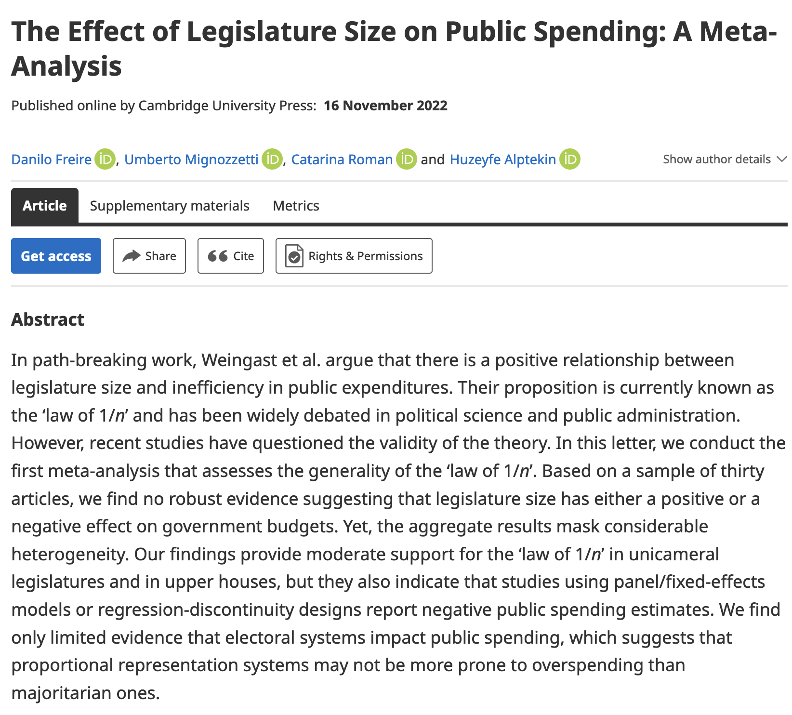
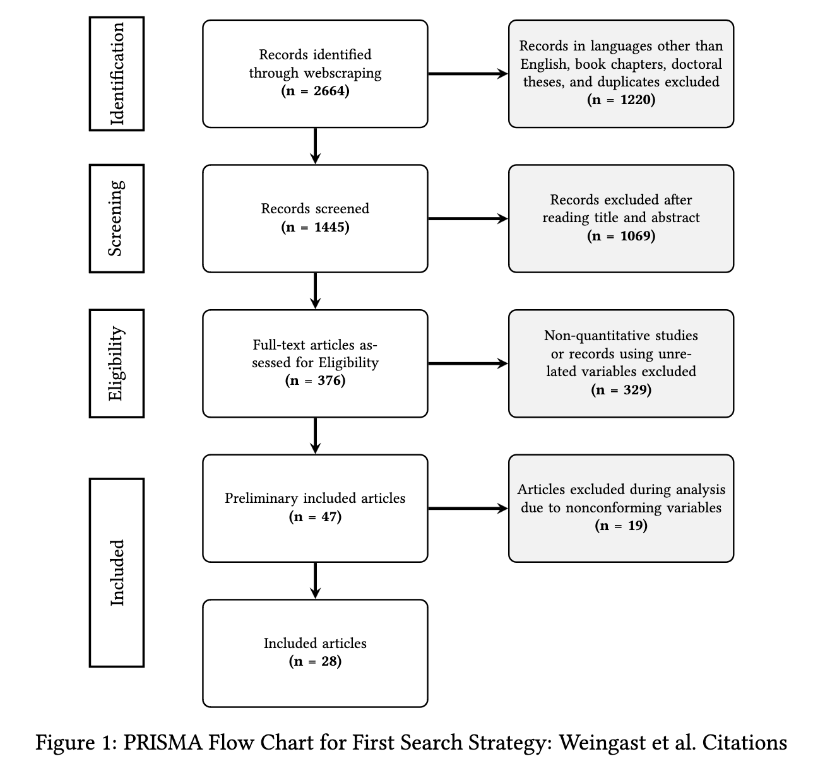
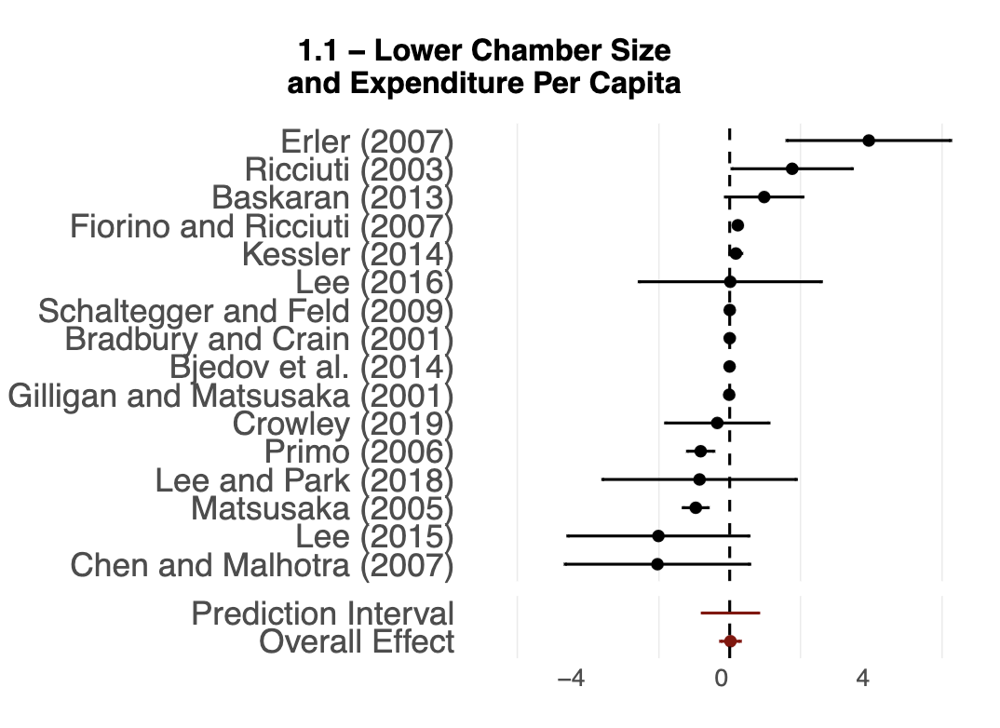

```{r setup, include=FALSE}
options(htmltools.dir.version = FALSE)
library(knitr)
opts_chunk$set(
  echo = FALSE,
  fig.align = "center",
  dpi = 300,
  cache = FALSE
)

options(repos = c(CRAN = "https://cran.rstudio.com/"))

ensure <- function(pkg) {
  if (!require(pkg, character.only = TRUE)) {
    install.packages(pkg, dependencies = TRUE)
    library(pkg, character.only = TRUE)
  }
}
invisible(lapply(c("ggplot2", "dplyr", "metafor", "fabricatr"), ensure))

suppressPackageStartupMessages({
  library(ggplot2); library(dplyr); library(metafor); library(fabricatr)
})

# paleta de la casa (mismo par azul/rojo que 01-apertura.qmd)
azul <- "#2d4563"; rojo <- "#b85450"

tema_taller <- theme_minimal(base_size = 15) +
  theme(panel.grid.minor = element_blank(),
        plot.margin = margin(6, 10, 6, 6))

# los datos de la DEMO: simulados con fabricatr, el MISMO generador que se
# muestra en la slide "Generá los datos". `literatura` es la literatura
# completa (40 estudios); `datos` son los 21 que sobreviven al filtro de
# publicación. Semilla fija => reproduce exactamente datos/meta_estudios.csv.
apellidos <- c("García", "Souza", "Lima", "Rojas", "Fernández",
               "Muñoz", "Silva", "Torres", "Vargas", "Herrera",
               "Castro", "Mendoza", "Ríos", "Acosta", "Núñez",
               "Ferreira", "Ortiz", "Cabrera", "Duarte", "Sosa")
paises <- c("Brasil", "México", "Chile", "Colombia", "Perú",
            "Argentina", "Uruguay")

set.seed(27)
literatura <- fabricate(
  N = 40,
  autor   = sample(apellidos, N, replace = TRUE),
  anio    = sample(2005:2022, N, replace = TRUE),
  estudio = paste0(autor, " (", anio, ")"),
  pais    = sample(paises, N, replace = TRUE),
  diseno  = sample(c("RDD", "DiD", "OLS"), N, replace = TRUE),
  n       = round(exp(runif(N, log(60), log(600)))),
  ee      = round(2.2 / sqrt(n), 3),
  efecto  = round(rnorm(N, 0.15, sqrt(0.08^2 + ee^2)), 3)
)
datos <- literatura |>
  filter(ee <= 0.12 | efecto / ee > 1.64)
datos <- datos[, c("estudio", "pais", "diseno", "n", "ee", "efecto")]

# los datos de la PRÁCTICA: otra literatura, 24 estudios sobre transferencias
# condicionadas y asistencia escolar. Sin cajón, pero con DOS efectos
# verdaderos (0.35 rural, 0.10 urbano). Generador en datos/generar-transferencias.R
set.seed(46)
transferencias <- fabricate(
  N = 24,
  autor    = sample(apellidos, N, replace = TRUE),
  anio     = sample(2008:2023, N, replace = TRUE),
  estudio  = paste0(autor, " (", anio, ")"),
  pais     = sample(c("Brasil", "México", "Colombia", "Perú",
                      "Honduras", "Nicaragua", "Ecuador"), N, replace = TRUE),
  contexto = rep(c("rural", "urbano"), each = 12),
  n        = round(exp(runif(N, log(200), log(2000)))),
  ee       = round(1.5 / sqrt(n), 3),
  efecto   = round(rnorm(N, ifelse(contexto == "rural", 0.35, 0.10),
                         sqrt(0.04^2 + ee^2)), 3)
)
transferencias <- transferencias[, c("estudio", "pais", "contexto",
                                     "n", "ee", "efecto")]

# funnel plot anotado, sólo para enseñar a leerlo: marca la línea del efecto
# combinado, la banda de los estudios chicos (ee > 0.12) y cuenta cuántos
# puntos caen a cada lado dentro de esa banda. En la práctica se usa funnel().
funnel_anotado <- function(d) {
  centro <- as.numeric(coef(rma(yi = efecto, sei = ee, data = d)))
  ee_max <- 0.30
  corte  <- 0.12
  banda  <- filter(d, ee > corte)
  izq <- sum(banda$efecto <  centro)
  der <- sum(banda$efecto >= centro)
  ggplot(d, aes(x = efecto, y = ee)) +
    annotate("rect", xmin = -Inf, xmax = Inf, ymin = corte, ymax = ee_max,
             fill = rojo, alpha = 0.07) +
    annotate("segment", x = centro, y = 0,
             xend = centro - 1.96 * ee_max, yend = ee_max,
             linetype = "dashed", colour = "grey55") +
    annotate("segment", x = centro, y = 0,
             xend = centro + 1.96 * ee_max, yend = ee_max,
             linetype = "dashed", colour = "grey55") +
    annotate("segment", x = centro, y = 0, xend = centro, yend = ee_max,
             colour = azul, linewidth = 0.6) +
    geom_point(size = 2.6, colour = azul, alpha = 0.85) +
    annotate("text", x = centro - 0.42, y = 0.285, label = paste(izq, "acá"),
             colour = rojo, size = 5, fontface = "bold", hjust = 0) +
    annotate("text", x = centro + 0.24, y = 0.285, label = paste(der, "acá"),
             colour = rojo, size = 5, fontface = "bold", hjust = 0) +
    scale_y_reverse(limits = c(ee_max, 0)) +
    coord_cartesian(xlim = c(centro - 0.55, centro + 0.55)) +
    labs(x = "Efecto estimado", y = "Error estándar") +
    tema_taller
}
```

# ¿Cuándo un resultado se vuelve evidencia robusta? {background-color="#2d4563"}

## El plan del bloque

:::{style="margin-top: 10px; font-size: 24px;"}
:::{.columns}
:::{.column width=50%}
[Las ideas]{.alert}

- Un estudio [no]{.alert} es evidencia completa: un resultado se vuelve evidencia cuando [sobrevive]{.alert} a la síntesis y a la replicación
- El [cajón]{.alert} de los resultados nulos y el sesgo de publicación
- La [crisis de replicación]{.alert}: de la medicina al código, y contada desde adentro
- El [meta-análisis]{.alert} como promedio ponderado por precisión
- Las [defensas]{.alert}: del pre-registro a GitHub
:::

:::{.column width=50%}
[Las herramientas]{.alert}

- `fabricatr` para simular una [literatura con cajón]{.alert} incluido
- `metafor`: `rma()`, `forest()`, `funnel()`, `regtest()`
- GitHub y Quarto para un flujo [reproducible]{.alert}
:::
:::

:::{style="margin-top: 15px; border-left: 4px solid #2d4563; padding: 6px 18px; font-size: 23px;"}
El caso: el tamaño de las legislaturas, [otra vez]{.alert}. La pregunta del RDD de la mañana, ahora contra la literatura entera, en nuestro meta-análisis del *BJPS* ([Freire et al., 2023](https://doi.org/10.1017/S0007123422000552))
:::
:::

## Antes de empezar: los paquetes

:::{style="margin-top: 16px; font-size: 23px;"}
Vas a necesitar tres paquetes. Instalalos ahora, mientras arrancamos

```{r instalar, echo=TRUE, eval=FALSE}
# Instalar (solo la primera vez)
install.packages(c("tidyverse", "metafor", "fabricatr"))

# Y bajá los datos de la práctica, así ya los tenés
url <- paste0("https://raw.githubusercontent.com/danilofreire/",
              "taller-evidencia-ucu/main/diapositivas/datos/",
              "transferencias.csv")
transferencias <- read.csv(url)
```

:::{style="margin-top: 30px; border-left: 4px solid #b85450; padding: 6px 18px; font-size: 22px;"}
`metafor` es el paquete estándar para meta-análisis en R ([Viechtbauer, 2010](https://doi.org/10.18637/jss.v036.i03)); `fabricatr` ya lo conocés bien. Si preferís bajarlo a mano: [transferencias.csv](https://raw.githubusercontent.com/danilofreire/taller-evidencia-ucu/main/diapositivas/datos/transferencias.csv)
:::
:::

# Sesgo de publicación {background-color="#2d4563"}

## ¿Se acuerdan del cero?

:::{style="margin-top: 6px; font-size: 25px;"}
:::{.columns}
:::{.column width=54%}
A las 10:15 les mostramos nuestro experimento con [resultado nulo]{.alert}, el programa de rendición de cuentas que no movió nada, y discutimos por qué un nulo creíble casi nunca llega a una revista ([Freire, Galdino y Mignozzetti, 2020](https://doi.org/10.1177/2053168020914444)).

- La pregunta de esa discusión: ¿[quién gana]{.alert} con ese sesgo?

- Ahora la cobramos: ¿qué le pasa a un campo entero cuando los ceros [desaparecen]{.alert}?
:::

:::{.column width=46%}
:::{style="text-align: center;"}
[{width="74%"}](#){data-modal-type="image" data-modal-url="figures/nulo-paper.jpg"}

:::{style="font-size: 18px; color: #555;"}
Freire, Galdino y Mignozzetti (2020), *Research & Politics*
:::
:::
:::
:::
:::

## El cajón de los resultados nulos

:::{style="margin-top: 10px; font-size: 25px;"}
El [file-drawer problem]{.alert} ([Rosenthal, 1979](https://doi.org/10.1037/0033-2909.86.3.638)): lo que no da significativo queda [en el cajón]{.alert}

- [Franco, Malhotra y Simonovits (2014)](https://doi.org/10.1126/science.1255484) lo midieron con el programa [TESS]{.alert}, que corre encuestas experimentales con la misma calidad para todos

- La ventaja: ahí se sabe qué se hizo... y qué nunca apareció

- Resultado: los estudios fuertes tuvieron [40 puntos]{.alert} más de probabilidad de publicarse que los nulos

- Y el [65%]{.alert} de los nulos ni siquiera se escribió

- Todos empujan para el mismo lado: las revistas prefieren efectos, los referees piden significancia, los autores anticipan el rechazo

:::{style="margin-top: 10px; border-left: 4px solid #2d4563; padding: 6px 18px; font-size: 25px;"}
El problema no es un estudio sesgado, sino una [literatura]{.alert} sesgada
:::
:::

## El cajón, diez años después

:::{style="margin-top: 4px; font-size: 24px;"}
:::{.columns}
:::{.column width=50%}
[Moniz, Druckman y Freese (2025)](https://doi.org/10.1073/pnas.2426937122) repitieron el estudio de Franco et al. con los proyectos TESS de la década siguiente, ya en plena era de la [ciencia abierta]{.alert}.

- La brecha sigue: los resultados significativos se publican el [75%]{.alert} de las veces; los nulos, el [46%]{.alert}

- Pero se achicó: de unos [40 puntos]{.alert} en Franco et al. a unos 30

- El nulo muere [antes de enviarse]{.alert}: el 28% de los nulos nunca se escribió (contra el 8% de los significativos); en la etapa de revista la brecha casi desaparece
:::

:::{.column width=50%}
:::{style="text-align: center;"}
[{width="100%"}](#){data-modal-type="image" data-modal-url="figures/file-drawer-tess.png"}

:::{style="font-size: 18px; color: #555;"}
Tabla 1 del paper: qué pasó con cada estudio, según su resultado
:::
:::
:::
:::

:::{style="margin-top: 6px; border-left: 4px solid #2d4563; padding: 6px 18px; font-size: 22px;"}
El cajón está en el escritorio del [autor]{.alert}, no en la revista: la mayoría de los nulos ni siquiera se escribe
:::
:::

## El cajón en el mundo real

:::{style="margin-top: 10px; font-size: 25px;"}
No es una curiosidad académica: el cajón distorsiona [decisiones]{.alert}

- [Antidepresivos]{.alert} ([Turner et al., 2008](https://doi.org/10.1056/NEJMsa065779)): de 74 ensayos registrados en la FDA, el [51%]{.alert} dio positivo... pero en las revistas el [94%]{.alert} parecía positivo

- Los negativos no se publicaron, o se publicaron contados como éxitos

- Cuando registrar la hipótesis [antes]{.alert} se volvió obligatorio, los grandes ensayos positivos cayeron del [57% al 8%]{.alert} ([Kaplan e Irvin, 2015](https://doi.org/10.1371/journal.pone.0132382))

- Los efectos dejaron de [fabricarse]{.alert}

:::{style="margin-top: 10px; border-left: 4px solid #b85450; padding: 6px 18px; font-size: 23px;"}
Y nos toca de cerca: en la región las muestras son más chicas (más sensibles al filtro de la significancia) y casi no hay replicaciones, así que las políticas se diseñan con [media foto]{.alert}
:::
:::

# La crisis de replicación, desde adentro {background-color="#2d4563"}

## Del cajón a la crisis

:::{style="margin-top: 8px; font-size: 24px;"}
El cajón nos dice qué estudios [existen]{.alert}. La pregunta que sigue es sobre los que sí llegaron a publicarse: cuando alguien los vuelve a mirar, ¿[aguantan]{.alert}? Para responderla hay que separar tres cosas que solemos confundir ([NASEM, 2019](https://doi.org/10.17226/25303)).

:::{style="margin-top: 20px; display: flex; justify-content: center;"}
:::{style="font-size: 26px;"}
| | Datos | Análisis | Pregunta |
|:--|:--|:--|:--|
| [Reproducir]{.alert} | mismos | mismo | ¿el mismo número? |
| [Replicar]{.alert} | nuevos | nuevo | ¿la misma conclusión? |
| [Robustez]{.alert} | mismos | otro | ¿sobrevive? |
:::
:::

:::{style="margin-top: 8px; border-left: 4px solid #2d4563; padding: 6px 18px; font-size: 24px;"}
La reproducibilidad es el [piso]{.alert}: un resultado puede reproducirse al decimal y estar equivocado, pero si no se reproduce no hay nada que discutir
:::
:::

## La crisis, medida: medicina y psicología

:::{style="margin-top: 4px; font-size: 20px;"}
:::{.columns}
:::{.column width=50%}
:::{style="text-align: center;"}
[{width="68%"}](#){data-modal-type="image" data-modal-url="figures/ioannidis.png"}
:::

- La alarma temprana, desde la medicina: con poca [potencia]{.alert}, mucha flexibilidad analítica y sesgo, la mayoría de los hallazgos publicados es [falsa]{.alert} ([Ioannidis, 2005](https://doi.org/10.1371/journal.pmed.0020124))
:::

:::{.column width=50%}
:::{style="text-align: center;"}
[{width="82%"}](#){data-modal-type="image" data-modal-url="figures/science.png"}
:::

- De [100]{.alert} estudios de psicología replicados con muestras grandes, sólo el [36%]{.alert} volvió a dar significativo, con efectos a la [mitad]{.alert} ([Open Science Collaboration, 2015](https://doi.org/10.1126/science.aac4716))

- En economía experimental, [11 de 18]{.alert} ([Camerer et al., 2016](https://doi.org/10.1126/science.aaf0918))
:::
:::
:::

## ¿Y el código? Todos escribimos código, ¿no?

:::{style="margin-top: 4px; font-size: 21px;"}
:::{.columns}
:::{.column width=52%}
El código es reproducible por definición... ¿o no?

- De [9.000+]{.alert} scripts de R publicados en repositorios de replicación, el [74%]{.alert} falló a la primera corrida ([Trisovic et al., 2022](https://doi.org/10.1038/s41597-022-01143-6))

- En economía y ciencia política: [~85%]{.alert} reproducible con esfuerzo, pero un [25%]{.alert} tenía errores de código ([Brodeur et al., 2024](https://doi.org/10.2139/ssrn.4790780))

- Y los números publicados tampoco cierran: la mitad de los artículos de psicología tenía una [inconsistencia]{.alert} entre un estadístico y su p-valor, y un 12,5% una grave, que daba vuelta la conclusión ([Nuijten et al., 2016](https://doi.org/10.3758/s13428-015-0664-2))
:::

:::{.column width=48%}
:::{style="text-align: center;"}
[{width="90%"}](#){data-modal-type="image" data-modal-url="figures/sdata.png"}

:::{style="font-size: 18px; color: #555;"}
Trisovic et al. (2022), *Scientific Data*
:::
:::
:::
:::
:::

## Lo estudié desde adentro: 100 estudios, 457 analistas

:::{style="margin-top: 6px; font-size: 21px;"}
:::{.columns}
:::{.column width=52%}
En [Aczél, Szászi, Nosek et al. (2026)](https://doi.org/10.1038/s41586-025-09844-9), en *Nature*, 457 analistas reanalizamos una [muestra aleatoria]{.alert} de 100 estudios sociales publicados entre 2009 y 2018 (soy coautor)

- El diseño: varios analistas [independientes]{.alert} por estudio, mismos datos, sin ver el análisis original

- Sólo el [34%]{.alert} de los reanálisis dio el mismo resultado; el [74%]{.alert} llegó a la misma conclusión, y un 2% a la opuesta

- En el [81%]{.alert} de los estudios los analistas reportaron estadísticos distintos entre sí

- Ciencia política, la [menos robusta]{.alert}: 24% de estudios robustos, contra 41% en psicología
:::

:::{.column width=48%}
:::{style="text-align: center;"}
[{width="80%"}](#){data-modal-type="image" data-modal-url="figures/nature.png"}
:::

:::{style="font-size: 18px; text-align: center; color: #555;"}
Robustez por disciplina, del paper en *Nature*
:::
:::
:::
:::

## Muchos analistas, muchas respuestas

:::{style="margin-top: 6px; font-size: 24px;"}
:::{.columns}
:::{.column width=48%}
[Breznau et al. (2022)](https://doi.org/10.1073/pnas.2203150119), en *PNAS*: [73 equipos]{.alert} (161 investigadores) analizaron los [mismos]{.alert} datos con la [misma]{.alert} pregunta: ¿la inmigración reduce el apoyo a las políticas sociales?

- De 1.253 modelos: [25%]{.alert} negativo y significativo, [58%]{.alert} indistinguible de cero, [17%]{.alert} positivo y significativo

- Ni la experiencia ni las creencias previas de los equipos explican la dispersión: la explican las [decisiones de análisis]{.alert}, cientos de bifurcaciones chicas que nadie registra

- [Ahí está el papel del meta-análisis]{.alert}
:::

:::{.column width=52%}
:::{style="text-align: center;"}
[{width="100%"}](#){data-modal-type="image" data-modal-url="figures/breznau-fig1.jpg"}

:::{style="font-size: 18px; color: #555;"}
Figura 1 del paper: los 1.253 modelos, ordenados por efecto estimado
:::
:::

:::{style="margin-top: 6px; border-left: 4px solid #b85450; padding: 6px 18px; font-size: 20px;"}
No es fraude: es el [jardín de senderos que se bifurcan]{.alert}
:::
:::
:::
:::

# Meta-análisis {background-color="#2d4563"}

## La idea: promediar con pesas

:::{style="margin-top: 6px; font-size: 21px;"}
Muchos estudios de la misma pregunta, cada uno con su efecto y su error estándar. El meta-análisis los combina en un [promedio ponderado por precisión]{.alert}:

:::{.columns}
:::{.column width=52%}
:::{style="font-size: 24px; text-align: center;"}
$$\hat\tau = \frac{\sum_k w_k \hat\tau_k}{\sum_k w_k}, \qquad w_k = \frac{1}{ee_k^2}$$
:::

- $\hat\tau_k$: el efecto que reporta el estudio $k$

- $w_k$: su [peso]{.alert}, el inverso de su varianza; error chico → peso grande

- $\hat\tau$: el [efecto combinado]{.alert}, el rombo del forest plot
:::

:::{.column width=48%}
Con dos estudios se ve la gracia:

:::{style="font-size: 20px;"}
|  | efecto | ee | peso |
|:--|--:|--:|--:|
| A (grande) | 0,10 | 0,05 | 400 |
| B (chico) | 0,60 | 0,25 | 16 |
:::

El promedio simple da [0,35]{.alert}; el ponderado, $\frac{400 \times 0{,}10 + 16 \times 0{,}60}{416} \approx 0{,}12$: manda el estudio [preciso]{.alert}
:::
:::

:::{style="margin-top: 4px;"}
- Efectos [fijos]{.alert}: un único efecto verdadero. Efectos [aleatorios]{.alert} (lo usual): el efecto varía entre contextos, y esa variación ($\tau^2$) entra al peso: $w_k = 1/(ee_k^2 + \tau^2)$

- El $I^2$ pone ese desacuerdo en porcentaje: cerca de [0%]{.alert}, todos miden lo mismo; arriba de [75%]{.alert}, miden cosas distintas
:::
:::

## Generá los datos: una literatura con cajón

:::{style="margin-top: 4px; font-size: 21px;"}
Para ver el sesgo por dentro, lo fabricamos: la [literatura completa]{.alert} (40 estudios, efecto verdadero 0,15) y después el cajón, que es [una línea]{.alert} de `filter`. Ojo: cada fila es [un estudio entero]{.alert}, no una persona.

:::{.columns}
:::{.column width=60%}
:::{style="margin-top: 6px; font-size: 15px;"}
```{r gen-datos-show, echo=TRUE, eval=FALSE}
library(fabricatr); library(dplyr)
set.seed(27)

apellidos <- c("García", "Souza", "Lima", "Rojas", "Fernández",
               "Muñoz", "Silva", "Torres", "Vargas", "Herrera",
               "Castro", "Mendoza", "Ríos", "Acosta", "Núñez",
               "Ferreira", "Ortiz", "Cabrera", "Duarte", "Sosa")
paises <- c("Brasil", "México", "Chile", "Colombia", "Perú",
            "Argentina", "Uruguay")

# 1. los 40 estudios que SE HICIERON
literatura <- fabricate(
  N = 40,
  autor   = sample(apellidos, N, replace = TRUE),
  anio    = sample(2005:2022, N, replace = TRUE),
  estudio = paste0(autor, " (", anio, ")"),
  pais    = sample(paises, N, replace = TRUE),
  diseno  = sample(c("RDD", "DiD", "OLS"), N, replace = TRUE),
  # muestras de 60 a 600 personas
  n       = round(exp(runif(N, log(60), log(600)))),
  # cuanto más grande el estudio, más chico su error
  ee      = round(2.2 / sqrt(n), 3),
  # el efecto verdadero es 0.15 para todos; lo demás es ruido
  efecto  = round(rnorm(N, 0.15, sqrt(0.08^2 + ee^2)), 3)
)

# 2. el cajón: los grandes (ee <= 0.12) se publican siempre;
#    los chicos, sólo si salieron significativos (t > 1.64)
datos <- literatura |>
  filter(ee <= 0.12 | efecto / ee > 1.64)
```
:::
:::

:::{.column width=40%}
:::{style="margin-top: 6px; font-size: 19px;"}
```{r gen-datos-head, echo=TRUE, eval=TRUE, message=FALSE, warning=FALSE}
# se hicieron 40...
nrow(literatura)

# ... pero se publicaron 21
nrow(datos)
```
:::

:::{style="margin-top: 8px; font-size: 20px;"}
[19 estudios]{.alert} quedaron en el cajón: existieron, pero nadie los va a ver nunca

Vos tenés las dos tablas porque las [fabricaste]{.alert}. Un meta-analista de verdad sólo tiene `datos`, y no hay ningún comando que le diga cuántos faltan
:::

:::{style="margin-top: 8px; font-size: 18px; color: #555;"}
El mismo código está en `codigo/practica-05.R`, y el CSV del repo es idéntico (misma semilla)
:::
:::
:::
:::

## Cómo leer un funnel plot

:::{style="margin-top: 4px; font-size: 21px;"}
:::{.columns}
:::{.column width=54%}
```{r funnel-anatomia, echo=FALSE, fig.height=4.4, fig.width=6}
funnel_anotado(literatura)
```

:::{style="font-size: 18px; text-align: center; color: #555;"}
La literatura completa de la simulación: los 40 estudios, con el cajón abierto
:::
:::

:::{.column width=46%}
[El mapa]{.alert}

- Cada punto es un [estudio]{.alert}: su efecto en x, su error estándar en y, con el eje [invertido]{.alert} (los grandes arriba, los chicos abajo)

- Las líneas punteadas marcan dónde caería el [95%]{.alert} de los estudios si sólo actuara el azar

[Qué mirar, en tres pasos]{.alert}

1. La [línea azul]{.alert}: el efecto combinado. Todo se lee respecto de ella

2. [Tapá la mitad de arriba]{.alert}: los grandes casi no se mueven. Lo que informa es la [banda rosa]{.alert}, la de los chicos

3. En esa banda, [contá]{.alert} los puntos de cada lado de la línea
:::
:::

:::{style="margin-top: 4px; border-left: 4px solid #2d4563; padding: 6px 18px; font-size: 20px;"}
Acá da [13 y 15]{.alert}: repartidos, un embudo sano. Si un lado quedara [vacío]{.alert}, ahí está el cajón. En un rato contamos lo mismo en los 21 publicados
:::
:::

## El caso: las legislaturas, otra vez

:::{style="margin-top: 6px; font-size: 24px;"}
:::{.columns}
:::{.column width=58%}
A la mañana vimos [un]{.alert} estudio: nuestro RDD en Brasil, más concejales, mejor salud y educación.

- La literatura de la [ley de 1/n]{.alert} ([Weingast, Shepsle y Johnsen, 1981](https://doi.org/10.1086/260997)) pregunta por otra cosa: el [gasto]{.alert}

- La lógica: con más distritos (n), cada legislador carga sólo [1/n]{.alert} del costo de sus proyectos

- Así que a todos les conviene sobregastar y [repartir la cuenta]{.alert}

- Predicción: más legisladores, más gasto

- Décadas de resultados en conflicto: positivos, negativos y nulos

- Hicimos el [primer]{.alert} meta-análisis de esa literatura
:::

:::{.column width=42%}
:::{style="text-align: center;"}
[{width="74%"}](#){data-modal-type="image" data-modal-url="figures/meta-paper.png"}

:::{style="font-size: 18px; color: #555;"}
Freire et al. (2023), *British Journal of Political Science*
:::
:::
:::
:::
:::

## Cómo se arma la muestra

:::{style="margin-top: 6px; font-size: 22px;"}
:::{.columns}
:::{.column width=52%}
Una búsqueda [sistemática]{.alert}, no una lista de favoritos:

- Tres bases (Scopus, Microsoft Academic, Google Scholar), palabras clave y páginas de autores; el criterio de inclusión se fija [antes]{.alert}

- [PRISMA]{.alert}, el estándar de las revisiones sistemáticas: un checklist y un [diagrama de flujo]{.alert} que documentan qué entró, qué quedó afuera y por qué

- Acá: [2.664 registros]{.alert} → dos codificadores independientes → [30 estudios]{.alert} comparables

:::{style="margin-top: 6px; border-left: 4px solid #2d4563; padding: 6px 18px; font-size: 20px;"}
La mitad del valor de un meta-análisis está acá: cualquiera puede [auditar]{.alert} qué entró y qué quedó afuera, y por qué
:::
:::

:::{.column width=48%}
:::{style="text-align: center;"}
[{width="100%"}](#){data-modal-type="image" data-modal-url="figures/meta-prisma.png"}
:::

:::{style="font-size: 18px; text-align: center; color: #555;"}
El diagrama PRISMA de la primera búsqueda: de 2.664 registros a 28 artículos
:::
:::
:::
:::

## Lo que encontramos

:::{style="margin-top: 6px; font-size: 22px;"}
:::{.columns}
:::{.column width=50%}
Cómo se lee un [forest plot]{.alert}: cada fila es un estudio, el cuadrado su efecto (su tamaño, el [peso]{.alert}), la línea su intervalo; el [rombo]{.alert} es el efecto combinado.

- Acá el efecto agregado es [nulo]{.alert} en las siete combinaciones de tamaño × gasto: cámara baja × gasto per cápita da [0,022]{.alert}, IC 95% [−0,26; 0,30]

- La heterogeneidad es [altísima]{.alert} (I² arriba de 80%): el desacuerdo entre estudios es real, no ruido de muestreo

- Y por [método]{.alert} cambia la historia: los tres RDD dan negativos y significativos, la "[ley inversa de 1/n]{.alert}". Mejor identificación, otra respuesta
:::

:::{.column width=50%}
:::{style="text-align: center;"}
[{width="100%"}](#){data-modal-type="image" data-modal-url="figures/meta-forest-paper.png"}
:::

:::{style="font-size: 18px; text-align: center; color: #555;"}
El forest plot del paper: 16 estudios, efecto global pegado a cero
:::
:::
:::
:::

## Lo que no arregla, y cómo se chequea

:::{style="margin-top: 6px; font-size: 21px;"}
:::{.columns}
:::{.column width=50%}
[Lo que no arregla]{.alert}

- [Basura entra, basura sale]{.alert}: combinar 30 estudios sesgados da un promedio sesgado con un intervalo angosto

- [Heterogeneidad]{.alert}: ¿tiene sentido promediar un RDD municipal en Italia con un panel de estados en EE.UU.? El I² te lo grita

- El [sesgo de publicación]{.alert} contamina el pozo: si los nulos faltan, el promedio sobra
:::

:::{.column width=50%}
[Cómo se chequea]{.alert}

- El [funnel plot]{.alert} que ya sabés leer: ¿está torcido el embudo?

- El test de [Egger]{.alert}: una regresión de los efectos sobre sus errores estándar; pendiente distinta de cero = embudo torcido ([Egger et al., 1997](https://doi.org/10.1136/bmj.315.7109.629))

- [Trim-and-fill]{.alert} rellena los estudios que "faltan", pero es una curita: la solución de fondo es que los nulos [se publiquen]{.alert}
:::
:::

:::{style="margin-top: 6px; border-left: 4px solid #b85450; padding: 6px 18px; font-size: 19px;"}
En NUESTRO caso los funnel plots no muestran asimetría: esa literatura publica positivos, negativos y nulos. El sesgo se [chequea]{.alert}, no se presume. Veamos ahora una donde sí aparece
:::
:::

# Un meta-análisis, paso a paso {background-color="#2d4563"}

## El modelo, y cómo leer la salida

:::{style="margin-top: 4px; font-size: 20px;"}
:::{.columns}
:::{.column width=52%}
```{r}
#| label: rma
#| echo: true
#| eval: true
m <- rma(yi = efecto,  # el efecto
         sei = ee,     # su error estándar
         data = datos)
m
```
:::

:::{.column width=48%}
:::{style="font-size: 18px;"}
| En la salida | Qué significa |
|:--|:--|
| `k = 21` | cuántos estudios entraron |
| `REML` | el método que estima la heterogeneidad |
| `tau^2` | cuánto varía el efecto [real]{.alert} entre estudios |
| `tau` | lo mismo, en unidades del efecto: se mueven ±0,08 |
| `I^2 = 31,9%` | ese desacuerdo, en porcentaje del total |
| `H^2 = 1,47` | 1,00 sería "ninguna heterogeneidad" |
| `Q, p = 0,05` | el test formal: ¿hay más desacuerdo del que explica el azar? |
| `estimate` | el [efecto combinado]{.alert}: el rombo |
| `ci.lb, ci.ub` | su intervalo del 95% |
:::
:::
:::

:::{style="margin-top: 4px; border-left: 4px solid #2d4563; padding: 6px 18px; font-size: 20px;"}
El efecto combinado da [0,20]{.alert}, IC 95% [0,14; 0,27]: positivo y bien medido... ¿o no?
:::
:::

## El funnel plot y el test de Egger

:::{style="margin-top: 12px; font-size: 22px;"}
Aplicá la receta sobre los 21 [publicados]{.alert}: tapá los grandes de arriba y contá la banda de abajo, a cada lado de la línea.

```{r}
#| label: funnel
#| echo: true
#| eval: true
#| fig.height: 4
funnel(m, xlab = "Efecto estimado", ylab = "Error estándar")
regtest(m)
```

:::{style="margin-top: 6px; font-size: 21px;"}
Da [0 y 9]{.alert}: en la literatura completa era 13 y 15. La esquina de abajo a la izquierda quedó [vacía]{.alert}, y ahí es donde estaban los estudios chicos con efectos chicos o negativos. El test de Egger lo confirma: p = [0,004]{.alert}, la asimetría no es casualidad
:::

:::{style="margin-top: 6px; border-left: 4px solid #b85450; padding: 6px 18px; font-size: 20px;"}
Acá el sesgo lo fabricamos nosotros con el `filter`. En una literatura real no vas a saberlo: por eso [siempre]{.alert} se chequea
:::
:::

## El chequeo: sólo los grandes

:::{style="margin-top: 8px; font-size: 21px;"}
Los estudios grandes se publican con cualquier resultado, así que no arrastran el filtro de la significancia. Si el promedio se mueve al quedarnos con ellos, algo pasa.

```{r}
#| label: grandes
#| echo: true
#| eval: true
grandes <- filter(datos, ee <= 0.12)
round(c(publicados    = unname(coef(m)),
        solo_grandes  = unname(coef(rma(yi = efecto, sei = ee, data = grandes))),
        cajon_abierto = unname(coef(rma(yi = efecto, sei = ee, data = literatura)))), 3)
```

- Con los 21 publicados: [0,203]{.alert}. Con los 12 grandes: [0,145]{.alert}. Con los 40 que existieron: [0,152]{.alert}, o sea el valor verdadero (0,15)

- El meta-análisis no falló: hizo su trabajo con la literatura que le dieron. El sesgo estaba en [qué llegó a publicarse]{.alert}

:::{style="margin-top: 6px; border-left: 4px solid #2d4563; padding: 6px 18px; font-size: 20px;"}
La tercera columna no existe en la vida real: nadie ve el cajón. El funnel y el Egger son lo más parecido que hay a [abrirlo]{.alert}
:::
:::

# Práctica {background-color="#2d4563"}

## De qué se trata la práctica {#sec:ejercicios}

:::{style="margin-top: 6px; font-size: 21px;"}
:::{.columns}
:::{.column width=56%}
Ahora te toca a vos, con una literatura [nueva]{.alert}: 24 estudios sobre el efecto de las [transferencias condicionadas]{.alert} en la asistencia escolar, en siete países de la región. El efecto está medido en desvíos estándar.

```{r bajar-datos, echo=TRUE, eval=FALSE}
url <- paste0("https://raw.githubusercontent.com/danilofreire/",
              "taller-evidencia-ucu/main/diapositivas/datos/",
              "transferencias.csv")
transferencias <- read.csv(url)
```

Tres ejercicios, con la [misma rutina]{.alert} que acabamos de hacer juntos: estimar, chequear el cajón y desconfiar del promedio.
:::

:::{.column width=44%}
[Las variables]{.alert}

:::{style="font-size: 19px;"}
| Variable | Qué es |
|:--|:--|
| `estudio` | Nombre del estudio |
| `pais` | País donde se hizo |
| `contexto` | `rural` o `urbano` |
| `n` | Tamaño de la muestra |
| `ee` | Error estándar del efecto |
| `efecto` | Efecto estimado |
:::

:::{style="margin-top: 8px; font-size: 19px;"}
Esta vez [no]{.alert} sabés cómo se generaron: tratalos como una literatura de verdad
:::
:::
:::

:::{style="margin-top: 6px; border-left: 4px solid #2d4563; padding: 6px 18px; font-size: 20px;"}
Tenés unos [15 minutos]{.alert}. El código está escrito: lo que se pide es [correrlo e interpretarlo]{.alert}. Las respuestas están en el apéndice
:::
:::

## Ejercicio 1: el efecto combinado {#sec:ej1}

:::{style="margin-top: 10px; font-size: 21px;"}
```{r ej1, echo=TRUE, eval=FALSE}
m_tr <- rma(yi = efecto, sei = ee, data = transferencias)
m_tr

forest(m_tr, slab = transferencias$estudio,
       xlab = "Efecto (desvíos estándar)")
```

:::{style="margin-top: 10px; border-left: 4px solid #b85450; padding: 8px 20px; font-size: 21px;"}
[¿Cuánto da el efecto combinado y qué dice su intervalo? ¿Cuánto da el I², y qué significa ese número acá? Mirando el forest plot: ¿las filas se parecen entre sí?]{.alert}
:::

[[Ver solución](#sec:sol-ej1)]{.button}
:::

## Ejercicio 2: ¿hay cajón en esta literatura? {#sec:ej2}

:::{style="margin-top: 10px; font-size: 21px;"}
```{r ej2, echo=TRUE, eval=FALSE}
funnel(m_tr, xlab = "Efecto estimado", ylab = "Error estándar")
regtest(m_tr)
```

:::{style="margin-top: 10px; border-left: 4px solid #b85450; padding: 8px 20px; font-size: 21px;"}
[¿El embudo se parece al de la literatura completa o al de los 21 publicados? ¿Qué p-valor da Egger, y qué concluís? Y la pregunta difícil: ¿alcanza esto para afirmar que no hay sesgo de publicación?]{.alert}
:::

[[Ver solución](#sec:sol-ej2)]{.button}
:::

## Ejercicio 3: un efecto, ¿o dos? {#sec:ej3}

:::{style="margin-top: 10px; font-size: 21px;"}
El I² del ejercicio 1 decía que el desacuerdo era real. Si es real, [algo]{.alert} lo explica. Probemos con el contexto:

```{r ej3, echo=TRUE, eval=FALSE}
rma(yi = efecto, sei = ee, data = filter(transferencias, contexto == "rural"))
rma(yi = efecto, sei = ee, data = filter(transferencias, contexto == "urbano"))
```

:::{style="margin-top: 10px; border-left: 4px solid #b85450; padding: 8px 20px; font-size: 21px;"}
[¿Cuánto da cada subgrupo? ¿Qué pasó con el I² dentro de cada uno? Y la que importa: un ministro leyó "el efecto es 0,24". ¿Qué le decís?]{.alert}
:::

[[Ver solución](#sec:sol-ej3)]{.button}
:::

## Las defensas, de punta a punta

:::{style="margin-top: 6px; font-size: 25px;"}
Cada patología tiene su herramienta, y ninguna es censura: podés desviarte del plan, pero queda [registrado]{.alert} qué era exploración y qué era confirmación.

:::{style="font-size: 21px;"}
| El problema | La defensa |
|:--|:--|
| El cajón de los nulos | [Pre-registro]{.alert} y registered reports: la revista acepta por el diseño, antes del resultado ([Nosek et al., 2018](https://doi.org/10.1073/pnas.1708274114)) |
| El jardín de senderos | El [plan de pre-análisis]{.alert} (PAP): hipótesis y análisis fijados antes de ver los datos |
| La síntesis opaca | [PRISMA]{.alert}: cada estudio incluido y excluido, documentado |
| El código que no corre | [GitHub]{.alert} + carpeta autocontenida + un script que corre de arriba a abajo |
| El copiar y pegar | [Quarto]{.alert}: los números del informe se calculan al renderizar, no se tipean ([Knuth, 1984](https://doi.org/10.1093/comjnl/27.2.97)) |
:::

:::{style="margin-top: 6px; border-left: 4px solid #2d4563; padding: 6px 18px; font-size: 21px;"}
En la página del taller hay una [guía de reproducibilidad](https://danilofreire.github.io/taller-evidencia-ucu/reproducibilidad.html) con este kit, paso a paso. Para profundizar: [The Turing Way](https://the-turing-way.netlify.app/), [Gentzkow y Shapiro (2014)](https://web.stanford.edu/~gentzkow/research/CodeAndData.pdf) y, para meta-análisis, [Harrer et al. (2021)](https://bookdown.org/MathiasHarrer/Doing_Meta_Analysis_in_R/)
:::
:::

## Para llevarte

:::{style="margin-top: 8px; font-size: 22px;"}
:::{.columns}
:::{.column width=50%}
[Las ideas]{.alert}

- Un estudio no es evidencia: la evidencia es un diseño creíble que [sobrevive]{.alert} a la síntesis y a la replicación

- Los nulos que faltan tuercen el promedio de todos

- El meta-análisis es tan bueno como la literatura que traga

- La crisis de replicación casi nunca es fraude: es [flujo de trabajo]{.alert}, y por eso tiene arreglo
:::

:::{.column width=50%}
[La caja de herramientas]{.alert}

- `fabricatr` para simular una literatura, [cajón incluido]{.alert}

- `rma()`, `forest()`, `funnel()`, `regtest()`

- el chequeo "sólo los grandes" y el corte por subgrupos, como reflejo

- las defensas: pre-registro, PAP, PRISMA, GitHub y Quarto
:::
:::

:::{style="margin-top: 8px; border-left: 4px solid #2d4563; padding: 6px 18px; font-size: 21px;"}
En quince minutos cerramos el día: el mapa completo de las dos preguntas, y una mirada a lo que viene
:::
:::

# Apéndice: soluciones {background-color="#2d4563"}

## Solución 1: el efecto combinado {#sec:sol-ej1}

:::{style="margin-top: 8px; font-size: 19px;"}
```{r sol1, echo=TRUE, eval=TRUE}
m_tr <- rma(yi = efecto, sei = ee, data = transferencias)
m_tr
```

- El efecto combinado da [0,244]{.alert}, IC 95% [0,18; 0,30]: positivo y lejos de cero

- Pero el I² da [84,9%]{.alert}: casi todo el desacuerdo entre los 24 estudios es [real]{.alert}, no ruido de muestreo. El test Q lo confirma (p < 0,0001)

- En el forest plot las filas [no]{.alert} se parecen: hay un grupo pegado a 0,35 y otro pegado a 0,10. El rombo pasa por el medio, donde casi no hay estudios

[[Volver al ejercicio](#sec:ej1)]{.button}
:::

## Solución 2: ¿hay cajón acá? {#sec:sol-ej2}

:::{style="margin-top: 8px; font-size: 19px;"}
```{r sol2, echo=TRUE, eval=TRUE, fig.height=3.4}
funnel(m_tr, xlab = "Efecto estimado", ylab = "Error estándar")
regtest(m_tr)
```

- El embudo es [simétrico]{.alert}, como el de la literatura completa: no falta la esquina de abajo a la izquierda

- Egger da p = [0,78]{.alert}: ninguna asimetría detectable. Esta literatura publica de todo

- La pregunta difícil: [no]{.alert}. Un Egger limpio no prueba que no haya cajón; sólo dice que no encontramos la huella que deja. Con 24 estudios el test tiene poca potencia, y hay sesgos (por ejemplo, que un país entero no publique) que no producen asimetría

[[Volver al ejercicio](#sec:ej2)]{.button}
:::

## Solución 3: un efecto, ¿o dos? {#sec:sol-ej3}

:::{style="margin-top: 8px; font-size: 19px;"}
```{r sol3, echo=TRUE, eval=TRUE}
rural  <- rma(yi = efecto, sei = ee, data = filter(transferencias, contexto == "rural"))
urbano <- rma(yi = efecto, sei = ee, data = filter(transferencias, contexto == "urbano"))
data.frame(contexto  = c("rural", "urbano"),
           efecto    = round(c(coef(rural), coef(urbano)), 3),
           ic_bajo   = round(c(rural$ci.lb, urbano$ci.lb), 3),
           ic_alto   = round(c(rural$ci.ub, urbano$ci.ub), 3),
           I2_porc   = round(c(rural$I2, urbano$I2), 1))
```

- [Rural]{.alert}: 0,360, IC 95% [0,33; 0,39]. [Urbano]{.alert}: 0,105, IC 95% [0,07; 0,14]. Los intervalos ni se tocan

- El I² pasó de [84,9%]{.alert} a [0,1%]{.alert} en los dos grupos: el contexto explicaba [todo]{.alert} el desacuerdo. Adentro de cada grupo, los estudios sí miden lo mismo

- Al ministro: "0,24 no es el efecto de nada. Es el promedio de dos programas distintos, y ninguno de los dos rinde 0,24. En el campo funciona muy bien; en la ciudad, poco. Si vas a gastar, gastá donde rinde"

:::{style="margin-top: 6px; border-left: 4px solid #2d4563; padding: 6px 18px; font-size: 19px;"}
Un I² alto no es un defecto del meta-análisis: es una [pregunta]{.alert}. Casi siempre la mejor de todas
:::

[[Volver al ejercicio](#sec:ej3)]{.button}
:::

## Referencias {#sec:referencias}

:::{style="font-size: 14px;"}
:::{.columns}
:::{.column width=50%}
Aczél, Szászi, Nosek et al. (2026). Investigating the analytical robustness of the social and behavioural sciences. *Nature* 652:135. [doi](https://doi.org/10.1038/s41586-025-09844-9)

Breznau, Rinke, Wuttke et al. (2022). Observing many researchers using the same data and hypothesis reveals a hidden universe of uncertainty. *PNAS* 119(44):e2203150119. [doi](https://doi.org/10.1073/pnas.2203150119)

Brodeur, Mikola, Cook et al. (2024). Mass reproducibility and replicability: a new hope. *I4R Discussion Paper* 107. [doi](https://doi.org/10.2139/ssrn.4790780)

Camerer et al. (2016). Evaluating replicability of laboratory experiments in economics. *Science* 351(6280):1433–1436. [doi](https://doi.org/10.1126/science.aaf0918)

Egger, M., Davey Smith, G., Schneider, M. y Minder, C. (1997). Bias in meta-analysis detected by a simple, graphical test. *British Medical Journal* 315(7109):629–634. [doi](https://doi.org/10.1136/bmj.315.7109.629)

Franco, A., Malhotra, N. y Simonovits, G. (2014). Publication bias in the social sciences: unlocking the file drawer. *Science* 345(6203):1502–1505. [doi](https://doi.org/10.1126/science.1255484)

Freire, D., Galdino, M. y Mignozzetti, U. (2020). Bottom-up accountability and public service provision: evidence from a field experiment in Brazil. *Research & Politics* 7(2). [doi](https://doi.org/10.1177/2053168020914444)

Freire, D., Mignozzetti, U., Roman, C. y Alptekin, H. (2023). The effect of legislature size on public spending: a meta-analysis. *British Journal of Political Science* 53(2):776–788. [doi](https://doi.org/10.1017/S0007123422000552)

Gentzkow, M. y Shapiro, J. (2014). *Code and Data for the Social Sciences: A Practitioner's Guide*. [pdf](https://web.stanford.edu/~gentzkow/research/CodeAndData.pdf)

Harrer, M., Cuijpers, P., Furukawa, T. y Ebert, D. (2021). *Doing Meta-Analysis with R: A Hands-On Guide*. Chapman & Hall/CRC. [enlace](https://bookdown.org/MathiasHarrer/Doing_Meta_Analysis_in_R/)

Ioannidis, J. (2005). Why most published research findings are false. *PLoS Medicine* 2(8):e124. [doi](https://doi.org/10.1371/journal.pmed.0020124)

Kaplan, R. e Irvin, V. (2015). Likelihood of null effects of large NHLBI clinical trials has increased over time. *PLoS ONE* 10(8):e0132382. [doi](https://doi.org/10.1371/journal.pone.0132382)
:::

:::{.column width=50%}
Knuth, D. (1984). Literate programming. *The Computer Journal* 27(2):97–111. [doi](https://doi.org/10.1093/comjnl/27.2.97)

Moniz, P., Druckman, J. y Freese, J. (2025). The file drawer problem in social science survey experiments. *PNAS* 122(12):e2426937122. [doi](https://doi.org/10.1073/pnas.2426937122)

NASEM (2019). *Reproducibility and Replicability in Science*. The National Academies Press. [doi](https://doi.org/10.17226/25303)

Nosek, B., Ebersole, C., DeHaven, A. y Mellor, D. (2018). The preregistration revolution. *PNAS* 115(11):2600–2606. [doi](https://doi.org/10.1073/pnas.1708274114)

Nuijten et al. (2016). The prevalence of statistical reporting errors in psychology (1985–2013). *Behavior Research Methods* 48(4):1205–1226. [doi](https://doi.org/10.3758/s13428-015-0664-2)

Open Science Collaboration (2015). Estimating the reproducibility of psychological science. *Science* 349(6251):aac4716. [doi](https://doi.org/10.1126/science.aac4716)

Rosenthal, R. (1979). The file drawer problem and tolerance for null results. *Psychological Bulletin* 86(3):638–641. [doi](https://doi.org/10.1037/0033-2909.86.3.638)

Trisovic, A., Lau, M., Pasquier, T. y Crosas, M. (2022). A large-scale study on research code quality and execution. *Scientific Data* 9:60. [doi](https://doi.org/10.1038/s41597-022-01143-6)

Turner, E., Matthews, A., Linardatos, E., Tell, R. y Rosenthal, R. (2008). Selective publication of antidepressant trials and its influence on apparent efficacy. *New England Journal of Medicine* 358(3):252–260. [doi](https://doi.org/10.1056/NEJMsa065779)

Viechtbauer, W. (2010). Conducting meta-analyses in R with the metafor package. *Journal of Statistical Software* 36(3):1–48. [doi](https://doi.org/10.18637/jss.v036.i03)

Weingast, B., Shepsle, K. y Johnsen, C. (1981). The political economy of benefits and costs: a neoclassical approach to distributive politics. *Journal of Political Economy* 89(4):642–664. [doi](https://doi.org/10.1086/260997)
:::
:::
:::
