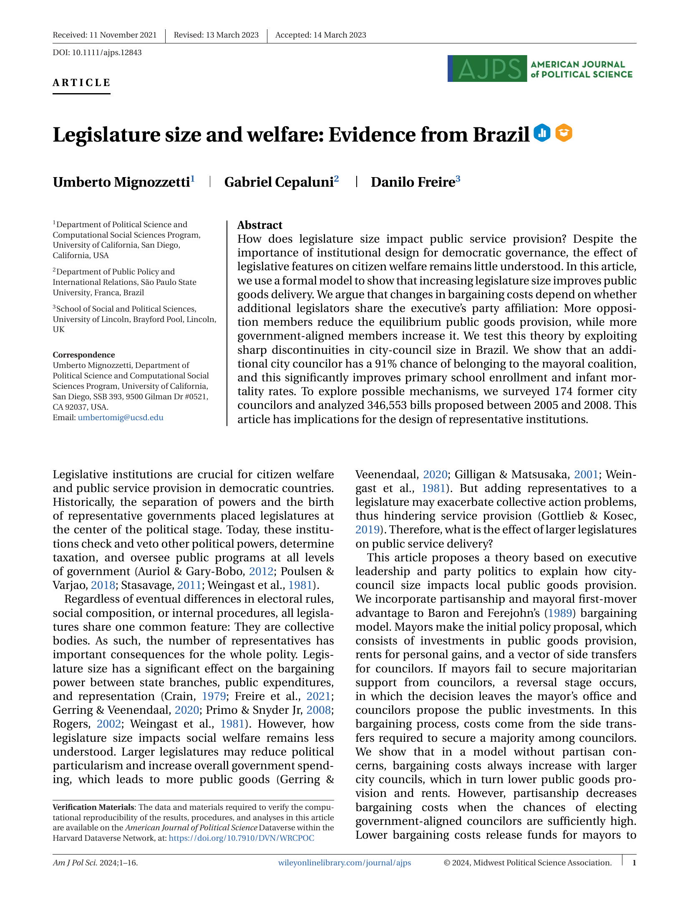

```{r setup, include=FALSE}
options(htmltools.dir.version = FALSE)
library(knitr)
opts_chunk$set(
  echo = FALSE,
  fig.align = "center",
  dpi = 300,
  cache = FALSE
)

options(repos = c(CRAN = "https://cran.rstudio.com/"))

if (!require("fontawesome", character.only = TRUE)) {
  install.packages("fontawesome", dependencies = TRUE)
  library(fontawesome, character.only = TRUE)
}
```

<!--
CIERRE (15:15-15:30). Sin práctica, sin datos. Corto y cálido: el mapa del día,
el arco de las legislaturas (un estudio a la mañana, la literatura a la tarde),
una lámina personal (TODO Danilo), dos usos de la IA sin humo, dónde enchufarse
en la región y dónde quedan los materiales. Termina en lo concreto, nunca en
optimismo genérico. Estilo de la casa: ver plan/01-guia-estilo.md.
-->

# Cierre: el mapa completo {background-color="#2d4563"}

## Las dos preguntas, respondidas

:::{style="margin-top: 8px; font-size: 20px;"}
Todo el día giró alrededor de una pregunta a la mañana y otra a la tarde. Este es el mapa entero.

[¿Comparado con qué? De dónde sale el contrafactual]{.alert}

| Diseño | ¿De dónde sale? | Supuesto clave |
|---|---|---|
| [Experimento]{.alert} | Lo [construís]{.alert} sorteando | El sorteo salió bien: [balance]{.alert} |
| [RDD]{.alert} | Lo [encontrás]{.alert} en una regla con umbral | Nada más salta en el corte: [continuidad]{.alert} |
| [DiD y sintético]{.alert} | Lo [armás]{.alert} con trayectorias de otras unidades | [Tendencias paralelas]{.alert} o buen ajuste pre |

:::{style="margin-top: 8px; border-left: 4px solid #2d4563; padding: 6px 18px; font-size: 19px;"}
[¿Esto ya es evidencia?]{.alert} Un resultado se vuelve evidencia cuando tiene un [diseño creíble]{.alert}, sobrevive a la [síntesis]{.alert} (meta-análisis) y a la [replicación]{.alert}, y es [reproducible]{.alert} (el piso de todo)
:::

:::{style="margin-top: 8px; font-size: 19px;"}
Dos preguntas para llevarte: ¿comparado con qué?, y ¿esto ya es evidencia, o es un estudio?
:::
:::

## La misma pregunta, dos veces

:::{style="margin-top: 8px; font-size: 20px;"}
El tamaño del concejo apareció [dos veces]{.alert} hoy, y en los dos niveles el método cambió la respuesta.

:::{.columns}
:::{.column width=50%}
:::{style="text-align: center;"}


:::{style="font-size: 16px; color: #555;"}
La mañana: un estudio
:::
:::

A la mañana, un [RDD]{.alert} sobre los 5.560 municipios de Brasil: más concejales, mejor salud y educación ([Mignozzetti, Cepaluni y Freire, 2025](https://doi.org/10.1111/ajps.12843))
:::

:::{.column width=50%}
:::{style="text-align: center;"}


:::{style="font-size: 16px; color: #555;"}
La tarde: la literatura
:::
:::

A la tarde, un [meta-análisis]{.alert} de 30 estudios y 45 coeficientes sobre el mismo tema ([Freire, Mignozzetti, Roman y Alptekin, 2023](https://doi.org/10.1017/S0007123422000552))
:::
:::

:::{style="margin-top: 8px; border-left: 4px solid #2d4563; padding: 6px 18px; font-size: 19px;"}
La moraleja: la unidad de la evidencia no es el paper, es la [literatura]{.alert}; y el método importa en los dos niveles
:::
:::

## Qué haría distinto hoy

<!-- TODO Danilo: reemplazá o confirmá estos bullets con tu propia lista -->

:::{style="margin-top: 14px; font-size: 21px;"}
Si le pudiera hablar a mi yo de hace diez años, cuando empezábamos estos proyectos, le diría tres cosas.

- TODO (Danilo): [preregistrá]{.alert} antes de tocar los datos; una hipótesis escrita de antemano vale más que diez encontradas después

- TODO (Danilo): [esperá nulos]{.alert} y presupuestá tiempo para ellos; un resultado que no sale no es un proyecto que fracasó

- TODO (Danilo): presupuestá más tiempo para [limpiar datos]{.alert} que para modelar, y documentá cada decisión chica el día que la tomás, no al final
:::

# ¿Y la inteligencia artificial? {background-color="#2d4563"}

## Dos usos que ya funcionan

:::{style="margin-top: 8px; font-size: 19px;"}
:::{.columns}
:::{.column width=50%}
[Medir lo que no está medido]{.alert}

Los LLM clasifican texto a escala (documentos, respuestas abiertas, noticias) donde las estadísticas oficiales son débiles.

- En tareas de anotación ya rinden al nivel de anotadores humanos típicos ([Gilardi, Alizadeh y Kubli, 2023](https://doi.org/10.1073/pnas.2305016120))

- El survey de referencia sobre LLMs para ciencias sociales computacionales: [Ziems et al. (2024)](https://doi.org/10.1162/coli_a_00502)
:::

:::{.column width=50%}
[Asistir el flujo de trabajo]{.alert}

Escribir y revisar código de análisis, documentar, detectar errores.

- La condición para que ayude: un proyecto [reproducible y legible]{.alert} (datos, código y decisiones a la vista) es justo lo que una IA puede verificar y extender
:::
:::

:::{style="margin-top: 8px; border-left: 4px solid #b85450; padding: 6px 18px; font-size: 19px;"}
Lo que [no]{.alert} hace: decidir tu pregunta, tu diseño ni tus supuestos; todo lo de hoy sigue siendo tu trabajo
:::
:::

## Dónde aprender más

:::{style="margin-top: 20px; font-size: 22px;"}
El curso introductorio de IA que dicté acá en la UCU tiene todos los materiales abiertos: [danilofreire.github.io/introduccion-ia-ucu](https://danilofreire.github.io/introduccion-ia-ucu/)

- Slides, labs en R y Python, todo descargable

- Los dos papers de arriba sirven como lecturas de entrada al tema
:::

# Dónde enchufarse {background-color="#2d4563"}

## En la región

:::{style="margin-top: 12px; font-size: 20px;"}
Cuatro puertas concretas, con lo que te dan: formación, financiamiento, redes y trabajo.

- [J-PAL LAC](https://www.povertyactionlab.org/lac): evaluaciones aleatorizadas, cursos, financiamiento y una red de investigadores afiliados

- [IPA](https://poverty-action.org/): implementa experimentos de campo en la región y contrata equipos locales

- [BID](https://www.iadb.org/): evaluación de impacto de sus proyectos y datos abiertos para la región

- [EGAP](https://egap.org/): red de gobernanza y política experimental, con registro de diseños, becas y talleres como este

:::{style="margin-top: 8px; border-left: 4px solid #2d4563; padding: 6px 18px; font-size: 19px;"}
Si algo de hoy te picó, cualquiera de estas puertas es una buena primera semana
:::
:::

## Los materiales quedan

:::{style="margin-top: 16px; font-size: 21px;"}
Todo lo del día sigue en línea, para que lo uses cuando quieras.

- El sitio del taller: [danilofreire.github.io/taller-evidencia-ucu](https://danilofreire.github.io/taller-evidencia-ucu/), con todas las diapositivas, el código y los datos, descargables

- Los papers del día están enlazados en las referencias de cada bloque

- Escribime: [danilofreire@gmail.com](mailto:danilofreire@gmail.com); las preguntas de la semana que viene valen tanto como las de hoy
:::

# ¡Gracias! 🎉 {background-color="#2d4563"}

## Referencias {#sec:referencias}

:::{style="font-size: 16px;"}
:::{.columns}
:::{.column width=50%}
Freire, D., Mignozzetti, U., Roman, C. y Alptekin, H. (2023). The effect of legislature size on public spending: a meta-analysis. *British Journal of Political Science* 53(2):776–788. [doi](https://doi.org/10.1017/S0007123422000552)

Gilardi, F., Alizadeh, M. y Kubli, M. (2023). ChatGPT outperforms crowd workers for text-annotation tasks. *PNAS* 120(30):e2305016120. [doi](https://doi.org/10.1073/pnas.2305016120)
:::

:::{.column width=50%}
Mignozzetti, U., Cepaluni, G. y Freire, D. (2025). Legislature size and welfare: evidence from Brazil. *American Journal of Political Science* 69(3):831–846. [doi](https://doi.org/10.1111/ajps.12843)

Ziems, C., Held, W., Shaikh, O., Chen, J., Zhang, Z. y Yang, D. (2024). Can large language models transform computational social science? *Computational Linguistics* 50(1):237–291. [doi](https://doi.org/10.1162/coli_a_00502)
:::
:::
:::
